# FSI GECX Bundle — Solution Architecture

This diagram is generated from the deployed Terraform topology (`deployment/terraform/`) and the service code. It shows the edge/identity layer, the Cloud Run application and voice runtimes, the AI/document/search services, the eventing and job orchestration, and the operational data plane with its CDC and lakehouse paths.

For a component-by-component walkthrough of each subsystem, see [docs/architecture/](docs/architecture/README.md).

```mermaid
flowchart TB
  subgraph CLIENTS["Clients & External Systems"]
    USER["End-User Browser"]
    OPS["Operator / Engineer"]
    AGG["Aggregator / FDX Client"]
    CCAI["CCAI Platform / GECX<br/>CX Agent Studio"]
    GH["GitHub Repository"]
  end

  subgraph EDGE["Edge & Identity"]
    DNS["Cloud DNS"]
    LB["Global External HTTPS LB<br/>Cloud Armor + Managed Cert"]
    IAP["Identity-Aware Proxy"]
    GCIP["Identity Platform / Firebase<br/>Google IdP"]
    BF["Blocking Functions<br/>beforeCreate / beforeSignIn"]
  end

  subgraph APP["Application Runtime — Cloud Run"]
    UI["banking-ui"]
    LOGIN["iap-login-ui"]
    SVC["banking-service<br/>FastAPI + MCP"]
    DG["data-generator"]
  end

  subgraph VOICE["Voice & Conversational AI"]
    LKVM["LiveKit Server VM"]
    AGENT["credit-support-agent<br/>Cloud Run / ADK"]
    GLIVE["Vertex AI Gemini Live"]
  end

  subgraph AIS["AI, Documents & Search"]
    GEM["Vertex AI Gemini"]
    DOCAI["Document AI<br/>splitter / W2 / paystub / bank-stmt"]
    DE["Discovery Engine<br/>Vertex AI Search"]
    DPLEX["Dataplex Knowledge Catalog<br/>Data Catalog policy tags"]
  end

  subgraph ASYNC["Eventing, Scheduling & Jobs"]
    SCHED["Cloud Scheduler"]
    EVT["Eventarc<br/>GCS finalize"]
    TASKS["Cloud Tasks"]
    PSA["Pub/Sub: audit-events"]
    PSU["Pub/Sub: underwriting-review"]
    DF["Dataflow<br/>Managed Iceberg"]
    JOBS["Cloud Run Jobs<br/>db bootstrap / migrate / reconcile<br/>lakehouse-reconcile / fraud-lifecycle / audit-relay"]
  end

  subgraph DATA["Operational Data, CDC & Lakehouse"]
    ADB[("AlloyDB PostgreSQL<br/>banking-primary")]
    REDIS[("Memorystore Redis")]
    BASTION["Bastion VM<br/>IAP SSH tunnel"]
    DSPROXY["Datastream Proxy VM"]
    DS["Datastream CDC"]
    BQ[("BigQuery<br/>oltp_cdc / analytics_curated / compliance_audit")]
    ICE[("BigLake Iceberg Catalog<br/>GCS iceberg-warehouse")]
    ARTGCS[("GCS<br/>interaction-artifacts")]
    CRAWL[("GCS<br/>site-crawled-content")]
  end

  subgraph PLAT["Platform, CI/CD & Security"]
    SM["Secret Manager"]
    KMS["Cloud KMS — CMEK"]
    AR["Artifact Registry"]
    CB["Cloud Build<br/>triggers + worker pool"]
    FCM["Firebase Cloud Messaging"]
  end

  %% Edge / ingress
  USER --> DNS --> LB
  AGG -->|FDX v6 API| LB
  LB --> IAP
  LB -->|"/login, /__/auth"| LOGIN
  LB -->|"/rtc"| LKVM
  IAP -->|"/ default"| UI
  IAP -->|"/api"| SVC
  IAP -->|"/data-generator"| DG
  IAP <--> GCIP
  LOGIN --> GCIP
  GCIP --> BF

  %% Voice
  UI -->|voice /rtc| LKVM
  AGENT <--> LKVM
  AGENT <--> GLIVE
  AGENT -->|MCP tools| SVC

  %% banking-service dependencies
  SVC --> ADB
  SVC --> REDIS
  SVC --> GEM
  SVC --> DOCAI
  SVC --> DE
  SVC --> DPLEX
  SVC --> SM
  SVC -->|audit outbox| PSA
  SVC -->|manual review| PSU
  SVC -->|artifacts| ARTGCS
  SVC -->|push| FCM
  SVC -->|analytics queries| BQ
  DG -->|card-network sim| SVC

  %% Eventing & scheduling
  ARTGCS --> EVT --> SVC
  SCHED --> DG
  SCHED --> JOBS
  TASKS --> DG
  CCAI -->|MCP / OpenAPI toolset| SVC
  CCAI -->|web widget| UI

  %% CDC & lakehouse
  ADB --> DSPROXY --> DS
  DS --> BQ
  DS --> ICE
  PSA --> DF --> ICE
  DF --> BQ
  JOBS --> ADB
  JOBS --> BQ
  OPS -->|IAP SSH| BASTION --> ADB

  %% CI/CD & content ingestion
  GH --> CB
  CB --> AR
  AR --> UI
  AR --> SVC
  AR --> DG
  AR --> AGENT
  CB --> JOBS
  CB -->|site crawl| CRAWL
  CRAWL --> DE

  %% CMEK
  KMS -.CMEK.-> ADB
  KMS -.CMEK.-> BQ
  KMS -.CMEK.-> ICE
  KMS -.CMEK.-> ARTGCS

  classDef client fill:#FCE8E6,stroke:#EA4335,color:#111;
  classDef edge fill:#E8F0FE,stroke:#4285F4,color:#111;
  classDef app fill:#E6F4EA,stroke:#34A853,color:#111;
  classDef voice fill:#F3E8FD,stroke:#A142F4,color:#111;
  classDef ai fill:#E0F7F5,stroke:#12A4AF,color:#111;
  classDef async fill:#FEF7E0,stroke:#F9AB00,color:#111;
  classDef data fill:#FDE7EF,stroke:#D01884,color:#111;
  classDef plat fill:#ECEFF1,stroke:#5F6368,color:#111;

  class USER,OPS,AGG,CCAI,GH client;
  class DNS,LB,IAP,GCIP,BF edge;
  class UI,LOGIN,SVC,DG app;
  class LKVM,AGENT,GLIVE voice;
  class GEM,DOCAI,DE,DPLEX ai;
  class SCHED,EVT,TASKS,PSA,PSU,DF,JOBS async;
  class ADB,REDIS,BASTION,DSPROXY,DS,BQ,ICE,ARTGCS,CRAWL data;
  class SM,KMS,AR,CB,FCM plat;
```

## Subsystem Documentation

| Area | Documentation |
| :--- | :--- |
| Data platform, CDC, lakehouse, migrations, DB access | [docs/architecture/data-platform/](docs/architecture/data-platform/README.md) |
| AI, voice, document processing, search & ingestion | [docs/architecture/ai-and-voice/](docs/architecture/ai-and-voice/README.md) |
| Domain workflows (origination, servicing, open banking, support, fraud) | [docs/architecture/domain-workflows/](docs/architecture/domain-workflows/README.md) |
| Identity & access (custom IAP login, blocking functions) | [docs/architecture/identity-access/](docs/architecture/identity-access/README.md) |
