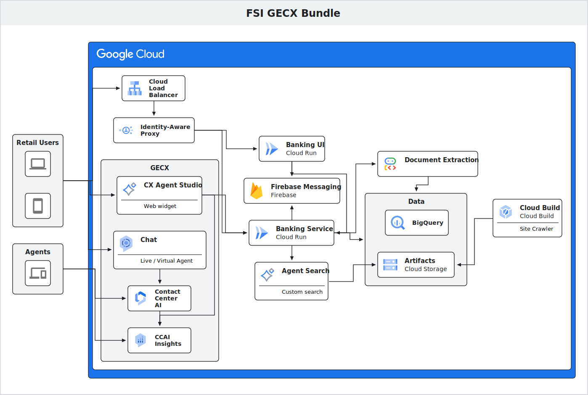

# FSI GECX Bundle

This repository is a collection of resources for the Financial Services Industry (FSI) GECX Bundle.

## Solution Diagram



## Prerequisites

- A Google Cloud Project:
    - Project ID of a new or existing Google Cloud Project, preferably with no
      APIs enabled.
    - You must have roles/owner or equivalent IAM permissions on the project.
- A CCAI Platform instance - you can get one by following the
    - [Quickstart](https://docs.cloud.google.com/contact-center/ccai-platform/docs/get-started).
- Development environment with:
    - [Google Cloud SDK](https://cloud.google.com/sdk) (gcloud CLI)
    - [Terraform](https://www.terraform.io/) (version 1.0+)
    - [git](https://git-scm.com/)
- You can also use [Cloud Shell](https://shell.cloud.google.com) which comes
  preinstalled with all required tools.
- Familiarity with:
    - [Terraform](https://www.terraform.io/)
    - [CCaaS (CCAI Platform)](https://docs.cloud.google.com/contact-center/ccai-platform/docs)

### Available Terraform Variables

| Name | Description | Optional | Default Value |
|---|---|---|---|
| `project_id` | Google Cloud Project ID. | No | |
| `region` | Google Cloud region. | Yes | `"us-central1"` |
| `zone` | Google Cloud zone. | Yes | `"us-central1-c"` |
| `deploy_cloud_build_triggers` | Whether to deploy Cloud Build triggers. | Yes | `false` |
| `deploy_cloud_run_services` | Whether to deploy Cloud Run services. | Yes | `false` |
| `banking_service_image_url` | Image URL for the banking service. | Yes | `null` |
| `banking_ui_image_url` | Image URL for the banking UI. | Yes | `null` |
| `iap_login_ui_image_url` | Image URL for the IAP login UI. | Yes | `null` |
| `additional_cloud_run_iap_members` | A list of IAM members to grant the Cloud Run IAP role. | Yes | `[]` |
| `ccai_company_id` | CCAI Company ID. | No | |
| `ccai_host` | CCAI Host URL. | No | |
| `custom_domain` | The custom domain for the Load Balancer. | No | |
| `set_cloud_run_audiences` | Whether to set the Cloud Run audiences env variable. | Yes | `false` |
| `github_app_installation_id` | GitHub App Installation ID (required if `deploy_cloud_build_triggers` is true). | Yes | `null` |
| `github_repo_remote_uri` | GitHub Repository Remote URI (required if `deploy_cloud_build_triggers` is true). | Yes | `"https://github.com/cloud-gtm/fsi-gecx-bundle.git"` |
| `github_connection_name` | GitHub connection name. | Yes | `"cloud-gtm"` |
| `github_oauth_token_secret_name` | GitHub OAuth token secret name (required if `deploy_cloud_build_triggers` is true). | Yes | |
| `manage_github_connection` | Whether to manage the GitHub connection. | Yes | `false` |
| `cx_agent_studio_deployment_name` | CX Agent Studio Web Widget deployment name. | Yes | `null` |
| `cx_agent_studio_upload_tool_name` | CX Agent Studio File Upload Tool deployment name. | Yes | `null` |
| `cx_agent_studio_populate_content_tool_name` | CX Agent Studio Populate Form Content Tool deployment name. | Yes | `null` |
| `cx_agent_studio_get_user_location_tool_name` | CX Agent Studio Get User Location Tool deployment name. | Yes | `null` |
| `use_external_identities` | Whether to enable the blocking functions in the agent. This cannot be enabled in Argolis as they require unauthenticated invocations as per https://www.npmjs.com/package/gcip-cloud-functions. | Yes | `false` |
| `enable_blocking_functions` | Whether to enable the blocking functions in the agent. | Yes | `false` |

### GCP Secrets
| Name | Description | Optional | Default Value |
|---|---|---|---|
| `ccai-company-secret` | The CCAI Company secret. | No | |
| `iap-client-id` | The IAP Client ID. | No | |
| `iap-client-secret` | The IAP Client Secret. | No | |
| `livekit-api-key` | LiveKit API Key for Gemini Live Voice Agent authentication. | Yes | `"devkey"` (managed by Terraform) |
| `livekit-api-secret` | LiveKit API Secret for Gemini Live Voice Agent authentication. | Yes | `"secret"` (managed by Terraform) |


## Deployment
If you're deploying the solution, fork it, and then change the `github_repo_remote_uri` variable to point to your fork. This is required for Cloud Build Triggers to work.

First go through the steps [Enable required APIs](#enable-required-apis), [Enable OAuth Consent Screen Branding](#enable-oauth-consent-screen-branding), [Create OAuth Client](#create-oauth-client), [Create Secrets](#create-secrets), and [Create GitHub Connection](#create-github-connection). These steps need to be completed manually. Once these are completed
proceed to the [Infrastructure Deployment](#infrastructure-deployment).

### Authenticate to Google Cloud
```bash
# Log in with Application Default Credentials (ADC)
gcloud auth application-default login

# Set the specified project as the active project in your configuration
export PROJECT_ID="[GCP_PROJECT_ID]"
gcloud config set project $PROJECT_ID

# Check the configuration to ensure the project and account are correct
gcloud config list

# Create Terraform state bucket
BUCKET_NAME="${PROJECT_ID}-tf-state"
LOCATION="us"

gcloud storage buckets create "gs://${BUCKET_NAME}" --location="${LOCATION}" --uniform-bucket-level-access

cd ./deployment/terraform

# Create tfbackend file
TF_BACKEND=${BUCKET_NAME}.tfbackend
echo -n 'bucket = "'${BUCKET_NAME}'"' > environment/${TF_BACKEND}

# Create TF vars file from template
envsubst "\$PROJECT_ID" < terraform.tfvars.template > terraform.tfvars

# Return to the root of the repository
cd ../../
```

### Enable required APIs
Open Cloud Shell, authorize it enable Compute Engine, Cloud Build, and Secret Manager:
```
gcloud services enable \
    compute.googleapis.com \
    secretmanager.googleapis.com \
    cloudbuild.googleapis.com
```

### Enable OAuth Consent Screen Branding

1. Go to https://console.cloud.google.com/auth/branding?project=${PROJECT_ID}

    ```bash
    echo https://console.cloud.google.com/auth/branding?project=${PROJECT_ID}
    ```

2. Click "Get started".
3. Fill in your application name (e.g., Banking Demo), and select a support email.
4. Click "Next".
5. Choose an Audience.
6. Click "Next".
7. Enter and email address for the contact information.
8. Click "Next"
9. Review/agree to the terms and conditions and click "Continue".
10. Click "Create".

### Create OAuth client
1. Go to https://console.cloud.google.com/auth/clients?project=${PROJECT_ID}

    ```bash
    echo https://console.cloud.google.com/auth/clients?project=${PROJECT_ID}
    ```

2. Click "Create client".
3. Select 'Web application' for the application type.
4. Fill in name, e.g. 'Banking Demo IAP'.
5. Click "Create".
6. A modal window will pop up with the client_id and client_secret. Copy the "Client ID" and "Client Secret" values and set the variables below:

    ```bash
    CLIENT_ID="[OAUTH_CLIENT_ID]" # The Client ID from the [Create OAuth client](#create-oauth-client) section.
    CLIENT_SECRET="[OAUTH_CLIENT_SECRET]" # The Client Secret from the [Create OAuth client](#create-oauth-client) section.
    ```

7. After being redirected back to the Clients page, click on the client you just created.
8. In the 'Authorized redirect URIs' section, click 'Add URI' and add the following URIs. Set the `CUSTOM_DOMAIN` variable below based on your custom domain.
  - https://iap.googleapis.com/v1/oauth/clientIds/${CLIENT_ID}:handleRedirect
  - https://vertexaisearch.cloud.google.com/oauth-redirect
  - https://${CUSTOM_DOMAIN}/__/auth/handler

    ```bash
    CUSTOM_DOMAIN="your-custom-domain" # Replace with your custom base domain    

    echo https://iap.googleapis.com/v1/oauth/clientIds/${CLIENT_ID}:handleRedirect
    echo https://vertexaisearch.cloud.google.com/oauth-redirect
    echo https://${CUSTOM_DOMAIN}/__/auth/handler
    ```

9. Click "Save".

### Create Secrets
```bash
CCAI_COMPANY_SECRET="[CCAI_COMPANY_SECRET]" # The CCAI Company Secret.

gcloud secrets create iap-client-id \
    --replication-policy="automatic" \
    --data-file=<(echo -n "${CLIENT_ID}")

gcloud secrets create iap-client-secret \
    --replication-policy="automatic" \
    --data-file=<(echo -n "${CLIENT_SECRET}")

gcloud secrets create ccai-company-secret \
    --replication-policy="automatic" \
    --data-file=<(echo -n "${CCAI_COMPANY_SECRET}")
```

### Generate GitHub Token Secret
1. Go to https://console.cloud.google.com/cloud-build/repositories/2nd-gen?project=${PROJECT_ID} and click on "Create host connection".

    ```bash
    echo https://console.cloud.google.com/cloud-build/repositories/2nd-gen?project=${PROJECT_ID}
    ```

2. Select a region (e.g., us-central1), enter a name (e.g., cloud-gtm).
3. Click "Connect".
4. A window will pop up in GitHub asking for authorization with a message like:

   `Project xxx is requesting your GitHub OAuth token. If you continue, the token will be stored in Secret Manager for use with Cloud Build GitHub Connection cloud-gtm`

5. Click "Continue".
6. Click "Install in a new account" on the bottom right of the dialog.
7. Select the appropriate organization and sign in.
8. Next, select "Only select repositories" and choose the fsi-gecx-bundle repository that was forked.
9. Click "Update access".
10. Navigate to Secret Manager: https://console.cloud.google.com/security/secret-manager?project=${PROJECT_ID}

    ```bash
    echo https://console.cloud.google.com/security/secret-manager?project=${PROJECT_ID}
    ```

11. Copy the name of the secret that was created by the Cloud Build GitHub Connection (it should be in the format of cloud-gtm-github-token-xxxxxx).
12. Paste this value into the `github_oauth_token_secret_name` variable in the `terraform.tfvars` file of the deployment/terraform directory. Only paste the name, not the fully qualified resource name.

### Infrastructure Deployment
Update the terraform.tfvars file with the following values:
- custom_domain
- ccai_company_id
- ccai_host
- additional_cloud_run_iap_members

```bash
# From the root of the repository
# If you need to reconfigure use `make tf-init ARGS="--reconfigure"`
make tf-init

# Make note of the load_balancer_ip output for use later in the [Create DNS A entry](#create-dns-a-entry)
make tf-apply-initial
```

### CX Agent Studio Deployment
1. After creating the "Web widget" deployment channel for your agent in CX Agent Studio, you will get a Deployment ID. Copy this value and update the `cx_agent_studio_deployment_name` variable in the `terraform.tfvars` file of the deployment/terraform directory and run `terraform apply`. Additionally update the `cx_agent_studio_upload_tool_name` and `cx_agent_studio_populate_form_content_tool_name` variables in the `terraform.tfvars` file with the file upload and populate form content tool deployment ids respectively.

```bash
make create-gecx
```

Open up your `terraform.tfvars` file and copy in these variables (the output from the `make upload-gecx` will give you the values for these):
- `cx_agent_studio_deployment_name` - 'Web widget deployment id'
- `cx_agent_studio_upload_tool_name` - 'Trigger file upload tool name'
- `cx_agent_studio_populate_form_content_tool_name` - 'Trigger populate form content tool name'
- `cx_agent_studio_get_user_location_tool_name` - 'Trigger get user location tool name'

```bash
make tf-apply
```

### Trigger site crawl to populate Agent Search datastore

```bash
make trigger-site-crawl
```

### Create DNS A entry:
Using the load_balancer_ip output from the `tf-apply-initial` target, create a DNS A entry for the load balancer in a project where you manage DNS records.
```bash
DNS_ZONE_NAME="mservidio-demo"
CUSTOM_DOMAIN="banking-test.mservidio.demo.altostrat.com" # Do not include trailing period, it is already in the command below
LB_IP="8.232.143.195"
DNS_PROJECT=[THE_PROJECT_FOR_DNS]

gcloud dns record-sets create "${CUSTOM_DOMAIN}." \
    --zone="${DNS_ZONE_NAME}" \
    --type="A" \
    --ttl="300" \
    --rrdatas="${LB_IP}" \
    --project="${DNS_PROJECT}"
```

To grant access to additional users, add their email addresses to the `additional_cloud_run_iap_members` variable in the `terraform.tfvars` file and run `make tf-apply`.

Example:

```bash
additional_cloud_run_iap_members = ["domain:google.com", "user:user@google.com"]
```

## Local Development Setup

For developers running the banking service and UI applications locally in their developer workspace:

### 1. Install All Dependencies
Use the Makefile bootstrapper to clean and sync all Python packages (via `uv`) and install React frontend node modules concurrently:
```bash
make install
```

### 2. Configure Local Frontend Credentials
To configure the local React applications to connect to your Firebase/Identity Platform engine:
* **Main Banking UI**: Copy `banking-ui/public/fbConfig.template.js` to `banking-ui/public/fbConfig.js` and update it with your Firebase Web App credentials.
* **Custom Login Gate**: Copy `iap-login-ui/config.template.js` to `iap-login-ui/config.js` and update it with your Identity Platform project credentials.

*(Note: Both `fbConfig.js` and `config.js` are globally git-ignored to prevent accidental credential leakage or workspace diff pollution. You must configure these manually in your local workspace).*

### 3. Run Services Locally
Launch both the FastAPI backend API server (port 8080) and the React Vite frontend dev server concurrently:
```bash
make run
```

### 4. Running LiveKit Voice Support Sandbox (Local Testing)
To test the voice support assistant locally in your developer workspace:
1. Spin up the local LiveKit server container:
   ```bash
   docker compose -f deployment/local/docker-compose.livekit.yaml up -d
   ```
2. Start the Voice Agent process:
   ```bash
   python adk-agent/credit-support-agent/voice_agent.py
   ```
   *(Note: The agent automatically connects to the local LiveKit server using default development keys. Ensure you have activated your python environment and installed dependencies).*

Navigate to `http://localhost:5173/` in your browser to access your local FSI banking workspace.
