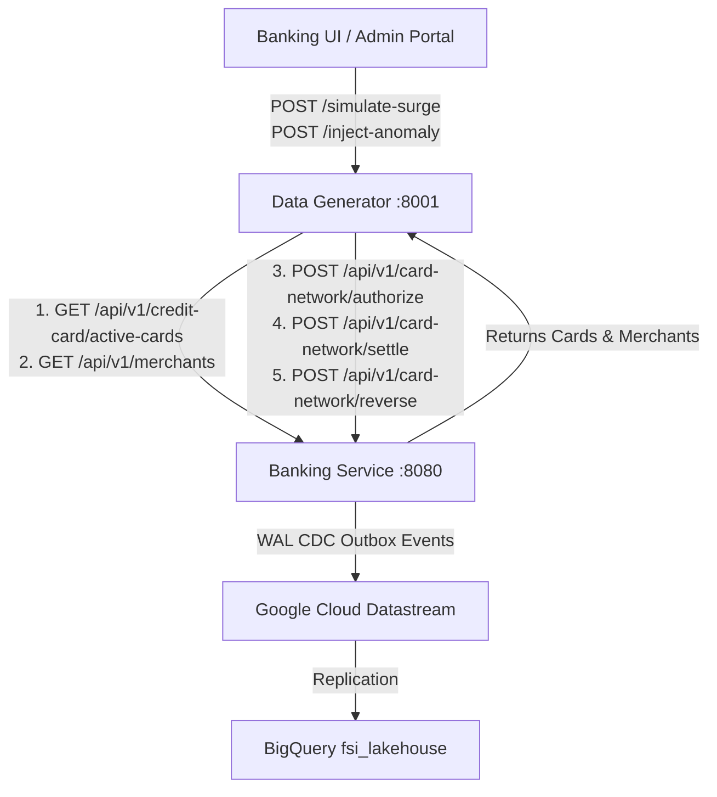

# Nova Horizon Synthetic Data Generator (`data-generator`)

An autonomous, cloud-native synthetic transaction data generator designed for the Nova Horizon Banking Demo suite. 

The service simulates an external merchant point-of-sale (POS) terminal network and cardholder activity engine. It generates synthetic credit card authorization holds, captures, and reversals over HTTP against the authoritative issuing bank gateway in **`banking-service`**. These real-time transactions generate PostgreSQL Outbox events that stream via Google Cloud Datastream (WAL Change Data Capture) into Google Cloud Storage and BigQuery Active Lakehouse (`fsi_lakehouse`), powering live AI Data Canvas spend velocity visualizations and Looker semantic dashboards.

---

## 🏛️ Architectural Overview & System Decoupling

`data-generator` operates as an autonomous microservice cleanly decoupled from local databases and filesystem dependencies:



### Key Architectural Characteristics
* **Zero Local Database Coupling**: Does not connect to SQLite databases (`cards.db`) or require shared filesystem volume mounts.
* **Dynamic Discovery via REST APIs**:
  * **Active Cards**: Discovers active credit card accounts and persona metadata dynamically by calling `GET {BANKING_SERVICE_URL}/api/v1/credit-card/active-cards` with service-to-service authentication (`X-Card-Network-Token`).
  * **Merchant Catalogs**: Fetches authoritative 3NF merchant store locations, MCC codes, and risk scores by calling `GET {BANKING_SERVICE_URL}/api/v1/merchants`.
* **Multi-Tier Fallbacks**: Automatically falls back to local CSV resources (`resources/merchants.csv`) and static `DEFAULT_PERSONAS` when running in offline development or unit test environments.

---

## 🧩 Core Classes & Data Models

The service uses structured Pydantic models to define persona capabilities and API request payloads:

### `CardPayload` (`BaseModel`)
Defines an active credit card profile used during transaction simulation:
* `card_token` (`str`): Unique tokenized card identifier (e.g., `tok_visa_erik_voit`).
* `cardholder_name` (`str`): Full name of the cardholder.
* `persona` (`str`): Spend profile categorization (`HNW` for High-Net-Worth, `PRIME` for everyday credit, `YPRO` for Young Professional).
* `mccs` (`List[str]`): Eligible Merchant Category Codes this persona frequently shops at.
* `amount_min` (`int`), `amount_max` (`int`): Minimum and maximum transaction amount boundaries in cents.

### `SurgeRequest` (`BaseModel`)
Request payload for initiating bulk spend velocity surges:
* `active_cards` (`Optional[List[CardPayload]]`): Optional list of card payloads to override dynamic discovery from `banking-service`.

### `AnomalyRequest` (`BaseModel`)
Request payload for targeted fraud anomaly injection:
* `card_token` (`Optional[str]`): Specific card token to target. If omitted, the service dynamically targets the active CE Presenter or Google Executive persona.
* `user_id` (`Optional[str]`), `email` (`Optional[str]`): Optional identity metadata for logging and traceability.

---

## ⚙️ Core Algorithms & Workflow Functions

### 1. `simulate_swipe_event(client: httpx.AsyncClient, card: Dict[str, Any]) -> None`
The core transaction engine algorithm representing a complete credit card point-of-sale lifecycle:
1. **Merchant Resolution & Filtering**: Matches available merchants against the cardholder's eligible MCC codes. Evaluates regional rules—assigning international Cancun, Mexico vacation transactions (`country_code = "MEX"`, `is_international = True`) specifically to Google Executive and Presenter personas.
2. **Realistic Spend Capping**: Generates a randomized transaction amount within persona thresholds while enforcing everyday common-sense caps:
   * **Coffee Shops (MCC 5814)**: Capped at $50.00 max.
   * **Dining & Restaurants (MCC 5812)**: Capped at $300.00 max.
   * **Gas Stations (MCC 5541)**: Capped at $100.00 max.
3. **Gateway Authorization**: Synthesizes a 12-digit Retrieval Reference Number (RRN) and transmits an authorization request to `POST /api/v1/card-network/authorize`.
4. **Clearing & Settlement Resolution**: Upon receiving an approved hold (`action_code == "00"`), deterministically resolves the clearing state using weighted random selection:
   * **80% Settle (`POST /api/v1/card-network/settle`)**: Captures the funds. For food & dining categories (MCC 5812, 5814), adds a randomized 15–20% restaurant tip to the final settlement amount.
   * **10% Reverse (`POST /api/v1/card-network/reverse`)**: Reverses the pending authorization hold (simulating customer cancellation or merchant void).
   * **10% Leave Pending**: Retains the active authorization hold without settling (simulating open pre-authorizations such as hotel incidentals or rental car holds).

### 2. `run_activity_surge_task(active_cards: Optional[List[Dict[str, Any]]]) -> None`
An asynchronous background task orchestrated via `asyncio.gather`. It executes 50 rapid-fire card swipes staggered over 10 seconds (5 swipes/second), generating high-velocity concurrent traffic across the persona pool.

---

## 🚀 API Endpoints

All endpoints are protected by `verify_switch_or_presenter_token`, requiring the `X-Card-Network-Token` header or execution within local development mode.

| Method | Endpoint | Description |
| :--- | :--- | :--- |
| `GET` | `/health` | Liveness check returning `{"status": "ok", "service": "data-generator"}`. |
| `POST` | `/simulate-pulse` | Wakes up and synchronously fires a randomized batch of 3–5 swipes across active cards. Used for continuous background heartbeat traffic. |
| `POST` | `/simulate-surge` | Accepts a `SurgeRequest` and initiates an asynchronous background task (`run_activity_surge_task`) firing 50 rapid-fire swipes over 10 seconds. |
| `POST` | `/inject-anomaly` | Identifies the CE Presenter card (or accepts an `AnomalyRequest` token) and fires 4 rapid-fire high-risk card-present transactions at `LUXURY BOUTIQUE CANCUN [MEX]` (`risk_score = 30`). This immediately flags real-time fraud alerts in BigQuery view `fsi_lakehouse.v_international_fraud_anomalies`. |

---

## 🛠️ Local Development & Testing

### Prerequisites
Ensure you have Python 3.13+ and [`uv`](https://github.com/astral-sh/uv) installed.

### Running the Service Locally
To start the FastAPI development server on port `8001`:

```bash
# Start server with auto-reload
uv run uvicorn main:app --host 0.0.0.0 --port 8001 --reload
```

By default, the service attempts to connect to `banking-service` at `http://localhost:8000`. You can override this using environment variables:

```bash
export BANKING_SERVICE_URL="http://localhost:8080"
export CARD_NETWORK_SWITCH_TOKEN="switch-secret-key-12345"
uv run uvicorn main:app --port 8001
```

### Triggering a Standalone CLI Pulse
You can execute a single synthetic swipe event directly from the command line without starting the HTTP server:

```bash
uv run python main.py --pulse
```

### Running Automated Unit Tests
The project includes automated unit and integration tests using `pytest`, `pytest-asyncio`, and `respx` (for HTTP client mocking):

```bash
# Run the full test suite
uv run pytest
```

---

## 🔗 Integration with Active Lakehouse
When transactions are dispatched from `data-generator` to `banking-service`, the resulting WAL CDC events populate two pre-canned BigQuery views used in demo stories:
1. **`fsi_lakehouse.v_realtime_spend_velocity`**: Aggregates spend volume, swipe count, and average ticket size by FDX spend category and cardholder home metro area.
2. **`fsi_lakehouse.v_international_fraud_anomalies`**: Isolates foreign card-present transactions where `risk_score > 20`, showcasing immediate W-2 / VIP fraud intervention via the Gemini Live voice avatar.
