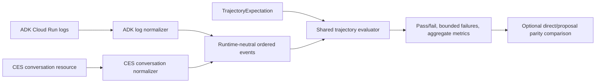

# Agent Trajectory Evaluation Architecture

This document defines the shared evaluation architecture for the two credit-support voice runtimes:

- the Cloud Run Agent Development Kit (ADK) agent connected through LiveKit
- the managed Customer Experience Suite (CES/GECX) agent connected through the banking-service Bidi proxy

The runtimes use different media transports, callback APIs, and sources of recorded evidence. They are evaluated against one runtime-neutral sequence of observable events so that release decisions depend on banking outcomes and security invariants rather than model wording alone.

## Evaluation model



`adk-agent/credit-support-agent/agent/trajectory_eval.py` owns the common `TrajectoryExpectation`, `TrajectoryResult`, and outcome-comparison contracts. The evaluator consumes observable application events, not model internals. This permits the same assertions to be applied to test fixtures, deployed ADK logs, recorded CES conversations, and future canary transports.

The normalizers deliberately exclude customer identifiers, tool arguments, raw tool responses, and proposal identifiers. Transcript text may exist transiently in the in-memory event stream for ordering checks, but persisted qualification reports contain only resource provenance, bounded failures, and aggregate metrics.

## Normalized event vocabulary

| Event | Architectural meaning |
| :--- | :--- |
| `SESSION_STARTED` | Runtime name and version, deployment identity, and reset generation were established. |
| `GUIDANCE_SNAPSHOT` | The session recorded the Knowledge Catalog source, topic set, snapshot, and content version used for guidance. |
| `FRAUD_REVIEW` | The transaction-selection state advanced, including whether the review was complete enough to propose. |
| `TOOL_CALL` / `TOOL_RESULT` | A named tool was attempted and produced a successful or failed structured result. |
| `ACTION_PROPOSAL` | The protected action advanced through `PROPOSED`, `PRESENTED`, `CONFIRMED`, `DECLINED`, `UNCLEAR`, `EXPIRED`, `INVALIDATED`, `COMMITTED`, or `TOOL_ERROR`. |
| `SUCCESS_CLAIM` | The agent claimed a consequential action succeeded; it must follow the corresponding successful tool result. |
| `UI_EVENT` | A structured data-channel event was emitted for the banking UI. |
| `INTERRUPTION` | The customer interrupted an agent turn. |
| `SESSION_ENDED` | The runtime recorded a bounded terminal outcome such as `NORMAL_DISCONNECT`, `HANDOFF`, or `TOOL_FAILURE`. |

The evaluator checks order as well as presence. In particular, a successful `commit_fraud_triage` result is invalid without an earlier `CONFIRMED` proposal event, and a success claim is invalid before the corresponding structured tool result.

## Runtime evidence adapters

### ADK

`adk-agent/credit-support-agent/scripts/voice_canary.py` reads Cloud Run logs, selects one hashed support-session reference, and converts callback, tool, proposal telemetry, UI event, interruption, and terminal records into the common event vocabulary.

The ADK scenarios cover:

- proposal and compatibility-path success
- Google Wallet acceptance, decline, and ambiguity
- proposal decline and ambiguity
- interruption, reset invalidation, and expiry
- tool failure
- customer-reported fraud

The canary can compare a direct-path baseline with an action-proposal session. Parity permits different tool names but requires the same banking outcome and terminal outcome and rejects tool failures in either path.

### CES/GECX

`adk-agent/credit-support-agent/agent/ces_trajectory.py` converts a completed CES conversation resource into the same events. CES session-variable updates supply proposal presentation and confirmation state; tool calls and responses supply workflow outcomes; the conversation resource supplies the saved app version and timing.

`scripts/cxas/ces_voice_qualification.py` applies the checked-in matrix at `gecx/Credit_Support_Voice_Agent/evaluations/ces_fraud_qualification_matrix.json`. The current fraud contract requires:

- native `CES_GEMINI_LIVE` runtime and a saved app version
- reset-generation and Knowledge Catalog provenance
- exactly one `get_open_fraud_alert`, `propose_fraud_triage`, and `commit_fraud_triage`
- no legacy `triage_fraud_case` call
- complete review before proposal
- `PROPOSED → PRESENTED → CONFIRMED → COMMITTED`
- contract `fraud-triage.v1`
- banking outcome `PENDING_SPECIALIST_REVIEW`
- normal termination

## Evidence layers and release meaning

The evidence layers answer different questions and are not interchangeable.

| Layer | Question answered | What it does not prove |
| :--- | :--- | :--- |
| Readiness probe | Is the deployed runtime configured, durable session store reachable, and authenticated banking MCP endpoint available? | Conversation behavior or mutation safety. |
| Recorded live trajectory | Did a real deployed consultation satisfy the ordered workflow, security, provenance, and banking-outcome contract? | Repeatability across model samples. |
| CES managed contract replay | Does a saved CES version preserve the expected tool and workflow shape with deterministic fake tool responses? | Approved wording or real banking mutation. |
| Conversational reference | Does the agent preserve required branding, transaction inventory, one clear proposal question, recovery guidance, and closeout behavior? | Live customer identity, transport, or banking state. |
| Focused callback and service tests | Do wrong action types, missing or stale turn evidence, reset/expiry, changed proposal scope, and idempotency races fail closed deterministically? | Deployed model behavior. |

A captured live trace is a source for a workflow replay, not approved conversational copy. The hand-authored conversational reference is the only copy reference, and it is evaluated separately.

## Typed-decision qualification

Every release that changes proposal, presentation, customer-decision, or commit
behavior must exercise varied responses against the saved app version:

| Sample | Required evidence |
| :--- | :--- |
| Clear acceptance | The model chooses typed commit on a later customer turn and exactly one authoritative banking commit succeeds. |
| Question or uncertainty | The model answers or clarifies without choosing a decision tool; the same proposal remains pending and no mutation occurs. |
| Qualified or unrelated response | The model does not choose commit. A structurally invalid attempt is rejected by typed scope and ordering checks before banking execution. |
| Decline or changed scope | The model chooses typed `DECLINE`, `REVISE`, or `CANCEL`; the old proposal becomes terminal and revision requires a new immutable proposal. |

The model's typed tool choice is the one semantic decision. Runtime callbacks
validate only opaque proposal identity, action type, session, and protected turn
ordering; they do not classify transcript words or parse the assistant's
presentation. Banking owns lifecycle and exactly-once execution. Transcript
checks may score clarity and factual completeness in evaluation, but never
grant production authority.

For CES stable replay, prior golden responses and variable updates become
context for later turns. Curate protected identifiers and runtime credentials
out of saved fixtures. Inspect callback and fake-tool spans to distinguish a
blocked typed transition from banking execution.

## Commands and artifacts

ADK readiness and trajectory evaluation:

```bash
cd adk-agent/credit-support-agent
uv run python scripts/voice_canary.py \
  --project PROJECT_ID \
  --region us-central1 \
  --scenario fraud \
  --session-id SUPPORT_SESSION_ID
```

CES live-trajectory, managed replay, and conversational qualification:

```bash
./adk-agent/credit-support-agent/.venv/bin/python \
  scripts/cxas/ces_voice_qualification.py \
  --project PROJECT_ID \
  --app projects/PROJECT_ID/locations/us/apps/APP_ID \
  --app-version projects/PROJECT_ID/locations/us/apps/APP_ID/versions/VERSION_ID \
  --conversation projects/PROJECT_ID/locations/us/apps/APP_ID/conversations/CONVERSATION_ID \
  --managed \
  --output /tmp/ces-qualification.json
```

The report is safe to retain because it contains resource provenance, pass/fail results, and aggregate metrics rather than transcripts or protected identifiers. Managed evaluation resources are app-level resources; an app overwrite can remove them, so recreate the contract replay and conversational reference after importing a new app bundle.

Operational procedures and the complete ADK scenario list are in [Credit Support Agent Operations](../../../adk-agent/credit-support-agent/OPERATIONS.md). CES-specific fixture boundaries are in [CES Voice Qualification](../../../gecx/Credit_Support_Voice_Agent/evaluations/README.md).
