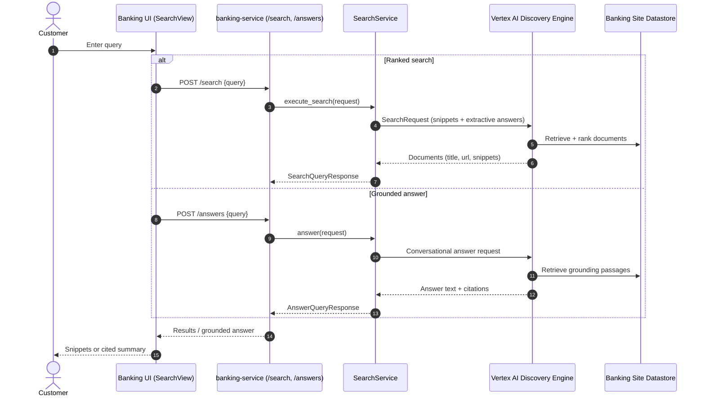

# FSI Architecture Design: Enterprise Search & Generative Answers

This document defines the AI integration and runtime flow for **Enterprise Search & Generative Answers** in the FSI GECX Bundle.

The platform provides an authenticated knowledge surface over the bank's public content (products, rates, disclosures, help center) using Vertex AI **Discovery Engine** (Agentspace / Vertex AI Search). It exposes two modes: classic ranked search with snippets, and grounded conversational answers that summarize retrieved documents with citations.

---

## 1. System Topology & Runtime Flow

---

## 2. Domain Responsibilities

### A. Access Control

The search router mounts every route behind `Depends(get_current_user)`, so both `/search` and `/answers` require an authenticated identity. There is no anonymous knowledge surface; the datastore content is public, but access is gated to keep query telemetry inside authenticated sessions.

### B. Search Endpoints

| Endpoint | Purpose |
| :--- | :--- |
| `POST /search` | Ranked document search returning titles, links, and snippets. |
| `POST /answers` | Grounded conversational answer that summarizes retrieved content with source references. |

### C. Discovery Engine Configuration

`SearchService` (`services/search.py`) wraps `discoveryengine_v1`:

| Concern | Configuration |
| :--- | :--- |
| Engine | `DISCOVERY_ENGINE_ID` (env, with a bundled default) under the `global` location and `default_collection`. |
| Serving config | `.../servingConfigs/default_search` for ranked search. |
| Snippets | `SnippetSpec(return_snippet=True)` returns highlighted passages per result. |
| Extractive answers | `ExtractiveContentSpec(max_extractive_answer_count=1)` pulls a direct extract per document. |
| Query expansion | `QueryExpansionSpec.Condition.AUTO` broadens recall automatically. |
| Spell correction | `SpellCorrectionSpec.Mode.AUTO` normalizes typos before retrieval. |

Ranked results are mapped from `derived_struct_data` into `SearchResultItem` (`id`, `title`, `link`, `snippets`), shielding the UI from raw Discovery Engine document structure.

---

## 3. Search vs. Grounded Answers

| Mode | Best For | Output |
| :--- | :--- | :--- |
| `/search` | Navigational and lookup intents ("mortgage rates", "fee schedule"). | Ranked list with snippets and links for the customer to choose from. |
| `/answers` | Natural-language questions ("how do I dispute a charge?"). | A single grounded, cited summary generated over retrieved passages. |

Both modes retrieve from the same banking-site datastore, so answers stay consistent with the pages a customer can navigate to.

---

## 4. Relationship to Conversational Agents

This capability is the retrieval-augmented knowledge layer that complements the transactional agents. Where the Gemini Live and GECX agents call banking-service tools to *act* on an account, enterprise search *informs* — answering product, policy, and how-to questions from published content. The `HelpCenterView` and `SearchView` surfaces in the banking UI consume these endpoints directly.

---

## 5. Related Documents

| Document | Relationship |
| :--- | :--- |
| [GECX Telephony Voice Agent](./gecx_telephony_voice_agent.md) | Conversational agents that answer transactional (vs. knowledge) intents. |
| [Knowledge Catalog Fraud Support Guidance](../data-platform/knowledge_catalog_fraud_support_guidance.md) | Separate Dataplex-sourced runtime guidance path for fraud handling. |
| [Branch & ATM Locator](../domain-workflows/servicing/branch_atm_locator.md) | Companion informational self-service journey. |
