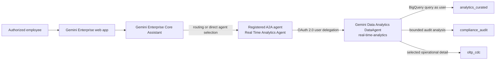

# Gemini Enterprise BigQuery A2A Architecture

## Purpose

Gemini Enterprise is the employee-facing conversational interface for Nova Horizon banking
analytics. It delegates quantitative banking questions to the existing Gemini Data Analytics
`real-time-analytics` DataAgent through Agent2Agent (A2A). The BigQuery agent remains the governed
analytics executor and queries the environment-local lakehouse with the signed-in user's
permissions.

This integration adds an interface and orchestration layer. It does not copy banking data into a
Gemini Enterprise data store, replace BigQuery IAM, or make Gemini Enterprise a system of record.

## Deployment Decision

Development and the prod-like field demo use separate, environment-local resources created from
the same source-controlled definitions.

| Environment | Google Cloud project | Gemini Enterprise app | App ID | Access model | BigQuery DataAgent |
| :--- | :--- | :--- | :--- | :--- | :--- |
| Development | `evo-genai-workspace` | Nova Horizon Dev Workbench | `nova-horizon-dev-workbench` | Personal development sandbox | `projects/evo-genai-workspace/locations/us/dataAgents/real-time-analytics` |
| Prod-like demo | `fsi-demo-1841` | Nova Horizon Banking Demo | `nova-horizon-banking-demo` | Shared presenter group | `projects/fsi-demo-1841/locations/us/dataAgents/real-time-analytics` |

Both apps and agents use the `us` multi-region. The table's access-model distinction is
intentional: Evo is the owner's personal development sandbox, while 1841 is the public-facing
demo environment. The app IDs, A2A endpoint, OAuth client, authorization resource, license
assignment, and end-user URL are environment-specific. Promote
the checked-in specification and Terraform configuration; do not copy a live agent registration
between projects.

The end-user URL contains a generated app configuration ID. Obtain it from the app's Gemini
Enterprise dashboard rather than constructing it from the project number.

## System Context

Users can open the agent directly from the Agent Gallery. The routing description is deliberately
specific so Gemini Enterprise can also select the agent for banking questions that require
quantitative analysis, transaction trends, customer behavior, fraud patterns, balances,
portfolio metrics, or audit evidence.

## Request and Identity Flow

1. The employee signs in to the environment-local Gemini Enterprise web app with Google Identity.
2. Gemini Enterprise selects the registered A2A agent through direct navigation, mention, or core
   assistant orchestration.
3. The A2A registration references an environment-local OAuth authorization resource.
4. On first use, the employee grants the requested Google API scope through the standard consent
   flow.
5. Gemini Enterprise invokes the environment-local Gemini Data Analytics endpoint.
6. The DataAgent generates and executes BigQuery queries with the employee's credentials.
7. Results stream back as text, Markdown, tables, or charts.

The user must have both Gemini Enterprise access and the required DataAgent and BigQuery IAM.
Registering or sharing the agent does not grant access to its underlying tables.

## Source of Truth and Ownership

| Concern | Owner | Source of truth |
| :--- | :--- | :--- |
| Gemini Enterprise app | Terraform | `deployment/terraform/discovery_engine.tf` and environment `terraform.tfvars` |
| BigQuery DataAgent behavior and routing description | DataAgent deployment | `deployment/data_agents/real_time_analytics_agent.json` |
| BigQuery source references | DataAgent deployment | Project-neutral allowlist in the same JSON specification |
| Environment-specific DataAgent resource | Deployment script | `deployment/data_agents/deploy_data_agent.py` |
| A2A agent card | Gemini Data Analytics publish output | Regenerated after the source DataAgent is reconciled |
| OAuth web client | Google Auth Platform operator | One separate client per environment; intentionally not programmable |
| Gemini Enterprise authorization and A2A registration | Operator or idempotent REST reconciler | Environment-local Discovery Engine resources |
| Identity provider and licenses | Gemini Enterprise administrator | Project and `us` multi-region configuration |
| Shared presenter membership | Google Group owner | `fsi-nova-horizon-demo-console-viewer@google.com` |
| Presenter app access | Terraform | Conditional `roles/discoveryengine.agentspaceUser` binding for `iam_console_viewers` |
| End-user web URL | Gemini Enterprise | Generated dashboard link; not a Terraform-derived project URL |

The description exists in both the source DataAgent and the registered A2A card. Updating the
DataAgent does not automatically rewrite an existing Gemini Enterprise registration. Reconcile
the DataAgent first, regenerate the card, and then patch or re-register the A2A resource.

## Security Boundaries

- Use Google Identity for these Google Cloud and BigQuery-backed environments.
- In 1841, use `fsi-nova-horizon-demo-console-viewer@google.com` as the single presenter access
  boundary. Group membership grants both the bounded backend roles and Gemini Enterprise app role.
- Do not add the shared presenter group to Evo; it remains a personal development sandbox.
- Use one OAuth web client per project with only the required redirect URIs and scopes.
- Never commit an OAuth client secret, refresh token, authorization payload containing a secret,
  or one-time credential export.
- Keep BigQuery access user-delegated. Do not give Gemini Enterprise a broad service account that
  bypasses user-level dataset permissions.
- Preserve the DataAgent source allowlist and query budget; Gemini Enterprise does not expand the
  agent's permitted BigQuery sources.
- Treat A2A registration as a pre-GA integration boundary. A2A agents registered directly with
  Gemini Enterprise do not pass through Agent Gateway policies; apply any required Model Armor or
  agent-side protections explicitly.
- Keep user-content and observability logging disabled unless the demo's logging and data-handling
  requirements have been reviewed.

## Promotion Model

The source JSON and Terraform configuration are portable; deployed resource identities are not.
Promotion follows this order:

1. Reconcile curated BigQuery views in the target project.
2. Deploy and drift-check the target project's `real-time-analytics` DataAgent.
3. Apply the target project's Gemini Enterprise app configuration.
4. Generate the target-specific A2A card from the deployed DataAgent.
5. Register or update the target app with its own OAuth authorization.
6. Verify identity, license, IAM, first-use consent, and representative analytics prompts.

See [Gemini Enterprise BigQuery A2A operations](../../operations/gemini_enterprise_bigquery_a2a.md)
for the executable runbook and
[Real Time Analytics Agent Architecture](../data-platform/real_time_analytics_agent_architecture.md)
for grounding, query behavior, and BigQuery IAM.
