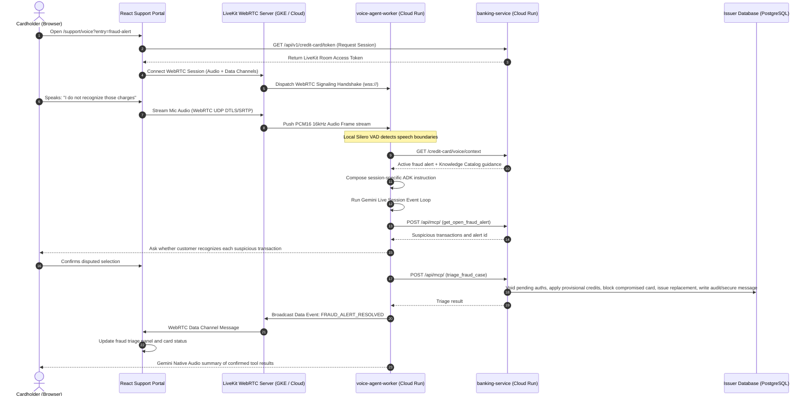

# FSI Architecture Design: Gemini Live Voice Agent & WebRTC Orchestration

This document defines the system architecture, design patterns, and Google Cloud Platform deployment configurations for the real-time **Gemini Live Voice Agent** used by the credit support portal.

The current reference flow is the fraud alert voice mitigation journey: the customer opens the support page from a secure message or support portal, the agent detects trusted active fraud context, reviews suspicious transactions, confirms the disputed selection, and then invokes a high-level fraud triage workflow through MCP.

---

## 📐 1. System Topology & Media Flow

The Voice Agent is orchestrated using the **Google Agent Development Kit (ADK)** and **LiveKit WebRTC**. It establishes persistent, low-latency, bidirectional audio streaming channels with the client browser and uses MCP tools exposed by the core FastAPI banking service.

---

## 🔒 2. Core Architectural Design Decisions

### A. Pessimistic Row Locking (`with_for_update()`)
* **Context**: Credit card authorization operations (such as credit limit increases and balance updates) are highly vulnerable to race conditions (e.g., double-spending or parallel fee reversals).
* **Decision**: We utilize SQLAlchemy's pessimistic lock modifier `with_for_update()` inside database transaction blocks. This issues a `SELECT ... FOR UPDATE` statement to PostgreSQL, blocking concurrent transactions from editing the selected accounts or card rows until the current transaction commits or rolls back.

### B. Immutable Ledger Pattern for Fee Reversals
* **Context**: Traditional CRUD patterns mutate transactional records (e.g., updating a fee amount to $0). This violates bank auditing compliance (such as PCI-DSS and SOC2).
* **Decision**: All transaction modifications are treated as immutable events. When reversing a late fee, the system does not alter the historical late fee row. Instead:
  1. A new, offsetting positive credit transaction is appended to the `account_ledger` table with the description `"FEE_REVERSAL_REF_<original_tx_id>"`.
  2. The account balances (`cleared_balance_cents` and `available_credit_cents`) are re-computed and committed.

### C. Deterministic Fraud Workflow Behind MCP
* **Context**: Gemini Live is good at conversational slot-filling, but brittle if asked to sequence several low-level card operations in one live turn. Fraud remediation also needs idempotency, audit events, provisional-credit semantics, secure messaging, and card targeting based on the active fraud alert.
* **Decision**: The agent uses a high-level MCP tool, `triage_fraud_case`, after it has inspected the alert and the customer has confirmed which transactions are disputed. Banking-service owns the business workflow:
  1. Validate the alert belongs to the customer and target `FraudAlert.card_id`.
  2. Void or release pending suspicious authorizations.
  3. Apply provisional credit entries for posted disputed charges.
  4. Block the compromised card and issue a replacement when requested by the workflow.
  5. Emit audit events and send secure-message follow-up.

The agent can still use existing support capabilities such as late fee reversal, credit limit increase, human escalation, card replacement, and wallet provisioning. During an active fraud alert, however, it must prefer the high-level fraud triage workflow rather than burst-calling low-level fraud tools.

### D. Session-Specific Prompt Composition
* **Context**: The base voice instruction should remain reusable for future specialized flows such as overdraft remediation. Baking every workflow into a monolithic prompt would make the reference architecture hard to extend.
* **Decision**: The agent composes instructions per LiveKit session:
  1. Base guidance from `agent/resources/instruction.txt`.
  2. Trusted session context from `/credit-card/voice/context`.
  3. Active-flow guidance such as `agent/resources/flows/fraud_alert.txt`.
  4. A compact `agent_guidance_summary` returned by banking-service from Dataplex Knowledge Catalog or local fallback.

This keeps general guardrails stable while allowing an active fraud alert to inject only the fraud-specific behavior needed for that session.

### E. Knowledge Catalog Guidance Grounding
* **Context**: Fraud support language changes more often than the mechanics of WebRTC audio. The demo also needs to show governed policy guidance flowing from the data platform into the agent.
* **Decision**: Dataplex Knowledge Catalog stores approved fraud support topics as entries and aspects. Banking-service reads those topics through `KnowledgeCatalogService` and returns the guidance bundle in voice context. If catalog is unavailable, banking-service falls back to `fraud_support_guidance.json`.

Catalog guidance is policy and phrasing context, not operational truth. Live banking-service state and MCP tool results remain the source of truth for fraud alert status, card status, provisional credits, and wallet provisioning.

See [Knowledge Catalog Fraud Support Guidance](../data-platform/knowledge_catalog_fraud_support_guidance.md) for the Dataplex entry/aspect model, sync job, fallback behavior, and IAM boundary.

### F. Per-Session MCP Tool Isolation
* **Context**: A module-level ADK `McpToolset` can retain stream/session state across LiveKit calls. In rehearsal this allowed one customer's fraud alert id and authorization ids to bleed into a later customer's `triage_fraud_case` call, which the fraud playbook guard correctly blocked.
* **Decision**: Each LiveKit session creates a fresh ADK agent instance and fresh MCP toolset after the customer context is bound. Session cleanup explicitly closes MCP tools and resets session context variables. This keeps target-customer headers, MCP session ids, fraud alert ids, and tool arguments scoped to one call.

### G. CPU-Only PyTorch VAD Optimization
* **Context**: The Voice Agent relies on **Silero VAD** (Voice Activity Detection) running locally inside the container to identify speech boundaries. Standard PyTorch packages include massive CUDA binaries, inflating the Docker image size to over 5GB.
* **Decision**: We bundle a CPU-only PyTorch build using the index URL `https://download.pytorch.org/whl/cpu`. This slashes the image size to under 1.2GB, reducing memory footprints, improving cold-start speeds, and driving down GCP compute costs.

### H. Multimodal Live Avatar Pipeline (FFmpeg Transcoding & Playout Pacing)
* **Context**: In video mode, the Gemini Live API (`gemini-3.1-flash-live-preview-04-2026`) does not emit raw audio PCM blocks. It returns unified `video/mp4` streams containing H.264 video and AAC audio.
* **Decision**: The backend container routes these MP4 packets into a subprocess running FFmpeg. The decoded raw RGBA video frames and PCM audio blocks are read from FFmpeg stdout/sockets and published to LiveKit `rtc.VideoSource` and `rtc.AudioSource` tracks. To maintain lip-sync and prevent audio/video stuttering under variable network/container CPU load, we enforce a local playout buffer queue on the container.

### I. Client-Side Video Warmup Guard (45-Frame Paint Threshold)
* **Context**: During WebRTC track connection, the browser's video decoder requires ~1-2 seconds to warm up, resulting in blank or green frame artifacts being painted on the screen.
* **Decision**: The React UI renders a dynamic letter placeholder card matching the active agent's profile. The HTML `<video>` element is overlayed at `opacity: 0` underneath the card. The UI uses the browser's native `requestVideoFrameCallback` API to count decoded and painted video frames; only when **45 consecutive frames** have successfully been decoded and painted does it transition the video element to `opacity: 1` and unmount the placeholder card, guaranteeing a seamless visual transition.

### J. Hybrid Out-of-Band Speech-to-Text (STT) Transcription Pipeline
* **Context**: Because the video model outputs unified multiplexed MP4 chunks rather than raw inline speech frames, Gemini's native transcription events are unavailable in the same turn structure.
* **Decision**: We implement a hybrid out-of-band transcription pipeline. For user input, the React frontend uses the browser's native Web Speech API (`webkitSpeechRecognition`) as primary. For agent output, the backend container copies FFmpeg-decoded PCM chunks to an asynchronous `agent_stt_queue`, which streams out-of-band to a `google-cloud-speech` AsyncClient. Final transcripts are broadcasted to the frontend via the LiveKit data channel.

### K. Thread-Safe Event Loop Scheduling (`loop.call_soon_threadsafe`)
* **Context**: To prevent database queries (SQL executions) from blocking the high-bandwidth video frame processing loop (108 MB/s), the agent tools are offloaded to separate background thread pools (`asyncio.to_thread`). Scheduling asynchronous tasks (such as broadcasting room events via the LiveKit data channel) directly from these background threads causes silent crashes due to asyncio's thread-safety constraints.
* **Decision**: We retrieve the main event loop at startup. Inside background worker callbacks, we schedule all WebRTC data channel updates back onto the main event loop thread using Python's thread-safe `loop.call_soon_threadsafe()`, resolving GUI state freezing and missing transcript errors.

### L. Gated Audio Input During Tool Processing
* **Context**: Gemini Live can discard a pending tool call if the customer speaks during the model's planning/tool-call interval.
* **Decision**: The backend tracks tool execution state through ADK tool callbacks. While a tool is processing or the session is shutting down, incoming microphone audio frames are dropped before they are sent to the model. This prevents conversational interruptions from cancelling fraud triage or other consequential tool turns.

### M. Graceful Session End Playout
* **Context**: Disconnecting the LiveKit room immediately after `end_consultation` can cut off the agent's final spoken goodbye.
* **Decision**: The agent waits for playout queue drain, publishes a `SESSION_END` data event, and then uses a short delayed disconnect so the farewell audio finishes before the WebRTC room is closed.

---

## ☁️ 3. GCP Production Deployment & Scaling Nuances

Stateful WebRTC real-time media agents have vastly different compute profiles compared to stateless REST microservices:

### A. The Autoscaling Blindspot
* **The Pitfall**: GCP Cloud Run autoscaler measures incoming HTTP request concurrency to scale container instances. Because the voice agent is a worker that establishes **outbound** WebRTC socket streams to the LiveKit server, Cloud Run's HTTP autoscaling mechanism is completely blind to active calls. If HTTP traffic drops to 0, Cloud Run will tear down containers, killing active conversations.
* **Production Recommendation**:
  * **Cloud Run Sandbox**: Enforce `min_instances = 1` and `cpu_idle_mode = false` (CPU Always Allocated) in Terraform. This prevents scale-to-zero disruptions and ensures continuous CPU processing for audio encoding.
  * **Enterprise Production**: Deploy the worker to **GKE Autopilot**. Scale GKE pods using a **Horizontal Pod Autoscaler (HPA)** backed by custom Prometheus metrics (e.g., querying the LiveKit API for active room connections).

### B. Network Boundary Integrity & Secret Management
* **Secrets Security**: Avoid passing sensitive credentials (like `LIVEKIT_API_SECRET`) in plain-text environment variables. Mount them as read-only files from Secret Manager (e.g., `/secrets/livekit-api-secret`) using IAM role authorization restricted strictly to the service account.
* **VPC Access Isolation**: Use a **Serverless VPC Access Connector** in Cloud Run to route all outbound SQL queries directly over Google's private backplane network, keeping the PostgreSQL instance off the public internet.

### C. LiveKit Server Infrastructure Design
* **Demo Deployment**: The LiveKit server runs inside a lightweight Google Compute Engine (GCE) instance running Container-Optimized OS (COS). The VM automatically pulls the official `livekit/livekit-server` Docker image and maps the signaling ports (TCP 7880-7881) and WebRTC media range (UDP 50000-60000) directly to the host network interface.
* **Production Sizing Recommendation**: For demo or POC environments, a small, cost-efficient VM (such as an `e2-medium` or `e2-small`) is sufficient. However, because WebRTC packet routing is highly CPU-bound and demands zero-jitter latency, production deployments must size up to **Compute-Optimized VM families (C2 or C3)**. Shared-core instances (like the E2 family) can experience scheduling delays and CPU throttling, which will cause speech packet dropouts and audio stuttering.

---

## 🩺 4. Observability & Health Checking

Bidirectional asynchronous loop libraries (like `asyncio` and `livekit-rtc`) can experience deadlock if threads block, while the parent Python process continues running.
* **Mitigation**: Implement a secondary Python HTTP daemon thread inside the worker running a health probe. This thread checks the health of the WebRTC connection loop.
* **Terraform Integration**: Wire this health endpoint to Cloud Run's native **Liveness and Readiness Probes** so that GCP automatically recycles any deadlocked container instances.
