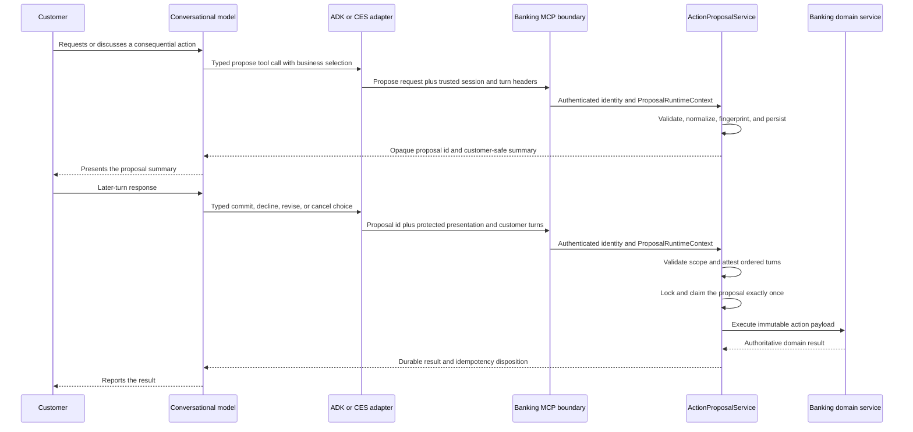

# Runtime-Neutral Banking Action Proposal/Commit Protocol

The action proposal/commit protocol is the shared authorization boundary for
consequential banking actions initiated through conversational runtimes. ADK
with Gemini Live and CX Agent Studio (CES) use the same banking-service
contracts even though they manage audio, turns, prompts, and model sessions
differently.

The protocol separates two kinds of state:

- `ProposalRuntimeContext` is trusted, request-local evidence about who is
  acting, in which session, and on which completed turns.
- `ActionProposal` is the durable, immutable banking action that may be
  presented, confirmed, and executed exactly once.

The model interprets the conversation and chooses a typed operation. It does not
construct the final mutation at commit time, supply its own authorization
evidence, or make transport events authoritative.

## Architectural Invariants

1. Banking service owns the normalized mutation payload and customer-safe
   summary.
2. The model commits an opaque proposal identifier, never a reconstructed
   mutation payload.
3. The semantic decision is the model's typed tool choice: commit, decline,
   revise, or cancel.
4. Trusted runtime evidence is transported outside model-visible tool
   arguments.
5. Turn and media boundaries establish ordering only. They do not interpret
   customer language or authorize an action.
6. Banking service validates identity, scope, session, reset generation,
   proposal type, expiry, lifecycle, and idempotency before execution.
7. An authoritative banking result is the only basis for a success statement or
   UI state change.

There is no confirmation phrase list, regular-expression gate, or transcript
classification callback in the authorization path.

## Current Workflow At A Glance

This is the implemented workflow shared by ADK and CES. Runtime-specific code
adapts provider turns and session identity into trusted evidence, but it does
not decide whether the customer's words constitute authorization.

1. The model identifies a consequential banking action and invokes its typed
   propose tool with the business facts it has gathered.
2. Banking service authenticates the customer and session, resolves current
   domain facts, creates an immutable proposal, and returns an opaque proposal
   id plus a customer-safe summary.
3. The model presents that banking-owned summary. The runtime records the
   presentation checkpoint using provider turn events, without inspecting the
   generated text.
4. On a later customer turn, the model chooses a typed operation: commit,
   decline, revise, cancel, or continue the conversation without advancing the
   proposal.
5. The runtime sends only the opaque proposal id and protected session and turn
   evidence. It never reconstructs the mutation or supplies model-authored
   authorization fields.
6. Banking service validates scope, lifecycle, expiry, reset generation,
   ordered-turn evidence, authorization policy, and current domain
   preconditions. A commit is claimed and executed exactly once in the
   lifecycle-owned transaction.
7. The runtime reports success only from the authoritative banking result. A
   retry uses the same proposal id; a changed action requires a terminal
   disposition and a new proposal.
8. Conversation closeout happens afterward as a separate runtime lifecycle. It
   cannot authorize, execute, or alter the banking proposal.

The three registered production actions currently use the Tier 1
general-acknowledgment policy: the customer agrees to the presented action on a
later turn and the model expresses that agreement through a typed decision.
The same kernel can host stricter protocols, such as required restatement,
verbatim disclosure, trusted UI confirmation, step-up verification, or human
approval, by registering a different authorization policy and its required
trusted evidence. These policies do not require a second lifecycle engine or a
semantic transcript parser.

## Characterized Protocol Baseline

The protocol-refinement baseline is application commit `6c563f3`. The focused
contract suite freezes current behavior before the internal kernel is
extracted. Run it from the repository root with:

```bash
./scripts/test_action_proposal_boundary.sh
```

The command covers the banking lifecycle and transaction boundary, MCP schemas,
CES callback and header binding, ADK evidence projection, negative trajectories,
reset and expiry invalidation, commit retry, and the static prohibition on
semantic transcript gates. The GitHub workflow runs the same script once per
component so failures retain a clear banking or runtime owner.

At this baseline, live ADK and CES golden fraud and Wallet trajectories have
completed in Evo and 1841 with authoritative proposal commits. That deployed
evidence freezes the successful path only. The broader ambiguity,
interruption, recovery, and audio-quality matrix remains qualification work and
must not be represented as a completed Packet 1 guarantee.

### Frozen Current Action Contracts

| Action | Contract | Propose tool | Commit tool | Authoritative UI event |
| --- | --- | --- | --- | --- |
| Fraud triage | `TRIAGE_FRAUD_CASE` / `fraud-triage.v1` | `propose_fraud_triage` | `commit_fraud_triage(proposal_id)` | `FRAUD_CASE_TRIAGED` |
| Card reissue | `REISSUE_CARD` / `card-reissue.v1` | `propose_card_reissue` | `commit_card_reissue(proposal_id)` | `CARD_REPLACED` |
| Google Wallet provisioning | `PROVISION_GOOGLE_WALLET` / `wallet-provisioning.v1` | `propose_wallet_provisioning` | `commit_wallet_provisioning(proposal_id)` | `WALLET_PROVISIONING_QUEUED` |

`decide_action_proposal(proposal_id, decision)` is the shared non-commit
surface. Its allowed decisions are `DECLINE`, `REVISE`, and `CANCEL`. Protected
identity, session, turn, reset, and confirmation fields are prohibited from all
model-visible proposal tool schemas.

### Frozen Transport Evidence

The authenticated MCP boundary currently accepts the following proposal
evidence outside model-visible arguments:

| Header | Owner | Purpose |
| --- | --- | --- |
| `x-banking-session-capability` | CES bootstrap | Bind a CES service call to one authenticated customer and reset generation. |
| `x-support-session-id` | Runtime adapter | Bind the product support interaction. |
| `x-runtime-name` | Runtime adapter | Identify ADK or CES evidence provenance. |
| `x-runtime-session-id` | Runtime adapter | Prevent evidence reuse by another concrete runtime session. |
| `x-customer-turn-id` | Runtime adapter | Identify the current real customer turn. |
| `x-reset-generation` | Banking bootstrap/runtime adapter | Invalidate authority after a reset. |
| `x-catalog-snapshot-id` | Banking bootstrap/runtime adapter | Correlate governed guidance used for the proposal. |
| `x-proposal-presentation-turn-id` | Runtime adapter | Identify the protected presentation turn. |
| `x-proposal-confirmation-turn-id` | Runtime adapter | Identify the later customer decision turn. |
| `x-proposal-confirmation-method` | Runtime adapter | Select the currently supported evidence method, `EXPLICIT_VERBAL`. |
| `x-proposal-confirmation-source` | Runtime adapter | Bind semantics to `MODEL_TOOL_INTENT`, not transcript parsing. |

CES additionally supplies immutable application/deployment provenance headers.
ADK and CES may acquire these values differently, but banking receives the same
proposal evidence vocabulary.

### Frozen Lifecycle Transitions

| From | Operation | To | Replay or rejection behavior |
| --- | --- | --- | --- |
| `PROPOSED` | attest presentation | `PRESENTED` | Same presentation turn replays; a different turn conflicts. |
| `PRESENTED` | typed later-turn commit intent | `CONFIRMED` | Same customer turn replays; missing evidence or another turn conflicts. |
| `PRESENTED` | typed decline | `DECLINED` | Same decline replays as the terminal disposition. |
| `PROPOSED` or `PRESENTED` | revise or cancel | `INVALIDATED` | A replacement requires a new immutable proposal. |
| `CONFIRMED` | claim commit | `COMMITTING` | A concurrent claim does not execute. |
| `COMMITTING` | store authoritative result | `COMMITTED` | A retry returns the durable result. |
| Any unresolved state | expiry | `EXPIRED` | Execution is rejected without mutation. |
| Any unresolved state | reset mismatch | `INVALIDATED` | Execution is rejected with `RESET_GENERATION_CHANGED`. |

Fraud commit additionally reconciles an uncertain `COMMITTING` proposal from
its durable domain idempotency record. Card and Wallet currently use the common
attest-and-claim path but do not yet share that specialized reconciliation
implementation; unifying it is refinement work, not baseline behavior.

### Refinement Decisions

The following decisions constrain the kernel extraction:

- The authoritative active-proposal scope is one authenticated customer and
  support session across action types. Runtime-local conflict checks remain
  fail-closed adapters, not the durable concurrency authority.
- Replacing a proposal requires an explicit terminal decision before a new
  proposal is created. The external operations remain separate; banking must
  serialize their durable session scope so a competing runtime cannot insert a
  proposal between them.
- The lifecycle engine owns the database transaction. Typed domain handlers may
  participate in and flush that transaction but must not commit it.
- Model-visible proposal failures use a stable code, recovery class, proposal
  disposition, and customer-safe message; correlated operator logs retain the
  detailed rejection reason.
- Internal lifecycle stages may remain more detailed than the compact
  disposition returned to runtimes. Extraction must not make implementation
  stages part of the public MCP contract accidentally.

### Active Proposal And Recovery Enforcement

Banking now enforces one unresolved proposal for an authenticated customer and
support session across action types. Creation locks the durable customer scope,
expires stale pre-commit proposals in the same transaction, and rejects a
competing proposal with `ACTIVE_PROPOSAL_EXISTS`. A partial unique database
index over `PROPOSED`, `PRESENTED`, `CONFIRMED`, and `COMMITTING` is the final
cross-process concurrency backstop.

Decline, revise, cancel, expiry, or successful commit releases the active
scope. Lifecycle callers can terminalize the current proposal and create its
replacement within one database transaction. The current runtime-facing revise
flow deliberately remains two explicit operations because it gathers revised
facts between disposition and replacement; it cannot bypass the banking-owned
active-scope check.

Protocol failures use a stable model-safe envelope containing `error`,
`recovery_class`, `message`, and, when safely scoped, the opaque proposal id,
action type, and current status. Operator logs retain the detailed exception
stage and correlated references.

| Error | Recovery class | Model action |
| --- | --- | --- |
| `ACTIVE_PROPOSAL_EXISTS` | `RESOLVE_ACTIVE_PROPOSAL` | Commit, decline, revise, or cancel the returned current proposal. |
| `PROPOSAL_EXPIRED` | `CREATE_NEW_PROPOSAL` | Refresh current facts and create a new proposal. |
| `PROPOSAL_SCOPE_MISMATCH` | `REFRESH_SESSION` | Stop using the stale opaque id and refresh trusted session state. |
| `RESET_GENERATION_CHANGED` | `CREATE_NEW_PROPOSAL` | Re-read current facts after reset and create a new proposal. |
| `PRESENTATION_EVIDENCE_REQUIRED` | `REPRESENT_AND_RECONFIRM` | Present the same proposal and obtain a later explicit decision. |
| `COMMIT_RESULT_PENDING` | `RETRY_SAME_PROPOSAL` | Retry only the same opaque proposal id. |
| `ACTION_PRECONDITION_CHANGED` | `CREATE_NEW_PROPOSAL` | Review authoritative domain state before proposing again. |

### Thin Runtime Adapters

ADK and CES now retain only a protected projection of the current banking
proposal. The projection contains the opaque proposal id and action type,
originating, presentation, and later customer turn ids, plus the local
checkpoint required to retry the same opaque commit after an uncertain result.
It does not copy the canonical action payload, payload fingerprint, proposal
expiry, support-session scope, or banking lifecycle status.

ADK represents its host mechanics as evidence checkpoints such as awaiting
presentation, awaiting a later decision, commit in flight, and same-id retry.
These checkpoints neither expire nor terminalize a banking proposal. Banking's
typed result determines whether ADK retries the same id, re-presents that id,
or clears stale local evidence. Runtime proposal creation and fraud-selection
callbacks no longer reject competing state locally; banking's active-proposal
invariant is authoritative.

Turn ids are opaque provider identifiers and are never parsed or compared for
numeric or lexical order. The trusted runtime adapter establishes chronology by
moving from awaiting presentation to awaiting decision and, where the host
exposes observation time, requiring the customer observation to follow the
recorded presentation. Banking then verifies that the distinct presentation
and decision ids belong to the protected current-turn projection. A runtime
that cannot establish that ordered transition must not emit decision evidence.

CES projects the same opaque identity and ordered turns through declared
variables. Its checked-in MCP contract maps those variables exactly to the
protected transport headers. A commit-retry checkpoint preserves the original
presentation and confirmation turns and permits only the same opaque proposal
id. CES closeout ordering is implemented by a separate callback-owned state
transition and has no banking tool or proposal-tool registration.

The ADK-only customer-reported fraud compatibility path is still a direct
action and therefore retains its existing bounded local authorization payload.
It is not one of the three registered banking proposal actions and is scheduled
for the subsequent fraud-workflow boundary consolidation. This exception must
not be used as a template for new proposal-backed actions.

### Authorization-Policy Baseline

The three current actions use one Tier 1 general-acknowledgment policy:
banking supplies the material facts, the model may express them naturally, and
a later customer turn causes the model to choose a typed decision. Presentation
quality is release evidence rather than a production transcript parser.

The internal kernel now distinguishes lifecycle mechanics from authorization
policy. `RuntimeEvidenceValidator` evaluates protected evidence against the
registered `AuthorizationPolicy`; `ProposalLifecycleEngine` owns durable
transitions and the common execute/reconcile transaction; and explicit
`ActionSpecification` registrations bind the three current actions to typed
handlers. A stricter required-restatement policy requires deterministic
presentation acknowledgment before accepting the same typed decision, without
forking the durable lifecycle. That stricter profile is contract-tested but is
not enabled for a production action.

Every consequential `ActionSpecification` must now declare a risk tier and an
action-specific `PresentationRequirement`. Registration fails if required
facts are absent, if flexible summaries prohibit natural phrasing, or if a
deterministic policy lacks typed trusted acknowledgment. The current Tier 1
requirements are:

| Action | Required banking facts | Quality gate | Phrasing |
| --- | --- | --- | --- |
| Fraud triage | reviewed activity selection; card last four; proposed disposition; replacement and escalation consequences | release evaluation | natural phrasing allowed |
| Card reissue | card last four; current-card blocking; replacement-card form | release evaluation | natural phrasing allowed |
| Google Wallet | card last four; Wallet provider; action is queued rather than completed | release evaluation | natural phrasing allowed |

For these actions, deterministic production authorization validates protected
turn ordering and typed model intent. Presentation completeness and natural
voice quality are evaluated through the versioned ADK/CES trajectory and
conversational-reference sets. Transcript wording is not reparsed at runtime,
and interruption, VAD, playout, or audio completion cannot authorize an action.

Stricter policies use the same lifecycle but must select an explicit typed
extension:

| Extension | Required contract |
| --- | --- |
| Required fact restatement | deterministic acknowledgment naming every required fact and a trusted render artifact |
| Verbatim disclosure | governed disclosure reference, no paraphrase, and trusted render acknowledgment |
| Explicit UI | trusted UI intent bound to the proposal and deterministic UI presentation evidence |
| Step-up | trusted step-up assertion bound to the proposal after deterministic presentation |
| Human approval | Tier 3 policy with trusted human-approval evidence |

These extension points are contract-tested but have no registered production
actions. A plain boolean, model-authored tool argument, transcript match, or
untyped evidence dictionary cannot satisfy them.

### Qualification And Promotion

Protocol and negative-path suites are deterministic release gates and must pass
at 100%. The versioned ADK/CES trajectory matrix covers questions, ambiguity,
interruption, decline, revision, later confirmation, tool failure, retry,
Wallet, and closeout behavior. Managed CES contract and conversational replays
bind their results to an immutable app version. Real-browser microphone,
playout, and barge-in checks remain bounded live canaries; they provide release
evidence and never create authorization evidence.

A qualified or promoted release is one coherent unit. Manifest schema version 3
pins all four service images, CES configuration and immutable version, Knowledge
Catalog snapshot, Alembic head, and validation results. It also embeds the URI,
digest, and complete runtime identity of one previously successful manifest in
the same environment. The release controller rejects mutable or missing rollback
images and cross-environment rollback targets. Database migration remains
forward-only, so the selected application rollback must remain compatible with
the current schema.

## Component Ownership

| Component | Responsibility |
| --- | --- |
| Conversational model | Understand the customer's request, gather needed facts, present the banking-owned summary, and choose a typed proposal decision. |
| ADK or CES runtime adapter | Bind authenticated session identity and actual turn references to each MCP request. |
| `ProposalRuntimeContext` | Parse trusted transport fields for the current request without interpreting customer or assistant prose. |
| `RuntimeEvidenceValidator` | Enforce the action's typed decision and presentation-evidence policy. |
| `ProposalLifecycleEngine` | Create immutable proposals and own lifecycle, scope, expiry, reset, claim, transaction, idempotency, and reconciliation mechanics. |
| `ActionProposalService` | Preserve the existing application/MCP façade and register the three banking action specifications. |
| Typed banking action handlers | Validate current domain preconditions and perform fraud, card, or Wallet mutation inside the lifecycle-owned transaction. |
| Audit and UI event surfaces | Record and display authoritative proposal dispositions and domain outcomes. |
| Knowledge Catalog | Supply governed policy and presentation guidance whose snapshot can be bound to a proposal. |

## End-to-End Flow



## Trusted Runtime Context

`ProposalRuntimeContext` is a frozen request object created from authenticated
transport headers at the banking MCP boundary. It contains:

- support session id
- runtime name and runtime session id
- current customer turn id
- reset generation
- optional Knowledge Catalog snapshot id
- proposal presentation turn id
- later customer decision turn id
- confirmation method and source

For a typed proposal decision, the context requires a real customer turn, a
presentation turn distinct from the decision turn, the current customer turn to
match the protected decision turn, `EXPLICIT_VERBAL` as the method, and
`MODEL_TOOL_INTENT` as the source. These checks prove ordering and provenance;
they do not inspect the words spoken by the customer.

ADK captures this evidence in `McpRequestEvidence` and adds it through the MCP
request header provider. The values are not model tool parameters. CES supplies
equivalent protected values through its scoped, signed session capability and
MCP transport configuration. The `requires_user_assertion` MCP boundary
authenticates the caller and customer before making the parsed context available
to the selected tool invocation.

## Durable Action Proposal

An `ActionProposal` is a typed, versioned record owned by banking service. It
contains:

- opaque proposal id
- action type and contract version
- canonical immutable action payload and payload fingerprint
- customer, account, support-session, runtime, and runtime-session scope
- originating customer turn and reset generation
- optional catalog snapshot
- confirmation policy
- banking-generated customer-safe summary
- idempotency key, creation time, and expiry
- presentation, confirmation, disposition, and result evidence

The implemented action contracts are:

| Action | Contract |
| --- | --- |
| Fraud triage | `TRIAGE_FRAUD_CASE` / `fraud-triage.v1` |
| Card reissue | `REISSUE_CARD` / `card-reissue.v1` |
| Google Wallet provisioning | `PROVISION_GOOGLE_WALLET` / `wallet-provisioning.v1` |

Proposal creation resolves sensitive operational details in banking service. For
example, card reissue binds the currently eligible card and Wallet provisioning
binds the active virtual card token. The conversational runtime receives only
the opaque id, safe summary, display selection, policy, and expiry needed to
continue the interaction.

## Lifecycle and Transaction Semantics

The successful lifecycle is:

```text
PROPOSED -> PRESENTED -> CONFIRMED -> COMMITTING -> COMMITTED
```

`DECLINED`, `INVALIDATED`, and `EXPIRED` are terminal dispositions. Revise and
cancel are typed non-commit decisions that invalidate the current immutable
proposal; a changed action is represented by a new proposal.

Presentation and confirmation are attested when the later typed decision reaches
banking service. Banking service locks the proposal, applies the protected turn
evidence, validates current scope and preconditions, and claims execution in the
same transactional path. If that transaction rolls back, its intermediate
lifecycle changes roll back with it.

The idempotency key and canonical payload fingerprint make repeated proposal
creation deterministic: the same request resolves to the same proposal, while
payload drift under the same key is rejected. A commit lock and `COMMITTING`
claim prevent concurrent execution. A completed result is durable and can be
returned as an idempotent replay if the original response was interrupted.

## Typed Decisions and Conversational Flexibility

The protocol does not prescribe a lexical conversation state machine. A
customer may ask questions, express uncertainty, correct the selection, decline,
or continue another topic. The model uses the conversation to select the next
typed operation:

- commit the presented proposal
- decline it
- revise it and create a replacement proposal
- cancel it
- ask or answer a question without advancing the proposal

Only the typed operation advances durable banking state. This preserves natural
conversation while keeping the consequential boundary deterministic.

## Policy, Observability, and Evaluation

Knowledge Catalog guidance controls governed policy and customer-facing
presentation behavior; live banking state and tool results remain operational
truth. The applicable catalog snapshot is carried in trusted runtime context and
stored with the proposal.

Audit events correlate the proposal id, contract, runtime, session, payload
fingerprint, disposition, and domain result. Runtime-neutral trajectory events
verify the conversational contract—complete presentation, later-turn typed
decision, authoritative result reporting—without making transcript parsing part
of production authorization. See [Agent Trajectory Evaluation](./agent_trajectory_evaluation.md).

Session closeout is a separate runtime concern. It may occur only after the
consequential action result has been presented, but it does not participate in
proposal authorization or banking mutation. A successful banking-action
callback opens `OFFER_PENDING`; completion of the follow-on model response
promotes it to `OFFERED` without inspecting generated text. After validating
that trusted checkpoint on a later customer turn, the closeout agent produces
one farewell and calls CES'
native `end_session` in the same turn. The resulting CES protocol `EndSession`
signal stops further customer input but does not truncate the provider response:
the proxy consumes trailing Bidi frames through a bounded terminal-output idle
interval, flushes all received frames to the browser, and the browser drains its
scheduled AudioContext playout before local teardown. No transcript
interpretation, closeout bookkeeping tool, synthetic event, or second model
generation participates in teardown.

## Implementation Map

- Trusted context: `banking-service/services/action_proposal_context.py`
- Authorization policies, evidence validation, and action specifications:
  `banking-service/services/proposal_protocol.py`
- Durable lifecycle and transaction engine:
  `banking-service/services/proposal_lifecycle.py`
- Application façade and typed domain dispatch:
  `banking-service/services/action_proposals.py`
- Durable model: `banking-service/models/action_proposal.py`
- MCP authentication and request-local context:
  `banking-service/routers/mcp/utils.py`
- Typed credit-card MCP tools: `banking-service/routers/mcp/credit_card.py`
- ADK proposal evidence adapter:
  `adk-agent/credit-support-agent/agent/proposal_evidence.py`
- CES proposal callbacks:
  `gecx/Credit_Support_Voice_Agent/agents/Credit_Card_Support_Agent/`
- CES closeout agent and checkpoint callbacks:
  `gecx/Credit_Support_Voice_Agent/agents/Session_Closeout_Agent/` and
  `gecx/Credit_Support_Voice_Agent/agents/Credit_Card_Support_Agent/`
- CES Bidi transport and terminal-output drain:
  `banking-service/services/voice_bidi.py`
- Runtime-neutral qualification entry point:
  `scripts/test_action_proposal_boundary.sh`
- CES managed and local SCRAPI qualification:
  `scripts/cxas/ces_voice_qualification.py` and `scripts/cxas/README.md`
