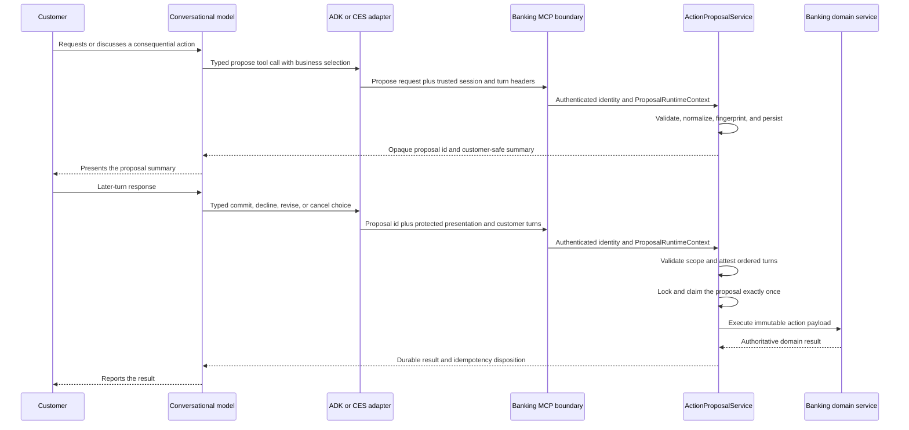

# Runtime-Neutral Banking Action Proposal/Commit Protocol

The action proposal/commit protocol is the shared authorization boundary for
consequential banking actions initiated through conversational runtimes. ADK
with Gemini Live and CX Agent Studio (CES) use the same banking-service
contracts even though they manage audio, turns, prompts, and model sessions
differently.

The protocol separates two kinds of state:

- `ProposalRuntimeContext` is trusted, request-local evidence about who is
  acting, in which session, and on which completed turns.
- `ActionProposal` is the durable, immutable banking action that may be
  presented, confirmed, and executed exactly once.

The model interprets the conversation and chooses a typed operation. It does not
construct the final mutation at commit time, supply its own authorization
evidence, or make transport events authoritative.

## Architectural Invariants

1. Banking service owns the normalized mutation payload and customer-safe
   summary.
2. The model commits an opaque proposal identifier, never a reconstructed
   mutation payload.
3. The semantic decision is the model's typed tool choice: commit, decline,
   revise, or cancel.
4. Trusted runtime evidence is transported outside model-visible tool
   arguments.
5. Turn and media boundaries establish ordering only. They do not interpret
   customer language or authorize an action.
6. Banking service validates identity, scope, session, reset generation,
   proposal type, expiry, lifecycle, and idempotency before execution.
7. An authoritative banking result is the only basis for a success statement or
   UI state change.

There is no confirmation phrase list, regular-expression gate, or transcript
classification callback in the authorization path.

## Component Ownership

| Component | Responsibility |
| --- | --- |
| Conversational model | Understand the customer's request, gather needed facts, present the banking-owned summary, and choose a typed proposal decision. |
| ADK or CES runtime adapter | Bind authenticated session identity and actual turn references to each MCP request. |
| `ProposalRuntimeContext` | Parse and validate trusted transport evidence for the current request. |
| `ActionProposalService` | Create immutable proposals; enforce lifecycle, scope, expiry, reset, concurrency, and idempotency; dispatch the typed domain commit. |
| Banking domain services | Perform the actual fraud, card, or Wallet mutation within the claimed transaction. |
| Audit and UI event surfaces | Record and display authoritative proposal dispositions and domain outcomes. |
| Knowledge Catalog | Supply governed policy and presentation guidance whose snapshot can be bound to a proposal. |

## End-to-End Flow



## Trusted Runtime Context

`ProposalRuntimeContext` is a frozen request object created from authenticated
transport headers at the banking MCP boundary. It contains:

- support session id
- runtime name and runtime session id
- current customer turn id
- reset generation
- optional Knowledge Catalog snapshot id
- proposal presentation turn id
- later customer decision turn id
- confirmation method and source

For a typed proposal decision, the context requires a real customer turn, a
presentation turn distinct from the decision turn, the current customer turn to
match the protected decision turn, `EXPLICIT_VERBAL` as the method, and
`MODEL_TOOL_INTENT` as the source. These checks prove ordering and provenance;
they do not inspect the words spoken by the customer.

ADK captures this evidence in `McpRequestEvidence` and adds it through the MCP
request header provider. The values are not model tool parameters. CES supplies
equivalent protected values through its scoped, signed session capability and
MCP transport configuration. The `requires_user_assertion` MCP boundary
authenticates the caller and customer before making the parsed context available
to the selected tool invocation.

## Durable Action Proposal

An `ActionProposal` is a typed, versioned record owned by banking service. It
contains:

- opaque proposal id
- action type and contract version
- canonical immutable action payload and payload fingerprint
- customer, account, support-session, runtime, and runtime-session scope
- originating customer turn and reset generation
- optional catalog snapshot
- confirmation policy
- banking-generated customer-safe summary
- idempotency key, creation time, and expiry
- presentation, confirmation, disposition, and result evidence

The implemented action contracts are:

| Action | Contract |
| --- | --- |
| Fraud triage | `TRIAGE_FRAUD_CASE` / `fraud-triage.v1` |
| Card reissue | `REISSUE_CARD` / `card-reissue.v1` |
| Google Wallet provisioning | `PROVISION_GOOGLE_WALLET` / `wallet-provisioning.v1` |

Proposal creation resolves sensitive operational details in banking service. For
example, card reissue binds the currently eligible card and Wallet provisioning
binds the active virtual card token. The conversational runtime receives only
the opaque id, safe summary, display selection, policy, and expiry needed to
continue the interaction.

## Lifecycle and Transaction Semantics

The successful lifecycle is:

```text
PROPOSED -> PRESENTED -> CONFIRMED -> COMMITTING -> COMMITTED
```

`DECLINED`, `INVALIDATED`, and `EXPIRED` are terminal dispositions. Revise and
cancel are typed non-commit decisions that invalidate the current immutable
proposal; a changed action is represented by a new proposal.

Presentation and confirmation are attested when the later typed decision reaches
banking service. Banking service locks the proposal, applies the protected turn
evidence, validates current scope and preconditions, and claims execution in the
same transactional path. If that transaction rolls back, its intermediate
lifecycle changes roll back with it.

The idempotency key and canonical payload fingerprint make repeated proposal
creation deterministic: the same request resolves to the same proposal, while
payload drift under the same key is rejected. A commit lock and `COMMITTING`
claim prevent concurrent execution. A completed result is durable and can be
returned as an idempotent replay if the original response was interrupted.

## Typed Decisions and Conversational Flexibility

The protocol does not prescribe a lexical conversation state machine. A
customer may ask questions, express uncertainty, correct the selection, decline,
or continue another topic. The model uses the conversation to select the next
typed operation:

- commit the presented proposal
- decline it
- revise it and create a replacement proposal
- cancel it
- ask or answer a question without advancing the proposal

Only the typed operation advances durable banking state. This preserves natural
conversation while keeping the consequential boundary deterministic.

## Policy, Observability, and Evaluation

Knowledge Catalog guidance controls governed policy and customer-facing
presentation behavior; live banking state and tool results remain operational
truth. The applicable catalog snapshot is carried in trusted runtime context and
stored with the proposal.

Audit events correlate the proposal id, contract, runtime, session, payload
fingerprint, disposition, and domain result. Runtime-neutral trajectory events
verify the conversational contract—complete presentation, later-turn typed
decision, authoritative result reporting—without making transcript parsing part
of production authorization. See [Agent Trajectory Evaluation](./agent_trajectory_evaluation.md).

Session closeout is a separate runtime concern. It may occur only after the
consequential action result has been presented, but it does not participate in
proposal authorization or banking mutation.

## Implementation Map

- Trusted context: `banking-service/services/action_proposal_context.py`
- Proposal lifecycle and domain dispatch:
  `banking-service/services/action_proposals.py`
- Durable model: `banking-service/models/action_proposal.py`
- MCP authentication and request-local context:
  `banking-service/routers/mcp/utils.py`
- Typed credit-card MCP tools: `banking-service/routers/mcp/credit_card.py`
- ADK trusted header adapter:
  `adk-agent/credit-support-agent/agent/agent.py`
