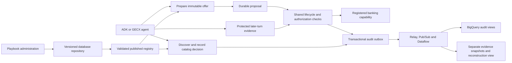

# Banking action proposal protocol

The proposal protocol is the shared control boundary for consequential banking actions initiated by conversational agents. ADK with Gemini Live and GECX/CES use the same banking contracts. The agent selects a published playbook and explains an offer; banking prepares its facts, validates authorization, and executes the pinned action through a durable lifecycle.

A **playbook definition** describes an available action. A **proposal** is a durable instance with resolved banking facts, customer and session scope, and an immutable definition identity. Its action facts are fixed; its lifecycle state advances as it is presented, authorized, executed, declined, invalidated, or expired. Discovery and preparation do not authorize the banking action.

## Architecture


```mermaid
flowchart LR
    Agent[ADK or GECX agent] --> Discovery[Discover and record catalog decision]
    Admin[Playbook administration] --> Repository[Versioned database repository]
    Repository --> Registry[Validated published registry]
    Registry --> Discovery
    Agent --> Prepare[Prepare immutable offer]
    Registry --> Prepare
    Prepare --> Proposal[Durable proposal]
    Agent --> Evidence[Protected later-turn evidence]
    Proposal --> Lifecycle[Shared lifecycle and authorization checks]
    Evidence --> Lifecycle
    Lifecycle --> Capability[Registered banking capability]
    Lifecycle --> Outbox[Transactional audit outbox]
    Discovery --> Outbox
    Outbox --> Lakehouse[Relay, Pub/Sub and Dataflow]
    Lakehouse --> BigQuery[BigQuery audit views]
    Lakehouse --> Archive[Separate evidence snapshots and reconstruction view]
```

| Component | Responsibility |
| --- | --- |
| `services/proposal_definitions.py` | Validate definition documents, calculate canonical digests, bind registered capabilities, and compile the registry. One `ServiceActionHandler` serves the supported execution type. |
| `services/playbook_repository.py` | Repository contract, SQL and memory adapters, explicit publication heads, detached catalog snapshots, and historical revision resolution. |
| `services/playbook_administration.py` and `routers/playbooks_admin.py` | Administrator authoring, validation, comparison, publication concurrency, and transactional management evidence. |
| `services/proposal_capabilities.py` | Code-owned input and payload contracts, authoritative fact preparation, eligibility and execution functions, result hooks, and domain reconciliation. |
| `services/proposal_protocol.py` | Specifications, registry resolution, authorization policy, required presentation facts, and runtime evidence validation. |
| `services/proposal_lifecycle.py` | Scope, expiry, locking, idempotency, state transitions, commit claims, authoritative results, and transactional transition audit. |
| `services/action_proposals.py` | Authenticated orchestration, generic preparation and commit, customer decisions, and rejected-request audit. |
| `services/playbook_discovery.py` and `routers/mcp/playbooks.py` | Published catalog descriptions, generic model-facing tools, and recorded catalog decisions. |
| `services/proposal_audit.py` | Versioned, minimal audit envelopes and references linking definitions, facts, evidence, decisions and outcomes. |
| `services/proposal_evidence.py` | Canonical self-contained snapshots, recursive fact/result allowlists, policy copies and immutable artifact identifiers. |
| Runtime adapters | Trusted session and turn context, pending-proposal state, presentation checkpoints, language changes, UI events, and consultation closeout. |

Paths in this table are relative to `banking-service/`.

## Definitions, publication and storage

Playbooks are versioned JSON documents stored in `admin.playbooks` and `admin.playbook_revisions` in the banking database. `PlaybookRepository` defines the storage contract, with SQL and memory adapters. The supported execution type is `service_action`. All current playbooks share one handler and one lifecycle engine; there is no class or module per playbook. Bundled files in `banking-service/config/action_definitions/` supply initial definitions and code-owned capability templates.

| Definition | Registered operation | Banking outcome |
| --- | --- | --- |
| `fraud-triage.v2.json` | `fraud.triage.v1` | Review the complete recognized/disputed selection and apply the configured fraud remediation or recognized-alert closure. |
| `card-reissue.v2.json` | `cards.issue_replacement.v1` | Block the affected card and issue a replacement. |
| `google-wallet-provisioning.v2.json` | `cards.queue_wallet.v1` | Queue an eligible active virtual card for Google Wallet. Queued does not mean installed or ready to pay. |
| `credit-limit-increase.v1.json` | `credit.adjust_limit.v1` | Apply an eligible USD demo credit-limit increase after later confirmation. |

A definition contains its ID and revision, action and contract identifiers, registered operation, bounded parameters and literal bindings, presentation contract, authorization policy, and discovery metadata. References bind registered capabilities; they do not execute arbitrary Python, SQL or expressions. Input validation and mandatory operation constraints remain code-owned. Adding another definition over a supported capability does not add an agent tool or handler. A new banking capability requires code and qualification.

Each playbook has an explicit current publication pointer. Drafts are excluded from discovery; a higher revision number alone does not publish a definition. Discovery metadata and executable configuration share a canonical SHA-256 digest. Each proposal in `operations.action_proposals` pins `definition_id`, `definition_revision`, and `definition_digest`, together with normalized action facts, their fingerprint, customer-safe presentation, protected evidence and result. Published revisions remain available for exact historical resolution and cannot be updated or deleted. PostgreSQL and SQLite triggers enforce published-row immutability.

The runtime compiles a consistent repository snapshot with explicit published heads and retained history. Fresh preparation checks and locks the authoritative publication head, rejecting stale discovery and requiring rediscovery. Existing proposal retries and commits resolve the original pin. Database failures do not silently fall back to bundled definitions. Initial bootstrap imports bundled history without changing its canonical identity; it never replaces a populated operational catalog. The admin schema is preserved by customer and demo resets.

## Playbook administration

The Banking UI provides `/admin/playbooks` for catalog browsing, revision history, supported-capability draft creation, structured discovery-guidance editing, advanced configuration, saved-draft validation, structural comparison, and explicit publication. Published definitions are read-only. A new configured playbook uses its own ID and unique action type while sharing a registered operation. An existing playbook's execution identity remains fixed.

Every `/admin/playbooks` backend endpoint enforces `require_admin_user`, including reads and capability templates. Signing into the UI does not grant authoring authority. Actor provenance comes from the verified token. Draft edits carry an expected draft version; cloning and publishing carry an expected publication generation. Conflicts require reloading the current state instead of overwriting it.

Publishing revalidates the saved definition against registered operations, required presentation facts, public projections, and the supported authorization policy inside the publication transaction. The publication pointer, immutable revision, management audit event, and restricted canonical evidence snapshot commit together. Draft creation and editing record bounded management metadata; raw editable draft text does not enter the ordinary audit stream. Administration does not execute financial actions, establish customer eligibility, or provide customer confirmation.

## Credit-limit increase

The credit-limit playbook requires `requested_limit_minor`, a strict integer new
total limit, and `currency_code`. For $7,500.00 USD, the amount is `750000`.
Missing totals, floats, booleans, aliases and model-selected percentages are
refused. Only USD is eligible because the product catalog stores USD limit
bounds; other recognized currencies receive a bounded policy refusal.

The versioned demo policy requires one unambiguous owned account, active account
and product, valid product bounds, a strict increase within the product bounds,
and a maximum new total of twice the current limit. Values and projected
available credit must remain within canonical Money range. This policy is demo
servicing, not credit-bureau underwriting or a submission for manual review.
The offer states current limit, proposed limit, increase and the consequence that
confirmation applies the eligible demo increase.

Banking owns the decision independently of the agent's catalog selection and
customer confirmation. `services/decisioning.py` defines a typed
`DecisioningProvider` contract and an in-process deterministic demo adapter.
The operator selects `STANDARD`, `DECLINE`, `NEEDS_INFORMATION` or
`REFER_FOR_REVIEW` through `config/decisioning/demo.v1.json` and optional
`BANK_DECISIONING_SCENARIO`; these controls are never model inputs. The generic
receipt contains provider-qualified decision ID, outcome, approved Money,
bounded reason codes, policy identity/version/digest, aware evaluation/expiry
times and checked request/scope/input evidence references. Only `APPROVED`
creates an offer; other outcomes change no limit and do not imply a manual
review was submitted. Provider/config failures and inconsistent receipts fail
closed. Counteroffers require a separate contract and are refused in this slice.

The provider evaluates before execution locks. The current adapter has no
network calls. A future adapter implements the same receipt contract while
providing local policy metadata; remote revocation and broader underwriting
require an explicitly qualified contract. The retained local execution guards,
including the demo ceiling, still bound an injected provider's approval.

Preparation preserves the exact decision receipt, checked request, policy
identity, revision, digest, product bounds and account eligibility facts. It does not change financial state. Commit locks
both account and product, rechecks the pinned facts, and invalidates a stale
offer. Spending or payment changes alone do not invalidate a limit offer: the
increase delta applies to the latest locked available credit. Account update,
financial audit, proposal state and evidence outbox persist atomically. Replaying
a committed proposal returns its stored result without another increase.
Commit also verifies the pinned approval scope/amount/input references, current
local policy, expiry and provider-qualified unique binding. It rechecks freshness
after waiting for account/product locks. A nullable unique `bank_decision_ref`
on the proposal reserves a decision for one proposal; invalidation, cancellation
or expiry never releases it. Its `COMMITTED` state consumes approval in the same
financial transaction. An exact preparation retry returns the immutable existing
offer before invoking decisioning again; changed inputs or scope reject the retry.

Restricted snapshots preserve approved decisions, checked requests, policy/facts
and evaluated arithmetic. Nonapprovals and unavailable/invalid provider responses
archive typed `BANK_DECISION` evidence with only bounded checked facts, validated
metadata and failure codes; raw provider responses and exception text are excluded.
Typed eligibility refusals after ownership is established archive the exact
resolved definition, bounded refusal code, requested amount and evaluated facts.
Stale refusals preserve both approved and observed facts. Malformed requests or
unavailable/ambiguous ownership expose no account facts. The generic commit emits
`LIMIT_UPDATED` with canonical `credit_limit` and `available_credit` Money fields.
ADK and CES use the generic proposal tools; no direct limit mutation tool is
published to the model.

## Generic agent tools

| Tool | Inputs and effect |
| --- | --- |
| `discover_playbooks` | Receives a bounded description of the customer need. Returns the complete small published catalog, public input schemas, applicability, exclusions, prerequisites, examples, and a durable `discovery_id`. Eligibility is `NOT_CHECKED`. |
| `record_playbook_decision` | Records `SELECT`, `CLARIFY`, or `NO_ACTION` against a scoped discovery result, with a bounded reason and optional published criterion reference. Does not prepare or authorize an action. |
| `prepare_action_proposal` | Receives exact playbook ID, revision and digest plus `inputs_json`, a serialized JSON object containing only declared business inputs. Validates inputs and banking eligibility and creates a durable offer. |
| `commit_action_proposal` | Receives only the opaque proposal ID. Validates protected authorization and current banking preconditions and executes the pinned operation. |
| `decide_action_proposal` | Receives the proposal ID and a later `DECLINE`, `REVISE` or `CANCEL` decision. Revision or cancellation invalidates the offer; changed facts require a new proposal. |

Discovery performs no server-side semantic ranking or keyword routing. The agent compares the published descriptions with the customer need and trusted account context. It may select one playbook, ask a focused clarification, or choose no action. It records that choice silently; internal audit mechanics do not belong in the customer conversation.

`PlaybookRetriever` isolates candidate retrieval behind discovery. The active adapter returns the full published catalog. Discovery verifies distinct exact published pins and projects canonical metadata itself. A filtering or ranking adapter must preserve that contract and cannot establish eligibility or authorization. The [selection evaluation runner and corpus](../../../adk-agent/credit-support-agent/tests/fixtures/PLAYBOOK_SELECTION_EVAL.md) measure synthetic direct, indirect, ambiguous, overlapping, clarification, and no-action cases, reporting semantic selection separately from reason-code, criterion, pin, and preparation safety. Recorded model responses are distinct from offline tests of the scorer and from qualification of a complete voice runtime.


`SELECT` uses reason `APPLICABLE` and a zero-based `when_to_use` criterion index. `CLARIFY` uses `AMBIGUOUS_INTENT`, `MISSING_INPUT`, or `UNCERTAIN_PREREQUISITE`; a named playbook cites `prerequisites`. `NO_ACTION` uses `NO_MATCH`, `UNSUPPORTED_REQUEST`, `ALREADY_SATISFIED`, or `INFORMATION_ONLY`; a named playbook cites `when_not_to_use`. The tool accepts only a criterion index; banking derives the metadata field from the decision. Catalog-wide clarification or no match needs no specific playbook. Banking checks the discovery scope and criterion reference, not the truth of the model's semantic assessment.

Preparation needs no preliminary permission question for a clear need. The agent presents the banking-authored offer, preserves every required fact and consequence, and stops for a later explicit customer confirmation. Questions and uncertainty do not advance authorization. Monetary facts remain canonical numeric currency in response text, with natural voice pronunciation and no recalculation or invented exchange rates.

## Protected authorization

The model interprets the customer response once and chooses a typed operation. It cannot supply its own customer identity, session identity, reset generation, presentation evidence or confirmation evidence through business tool arguments. Runtime adapters transport those values outside model-visible schemas.

| Protected context | Purpose |
| --- | --- |
| Customer identity and CES session capability | Resolve the authenticated banking customer. |
| Support session, runtime name and runtime session | Bind the proposal and evidence to the current interaction. |
| Current customer turn and reset generation | Require an actual completed customer turn and reject authority invalidated by reset. |
| Catalog snapshot | Correlate approved guidance used for the interaction. |
| Presentation and later customer decision turn | Establish ordering of the offer and model-selected decision. |
| Confirmation method and source | Identify `EXPLICIT_VERBAL` and `MODEL_TOOL_INTENT` for the supported policy. |

Banking validates identity, scope, lifecycle, expiry, definition pin, protected evidence, and current domain preconditions. There is no confirmation phrase list, regex classifier or secondary transcript interpretation in the authorization path.

The published definitions bind `general_acknowledgment.v1`: flexible presentation with required facts qualified through release evaluation and an explicit later customer decision. Protected turn evidence establishes sequencing and provenance; it does not independently prove the spoken content or customer comprehension. Stricter policies require an implemented policy binding, trusted evidence source and qualification; a definition author cannot weaken banking authorization constraints.

## Lifecycle and transaction behavior

| State change | Meaning |
| --- | --- |
| Creation → `PROPOSED` | Banking facts and the definition identity are fixed for the offer. |
| `PROPOSED` → `PRESENTED` | Protected evidence attests a presentation checkpoint. |
| `PRESENTED` → `CONFIRMED` | A later model-selected commit decision has accepted protected evidence. |
| `PRESENTED` → `DECLINED` | A later customer decline ends the proposal. |
| Revision or cancellation → `INVALIDATED` | The offer cannot execute; changed facts need another proposal. |
| `CONFIRMED` → `COMMITTING` | The lifecycle claims execution while holding the proposal lock. |
| `COMMITTING` → `COMMITTED` | The authoritative result is durably stored. |
| Expiry → `EXPIRED` | The proposal cannot execute. |
| Reset mismatch or changed preconditions → `INVALIDATED` | Previously prepared authority or facts are no longer usable. |

Only one unresolved proposal is allowed per customer/support session. Scoped idempotency keys bind preparation retries to the same immutable action. Proposal locking and durable results prevent duplicate execution; retries return the existing result or a pending disposition. Registered reconciliation recovers an uncertain outcome where the capability supports it.

Lifecycle state, transition audit, and domain mutations commit in the same database transaction. A failed transaction removes its tentative transitions and success records. A commit-started event records an accepted execution claim; it is not proof that the banking mutation completed. Presentation and confirmation may be persisted together when a later decision arrives, so their audit timestamps indicate recording time, not independently measured speech times.

Only an authoritative successful tool result can justify a success statement or UI state change. Runtime closeout follows the banking action as a separate lifecycle and cannot authorize an action.

## Audit contract and BigQuery

Proposal audit envelopes use schema version `2` and `audit_contract: proposal-audit.v2`. They are append-only outbox records. Each contains minimal identifiers or pseudonymous references, banking build provenance, and bounded metadata appropriate to its stage.

| Event | Recorded evidence |
| --- | --- |
| `PLAYBOOK_DISCOVERED` | Scoped session and turn, customer reference, need fingerprint, exact returned definition identities, catalog fingerprint, and unchecked eligibility. Raw customer wording is omitted. |
| `PLAYBOOK_DECISION_RECORDED` | Discovery reference, declared selection/clarification/no-action reason, optional pinned definition and criterion index/fingerprint, and `MODEL_TOOL_SELECTION` provenance. |
| `ACTION_PROPOSAL_PROPOSED`, `PRESENTED`, `CONFIRMED`, `COMMIT_STARTED`, `COMMITTED` | Definition pin, registered operation and authorization policy, required fact keys and quality gate, action/presentation/result fingerprints, state, session references, protected evidence references and available outcome codes. |
| `ACTION_PROPOSAL_DECLINED`, `INVALIDATED`, `EXPIRED` | The same shared transition envelope plus the terminal reason. |
| `ACTION_PROPOSAL_COMMIT_RECONCILED` | Recovery of an authoritative result through registered reconciliation. |
| `ACTION_PROPOSAL_REQUEST_REJECTED`, `ACTION_PROPOSAL_REQUEST_FAILED` | Request operation and fingerprint, bounded failure code, requester scope, attempted proposal reference when supplied, and no assertion of accepted authorization evidence. It does not resolve a potentially foreign proposal into the audit payload. |

A transition has a stable event ID derived from its proposal and stage. Replays do not append another transition for the same recorded state. Discovery, declared catalog decisions and failed request attempts have separate event IDs; repeated invocations remain distinct observations.

Contract rejections are distinguished from unexpected request failures, whose execution certainty is recorded as unknown. This avoids interpreting an infrastructure error as proof that a banking action did not happen. Rejected authenticated service requests are recorded in a new transaction after rollback, preserving the rejection without committing failed banking changes. Audit write failure is surfaced. Model-facing malformed JSON and invalid proposal IDs also use the rejected-request boundary. Requests lacking trusted runtime context, authentication failures and attempts stopped inside a runtime before reaching banking belong to transport/runtime telemetry rather than this banking outbox contract.

Each lifecycle event, catalog discovery and declared catalog decision also creates a `proposal-evidence.v1` snapshot in the same source transaction. The metadata event carries `evidence_artifact.id` and `evidence_artifact.digest`; the separate `PROPOSAL_EVIDENCE_SNAPSHOT` outbox record contains the exact canonical JSON string and its SHA-256 digest. Evidence writes participate in rollback: neither a banking mutation nor its successful audit can commit without its snapshot.

Lifecycle snapshots preserve the exact published definition, the effective authorization and presentation policies, banking scope and source identifiers, the banking-generated offer and allowlisted facts, accepted protected authorization provenance, allowlisted outcome facts and lifecycle timestamps. Fraud facts retain original and billing Money and source posting/authorization references; outcome projections retain released holds, provisional credits and replacement identifiers. Recursive code-owned field allowlists exclude card tokens and unrecognized nested fields. Catalog snapshots retain all returned definition documents, and decision snapshots retain the chosen criterion text and reference the archived catalog. Rejected requests contain requester metadata only and do not retrieve a foreign proposal's evidence.

Dataflow verifies the snapshot digest and routes evidence exclusively to `proposal_evidence.snapshots`, separate from `compliance_audit.audit_events`. The deduplicated BigQuery `proposal_evidence.snapshots` view preserves the canonical string for independent digest verification. Reconstruction uses these snapshots and metadata rather than mutable proposal rows, live catalog files or retained operational banking source rows. The offer snapshot is the banking-generated presentation, not a recording or proof of the exact words spoken. Credentials, raw conversations, model reasoning and arbitrary exception text are not archived.

The full demo reset preserves the outbox and relay checkpoint. Ordinary outbox pruning excludes evidence snapshots because Pub/Sub publication is not proof of archive ingestion. Local evidence therefore remains a recovery copy until an explicitly verified retention process is provided. Lakehouse snapshots have no configured row-expiration policy; Iceberg time-travel snapshot expiration does not delete current append-only evidence rows. This is append-only application evidence with digest verification, not a WORM or independently tamper-proof storage guarantee.

The evidence BigQuery dataset grants its owner pipeline principal access and does not inherit the ordinary compliance dataset's reporting/viewer grants. Existing project-wide BigQuery/BigLake principals, warehouse access, database owners and transport/DLQ operators remain privileged; the separate dataset is not isolation from those principals. Access to financial facts and protected provenance must be reviewed at all these layers. Storage deployment creates the evidence namespace/table and dataset, then updates Dataflow routing, before deploying a banking producer that emits snapshots. An older pipeline routes every event to the ordinary audit table and must not consume evidence events.

Events flow through the [transactional audit pipeline](../data-platform/bigquery_olap_audit_architecture.md): AlloyDB outbox → bounded relay → Pub/Sub → Dataflow → catalog-native Iceberg → deduplicated BigQuery views. `compliance_audit.proposal_audit_log` exposes the versioned proposal stream with definition pins, decisions, state and reason codes. It is reconciled by `banking-service/scripts/bootstrap_iceberg_catalog.py`.

```sql
SELECT created_at, event_type, definition_id, definition_revision,
       state, decision, reason_code, banking_outcome
FROM `PROJECT_ID.compliance_audit.proposal_audit_log`
WHERE support_session_ref = @support_session_ref
ORDER BY created_at, event_id;
```

Authorized evidence reconstruction joins by ID and checks both digest references and the canonical bytes:

```sql
SELECT a.event_id, a.event_type, e.snapshot_json,
       e.snapshot_digest = a.evidence_artifact_digest
         AND LOWER(TO_HEX(SHA256(e.snapshot_json))) = e.snapshot_digest AS digest_valid
FROM `PROJECT_ID.compliance_audit.proposal_audit_log` a
LEFT JOIN `PROJECT_ID.proposal_evidence.snapshots` e
  ON a.evidence_artifact_id = e.artifact_id AND a.event_id = e.audit_event_id
WHERE a.proposal_id = @proposal_id
ORDER BY a.created_at, a.event_id;
```

A missing snapshot is delivery incompleteness, not proof that a transition lacked evidence at its source transaction. Audit and evidence tables commit asynchronously and can become queryable at different times.

Delivery is asynchronous and at least once. Stable event IDs allow deduplication of transport redelivery; a BigQuery record is not part of the synchronous banking commit acknowledgment.

## Assurance and validation

The protocol provides an enforceable action boundary and evidence linking an offer, protected customer authorization, execution controls and an outcome. It does not certify regulatory compliance, prove fairness or suitability, replace domain decisioning, or govern banking tools outside its proposal surface. Recorded catalog choices are model-declared claims; actual prepared offers and accepted execution remain banking-owned evidence. Omitted model decision-reporting calls cannot be recovered as recorded no-action choices.

Run `./scripts/test_action_proposal_boundary.sh` for lifecycle, scope, input, adapter and authorization contracts. Audit tests additionally cover reconstruction after proposal deletion, archived definitions and criteria, recursive sensitive-data exclusion, definition/policy pins, atomic evidence rollback, durable rejections, reset/retention protection, cross-scope discovery isolation and retry deduplication. Relay and Dataflow tests verify delivery, digest validation and separate routing of evidence from versioned audit metadata. Runtime trajectory evaluation complements these records; it does not substitute for transactional audit.
