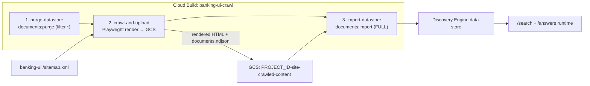

# FSI Architecture Design: Search Content Ingestion Pipeline

This document defines the **build-time content pipeline** that populates the Vertex AI Discovery Engine data store consumed by [Enterprise Search & Generative Answers](./enterprise_search_and_answers.md).

The runtime search service only *queries* a data store; something has to *fill* it. That is the job of the `scripts/crawl_and_upload` crawler: it renders the banking UI's own pages with a headless browser, stores the rendered HTML in Cloud Storage, and imports a document manifest into Discovery Engine. Because the crawler indexes the same site customers browse, search results and grounded answers stay consistent with the live product content.

---

## 1. Three-Stage Pipeline

The pipeline runs as a single Cloud Build job (`scripts/crawl_and_upload/cloudbuild-crawl.yaml`) with three ordered stages.



| Stage | Action |
| :--- | :--- |
| `purge-datastore` | Calls `documents:purge` with `{"filter": "*", "force": true}` to clear the existing branch so stale pages do not linger. |
| `crawl-and-upload` | Runs `crawl_and_upload.py` under `uv`, installing Chromium via `playwright install --with-deps`. |
| `import-datastore` | Calls `documents:import` with `gcsSource.inputUris = [gs://…/documents.ndjson]` and `reconciliationMode: FULL`, replacing the branch contents with the freshly crawled set. |

`FULL` reconciliation plus the upfront purge makes each run a clean rebuild of the index rather than an incremental append.

---

## 2. Crawl Source: The Site's Own Sitemap

The crawler is driven by the banking UI's published sitemap (`banking-ui/public/sitemap.xml`), not an ad-hoc URL list:

1. Fetch `SITEMAP_URL` and parse it as sitemap XML (namespace `http://www.sitemaps.org/schemas/sitemap/0.9`), collecting every `<loc>` URL.
2. If no URLs are found, the job exits cleanly without touching the data store.

Using the sitemap means the index scope is governed by what the UI chooses to publish — adding a page to the sitemap is what makes it discoverable to search.

---

## 3. Authenticated Crawling

The banking UI sits behind IAP / authenticated Cloud Run, so the crawler must authenticate both the sitemap fetch and every in-page asset request:

| Mechanism | Behavior |
| :--- | :--- |
| Manual token | If `BEARER_TOKEN` is set, it is used directly. |
| GCP OIDC | If `USE_GCP_AUTH=true`, the crawler mints a Google ID token via `id_token.fetch_id_token` for `GCP_AUTH_AUDIENCE` (defaulting to the sitemap URL). |
| Request session | The token is attached as `Authorization: Bearer …` on the `requests` session used for the sitemap. |
| Playwright route interception | A `context.route("**/*")` handler injects the bearer header **only** for requests to the sitemap host (or `BASE_URL_OVERRIDE` host), so the token is never leaked to third-party origins the page might call. |

The Cloud Build job runs under a dedicated `cloudbuild-crawler-sa` service account, so the ID token identity is scoped to the crawler.

---

## 4. Rendering Single-Page-App Content

The banking UI is a React SPA, so raw HTML from the server is nearly empty. The crawler uses a headless Chromium browser to render each page before capture:

1. `page.goto(fetch_url, wait_until="networkidle")` — navigate and wait until the SPA finishes fetching and rendering.
2. Reduce the DOM to the main content: the body is replaced with the `#main-content` element's markup, dropping headers, footers, navigation, and widgets. A missing `#main-content` is logged as a warning.
3. Capture the rendered `page.content()` and `page.title()`.

This yields clean, content-only HTML that indexes well and keeps chrome/navigation text out of snippets and grounded answers.

---

## 5. Storage Layout & Document Manifest

For each page the crawler writes two things to the `GCS_BUCKET_NAME` bucket:

**A. Rendered HTML blob** — a path-derived object name:

| Original URL shape | Blob name |
| :--- | :--- |
| ends with `/` | `…/index.html` |
| last segment has no extension | `…<path>.html` |
| already a file | `…<path>` (unchanged) |

**B. A line in `documents.ndjson`** — one Discovery Engine document record per page:

```json
{
  "id": "<sha256(original_url)>",
  "structData": { "title": "<page title>", "uri": "<public-facing URL>" },
  "content": { "mimeType": "text/html", "uri": "gs://<bucket>/<blob>" }
}
```

| Field | Meaning |
| :--- | :--- |
| `id` | Deterministic `sha256` of the original URL, so re-crawls map to stable document IDs. |
| `structData.title` | Page title surfaced as the result title. |
| `structData.uri` | The link a user clicks — rewritten to the public site (see below). |
| `content.uri` | GCS pointer to the rendered HTML that Discovery Engine ingests and indexes. |

The compiled NDJSON is uploaded once as `documents.ndjson`, which stage 3 imports.

---

## 6. URL Rewriting: Crawl Internally, Link Publicly

Two independent overrides separate *where content is fetched* from *what URL is indexed*:

| Variable | Effect |
| :--- | :--- |
| `BASE_URL_OVERRIDE` | Fetches each sitemap path from an alternate origin (e.g. an internal Cloud Run URL) while keeping the original URL as document identity. |
| `SITE_BASE_URL` | Rewrites the `structData.uri` shown in results to the public domain (preserving path, query, and fragment), so customers click a clean public link rather than the internal crawl target. |

This lets the crawler reach a private deployment URL yet publish results that point at `https://banking.<custom-domain>`.

---

## 7. Operations

| Trigger | How |
| :--- | :--- |
| Cloud Build trigger | `make trigger-site-crawl` runs the `banking-ui-crawl` trigger. |
| Manual submit | `make run-crawl` submits `cloudbuild-crawl.yaml` with dynamic substitutions and the crawler service account. |

Run the pipeline after content changes ship to the UI, or whenever the sitemap gains or loses pages, so the index reflects the live site. The data store itself (`data_store_id`) and the crawled-content bucket are provisioned by Terraform (`discovery_engine.tf`, `gcs.tf`).

---

## 8. Related Documents

| Document | Relationship |
| :--- | :--- |
| [Enterprise Search & Generative Answers](./enterprise_search_and_answers.md) | Runtime query layer that consumes the data store this pipeline fills. |
| [Build & Deploy Operations](../../operations/build_and_deploy.md) | Build/deploy context for the Cloud Build triggers and service accounts. |
