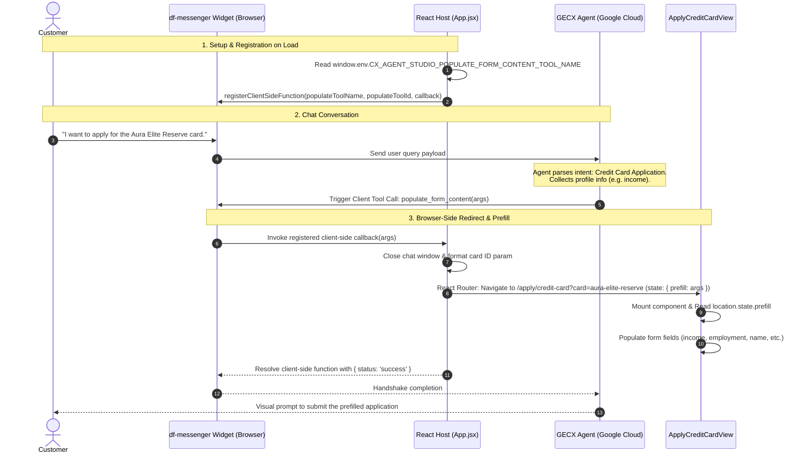

# FSI Architecture Design: Credit Card Application Prefill Integration

This document defines the system architecture, flow mechanics, and client-side integration patterns for the **Credit Card Application Prefill Integration** in the FSI GECX Bundle.

---

## 📐 1. System Topology & Flow Mechanics

The application prefill integration utilizes GECX's client-side tool execution capability to dynamically route, format, and populate card applications based on live conversation context with the conversational agent.



---

## 🔒 2. Core Architectural Design Decisions

### A. Client-Side Tool Execution Paradigm (Client Functions)
* **Context**: The conversational agent does not have access to client-side navigation objects or local storage contexts. Direct API-based form filling requires background database writes that can lead to race conditions when the user lands on the page.
* **Decision**: We use GECX **Client-Side Functions** to pass execution control back to the hosting browser context. By declaring `populate_form_content` as a Client-Side Tool in CX Agent Studio, the agent issues a JSON-RPC request to the browser's `df-messenger` component. The browser acts as the execution coordinator, updating the DOM and routing parameters instantly.

### B. Route Prefill Isolation using React Router State
* **Context**: Passing prefilled profile metadata (e.g., employment details, annual income, phone numbers) through URL query parameters exposes sensitive personal identifiable information (PII) in browser history logs.
* **Decision**: We isolate the prefill payload using **React Router State** (`location.state`). While the product code name is passed safely as a URL query parameter (`card=aura-elite-reserve`), the sensitive field values are passed inside the ephemeral router history state, keeping PII out of browser addresses.

---

## 🛠️ 3. Client & Agent Tool Schemas

### A. GECX Client Tool Definition
The `populate_form_content` tool is registered in the conversational agent's scope with the following schema:

```json
{
  "name": "populate_form_content",
  "description": "Invoke this tool to pre-fill the credit card application form with user details collected during conversation.",
  "input_schema": {
    "type": "OBJECT",
    "properties": {
      "product": { "type": "STRING", "description": "The specific card product chosen (e.g. Aura Elite Reserve)" },
      "annual_income": { "type": "NUMBER", "description": "User's annual income" },
      "employment_status": { "type": "STRING", "description": "Employment status (e.g. EMPLOYED, SELF_EMPLOYED)" },
      "housing_payment": { "type": "NUMBER", "description": "Monthly housing payment amount" },
      "first_name": { "type": "STRING" },
      "last_name": { "type": "STRING" },
      "phone": { "type": "STRING" }
    }
  }
}
```

### B. Client Callback Execution
The browser handler maps the structured arguments and transitions the UI viewport:

```javascript
node.registerClientSideFunction(
  populateToolName,
  populateToolId,
  (args) => {
    // Map product display name to canonical URL parameter format
    const cardParam = args.product 
      ? args.product.toLowerCase().replace(/\s+/g, '-') 
      : 'aura-elite-reserve';

    // Route to page with data injected in state
    navigate(`/apply/credit-card?card=${cardParam}`, { state: { prefill: args } });

    return Promise.resolve({ status: 'success' });
  }
);
```

---

## 💾 4. Field Population and Review

Once navigated to [ApplyCreditCardView.jsx](../../banking-ui/src/components/ApplyCreditCardView.jsx), the component checks the prefill payload during component setup:

```javascript
  const prefill = location.state?.prefill;

  // Read initial fields on mount
  useEffect(() => {
    if (prefill) {
      if (prefill.annual_income) setAnnualIncome(prefill.annual_income.toString());
      if (prefill.housing_payment) setHousingPayment(prefill.housing_payment.toString());
      if (prefill.employment_status) setEmploymentStatus(prefill.employment_status);
      if (prefill.first_name) setFirstName(prefill.first_name);
      if (prefill.last_name) setLastName(prefill.last_name);
      if (prefill.phone) setPhone(formatPhoneNumber(prefill.phone));
    }
  }, [prefill]);
```

This allows the customer to perform a visual verification, edit any incorrect fields, and complete their application submission securely.
