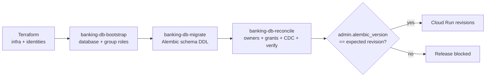

# FSI Architecture Design: Alembic Schema Migrations

This document defines how the FSI GECX Bundle manages relational schema evolution with **Alembic** against a multi-schema AlloyDB (PostgreSQL) database.

Alembic owns exactly one thing: versioned schema DDL for application objects. It does not create roles, grant privileges, or manage CDC — those belong to the bootstrap and reconciliation stages of the deployment lifecycle. Keeping that boundary tight is what makes migrations safe to run repeatedly against a shared, horizontally scaled database.

---

## 1. Where Migrations Sit in the Lifecycle

Migrations are the middle stage of an ordered, three-job release controller. Each stage is idempotent and blocks the next on failure.



The reconcile job's verification reads `admin.alembic_version` and compares it against `EXPECTED_ALEMBIC_REVISION` from the release manifest, so a partially-applied or drifted schema fails the release rather than shipping. See [Database Deployment Lifecycle](./pre_deployment_migrations_plan.md) for the surrounding controller.

---

## 2. Metadata & Model Registration

`alembic/env.py` builds a complete picture of the intended schema before any comparison:

- It inserts the `banking-service` package root onto `sys.path`, then imports **every** model module (`models.credit_card`, `models.identity`, `models.origination`, `models.audit`, `models.merchant`, `models.fraud`, `models.voice_session`, …) so each table registers on `Base.metadata`.
- `target_metadata = Base.metadata` becomes the single source of truth for autogenerate.
- The live connection string is injected at runtime from `utils.database.DATABASE_URL` (not the placeholder `sqlalchemy.url` in `alembic.ini`), and the password is masked before any URL is logged.

If a model module is not imported here, its tables are invisible to autogenerate — this import block is the authoritative table registry.

---

## 3. Multi-Schema Layout

The database is organized into bounded-context schemas rather than a single `public` namespace. Both offline and online paths create them up front (idempotently) before running migrations:

`identity`, `kyc`, `ledger`, `cards`, `operations`, `origination`, `audit`, `admin`, `catalog`, `ref_data`, `merchants`, `voice_support_sessions`.

Two configuration choices make multi-schema migrations behave:

| Setting | Effect |
| :--- | :--- |
| `include_schemas=True` | Alembic reflects and compares objects across all non-default schemas, not just `public`. |
| `version_table_schema="admin"` | The `alembic_version` bookkeeping table lives in `admin`, isolated from application schemas. On PostgreSQL the online path also runs `ALTER TABLE IF EXISTS public.alembic_version SET SCHEMA admin` to migrate any legacy version table into place. |

---

## 4. Concurrency: Transactional Advisory Lock

The application runs as multiple Cloud Run instances, and a migrate job can overlap with a scaling event. To guarantee only one migration runs at a time, the online path takes a **transactional advisory lock** inside the migration transaction before applying anything:

```sql
SELECT pg_advisory_xact_lock(592837410);
```

Because it is an `xact` lock, PostgreSQL releases it automatically when the transaction commits or rolls back — there is no separate unlock step to leak. Any concurrent migrator blocks on the same key (`592837410`) until the holder finishes, preventing two processes from racing on the same DDL.

---

## 5. Autogenerate Governance

Autogenerate is powerful but will happily propose destructive diffs for objects the platform does not want it to own. `env.py` constrains it:

| Hook | Rule |
| :--- | :--- |
| `include_object` | Only filters when a migration is being **autogenerated** (`--autogenerate`); normal `upgrade`/`downgrade` runs include everything. |
| ADK-owned tables | Objects in the `voice_support_sessions` schema are excluded from autogenerate **except** `reset_epochs`, so Alembic never tries to drop ADK-managed session tables while still owning the one table the platform authoritatively models. |
| `process_revision_directives` | If autogenerate detects no changes, the empty revision is discarded (no blank migration files) with an informational log. |
| `compare_foreign_keys=False` | FK comparison is disabled to avoid noisy, environment-dependent FK churn in generated diffs. |

Only migrations that carry real, reviewed schema changes make it into `alembic/versions/`.

---

## 6. SQLite Compatibility for Tests

The suite can run against SQLite, whose DDL cannot express everything PostgreSQL can. `env.py` degrades gracefully so the same migration chain applies in tests:

- `compare_type` returns `False` under SQLite to suppress spurious type-change diffs.
- Foreign-key constraints and the `merchants` / `ref_data` schemas are excluded from SQLite autogenerate.
- `process_revision_directives` strips `CreateForeignKeyOp` / `DropConstraintOp` operations from generated scripts when the dialect is SQLite, since SQLite cannot `ALTER TABLE ... ADD CONSTRAINT`.

The `version_table_schema` and schema-creation steps are gated on a PostgreSQL dialect check, so SQLite runs against the default namespace.

---

## 7. Offline vs. Online Modes

| Mode | Behavior |
| :--- | :--- |
| Offline (`run_migrations_offline`) | Configures the context from a URL only and emits SQL (`literal_binds`) without a live DBAPI — used to render migration SQL for review. |
| Online (`run_migrations_online`) | Builds an engine with `NullPool` (no connection reuse for a one-shot job), creates schemas, relocates the legacy version table, takes the advisory lock, and applies migrations transactionally. |

---

## 8. Operational Boundaries

| Alembic owns | Alembic does **not** own |
| :--- | :--- |
| Versioned schema and application objects | Database and role creation (bootstrap) |
| The `admin.alembic_version` revision pointer | Object ownership, grants, default privileges (reconcile) |
| Idempotent schema pre-creation | CDC / logical replication prerequisites (reconcile) |

Application services never create roles or own schema objects; they only read and write within the schemas Alembic defines and reconcile grants.

---

## 9. Related Documents

| Document | Relationship |
| :--- | :--- |
| [Database Deployment Lifecycle](./pre_deployment_migrations_plan.md) | The bootstrap → migrate → reconcile release controller that invokes Alembic. |
| [Transactional Data Layer Architecture](./data_layer_architecture.md) | The bounded-context schemas and models Alembic versions. |
| [Secure Database Access via IAP SSH Tunnel](./iap_ssh_tunnel_database_access.md) | How operators reach the same private AlloyDB instance to inspect migration state. |
| [Apache Iceberg CDC Data Lakehouse](./apache_iceberg_cdc_datalake_architecture.md) | Downstream replication that depends on reconcile-stage CDC prerequisites, not Alembic. |
