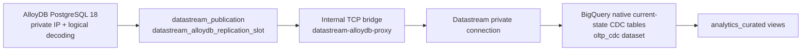
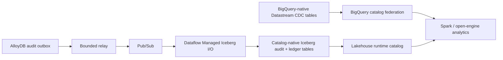

# CDC and Apache Iceberg Lakehouse Architecture

This document describes the complementary mutable-table CDC and immutable Iceberg event paths. It deliberately distinguishes BigQuery-native Datastream tables from catalog-native Iceberg tables.

## Deployed mutable-table CDC

AlloyDB connects to the application VPC through Private Service Access, while Datastream uses a separate peered producer network (`172.16.1.0/29`). Because VPC peering is non-transitive, a Container-Optimized OS VM in the application subnet exposes TCP 5432 only to the Datastream subnet and forwards the connection to the AlloyDB private address. It runs Google's supported, digest-pinned Database Migration Service TCP proxy in host-network mode. The bridge has no public IP and does not hold database credentials.

The `banking_bq_connector` built-in database user owns the Datastream password boundary. The ordered database reconciliation job creates and verifies its replication grant, publication, and AlloyDB-specific logical slot after Alembic completes. Terraform creates a new AlloyDB-specific stream identity rather than retaining a Cloud SQL WAL checkpoint, and the release controller starts that stopped stream only after database and analytics prerequisites pass.

The `oltp_cdc` destination contains BigQuery-native merge-mode replicas, not Apache Iceberg tables and not a retained WAL event history. It exposes the latest source row state plus Datastream metadata. Immutable audit and financial-journal history follows the separate catalog-native Iceberg path below.

### Current-state replica physical design

The demo keeps `oltp_cdc` tables unpartitioned and lets Datastream cluster them by source primary key. This is intentional:

- the tables are small current-state replicas rather than an append-only event archive;
- most dimension and account tables do not have a useful time-partition key;
- BigQuery CDC background apply and runtime merge work cannot use partitions to prune the mutable baseline; and
- the curated layer already applies bounded business timestamps for time-window analysis.

If production-scale query scans justify partitioning later, configure it selectively when Datastream creates new fact tables—for example `cards_posted_transactions.posted_at` and `cards_transaction_authorization.created_at` at daily granularity—and validate CDC cost as well as query cost. Datastream applies partition and clustering configuration only when it creates a destination table, so changing the design requires a controlled table recreation and backfill. See [Partition and cluster BigQuery tables](https://cloud.google.com/datastream/docs/partitioning-and-clustering) and [BigQuery CDC ingestion behavior](https://cloud.google.com/bigquery/docs/change-data-capture).

## Catalog-native Iceberg event architecture

The platform uses two complementary catalog paths:

1. Audit outbox events flow through Pub/Sub into Iceberg managed tables registered in the lakehouse runtime catalog.
2. Existing BigQuery-native mutable CDC tables remain queryable from Spark through BigQuery catalog federation.

BigQuery queries catalog-native tables with a four-part project/catalog/namespace/table name. Spark connects to the runtime catalog for immutable Iceberg history and uses the Spark BigQuery connector for the mutable BigQuery-native CDC tables in the same session. See [Catalog-Native Iceberg Audit and Financial Ledger](./bigquery_olap_audit_architecture.md) for contracts and operations.

## Curated analytics contract

The `analytics_curated` views provide stable business-facing names over raw CDC tables. They include enriched posted transactions, spend velocity, international fraud anomalies, and premium travel offer candidates. The view reconciler runs after Datastream activation and fails closed only for required dependencies; optional demo sources may remain deferred until their first backfill.

Operational identities use UUID joins, and authorization-time merchant snapshots remain immutable so historical financial activity does not change when reference data is reseeded.
