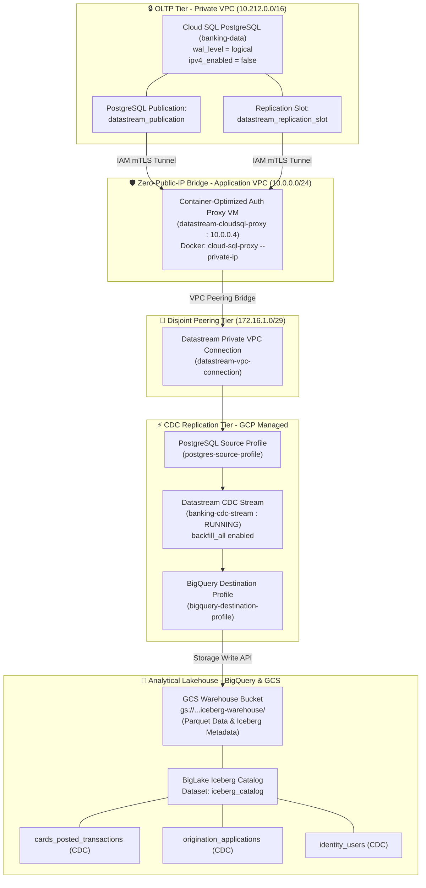

# 🌊 Apache Iceberg BigLake Data Lake & Real-Time Datastream CDC Architecture

This document specifies the enterprise analytical data lakehouse architecture for the Nova Horizon Banking Platform. It defines our real-time Change Data Capture (CDC) replication strategy, open-source Apache Iceberg BigLake table formatting, zero-trust networking topology, and bounded domain schema mapping from Cloud SQL PostgreSQL to Google Cloud BigQuery.

---

## 🌐 1. Executive Summary & Data Lake Vision

To support advanced financial reporting, credit risk analytics, and machine learning models without impacting live transactional OLTP performance, our platform implements an **Apache Iceberg BigLake Data Lakehouse**.

Rather than relying on legacy batch ETL scripts or scheduled federated polling queries we utilize **Google Cloud Datastream** to capture physical row mutations directly from PostgreSQL's Write-Ahead Log (WAL). These logical data streams are mirrored in real time into cloud storage as immutable Apache Iceberg Parquet files, exposed to BigQuery and multi-engine OLAP query tools via Google's BigLake Catalog.

### Key Architectural Benefits
* **Zero OLTP Impact**: Reading from PostgreSQL WAL (`wal_level = logical`) eliminates query polling load on the primary transactional database.
* **Open Lakehouse Standard**: Apache Iceberg provides ACID transactions, snapshot time-travel, and schema evolution without vendor lock-in.
* **Bounded Domain Alignment**: Mirrors our decoupled domain schemas (`cards`, `origination`, `identity`) directly into distinct analytical tables.

---

## 🏛️ 2. End-to-End System Topology

The following diagram illustrates the complete ingestion pipeline, networking bridge, and analytical storage layers:



---

## 🔐 3. The Security & Networking Stack

A critical engineering challenge when deploying managed CDC in banking environments is reconciling Google Cloud's network isolation rules with strict financial security compliance.

### A. The Non-Transitive Peering Constraint
In Google Cloud Platform, when Cloud SQL connects to a customer VPC via Private Service Access, it resides inside Google's managed producer VPC (`10.212.0.0/16`). When Datastream connects via Private Connectivity, it resides inside Datastream's managed producer VPC (`172.16.1.0/29`). Because **GCP VPC peering is non-transitive**, traffic originating in Datastream's VPC cannot route *through* the customer application VPC to reach Cloud SQL's VPC directly.

### B. Zero-Public-IP Auth Proxy Bridge
To bridge this non-transitive boundary without exposing our primary financial database to a public internet IP (`ipv4_enabled = false`), we implement an internal Container-Optimized OS (COS) proxy bridge:
1. **Container-Optimized OS VM (`datastream-cloudsql-proxy`)**: Deployed in our application subnet (`10.0.0.4`), this lightweight instance runs Google's official immutable `cloud-sql-proxy` Docker container (`gcr.io/cloud-sql-connectors/cloud-sql-proxy:latest`).
2. **Local Kernel Firewall Rules**: On boot, an automated metadata startup script executes `iptables -I INPUT -p tcp --dport 5432 -j ACCEPT`, opening the local kernel firewall to accept unencrypted TCP connections on port `5432` from internal peered subnets.
3. **Encrypted mTLS Tunneling**: The proxy binds to `0.0.0.0:5432` and tunnels traffic over Google's internal fabric to Cloud SQL's private IP (`10.212.1.3:5432`) using IAM Application Default Credentials.

### C. Disjoint Subnet Allocation
To prevent internal routing table collisions and route shadowing with existing application subnets (`10.0.0.0/24`, `10.1.0.0/24`) and the Private Service Access range (`10.212.0.0/16`), our Datastream private connection is allocated a **disjoint RFC 1918 Class B subnet** (`172.16.1.0/29`). This guarantees mathematical isolation across the VPC peering bridge.

---

## 🏛️ 4. Decoupled Domain Schema Mapping & Medallion Views

To solve the impedance mismatch between normalized OLTP schemas and denormalized analytical reporting without creating ETL lag or race conditions, our data lakehouse implements a strict **Medallion Lakehouse Architecture (Bronze Raw CDC -> Silver/Gold Curated Views)**.

### A. Bronze Tier: Raw 1-to-1 CDC Replication
The Datastream replication stream (`banking-cdc-stream`) filters and mirrors our refactored Bounded Context tables directly into corresponding BigLake Iceberg definitions in the `iceberg_catalog` dataset:

| Domain Context | OLTP Source Schema | OLTP Source Table | BigLake Iceberg Table | Analytical Purpose |
| :--- | :--- | :--- | :--- | :--- |
| **Cards & Ledgers** | `cards` | `posted_transactions` | `iceberg_catalog.cards_posted_transactions` | Base posted ledger entries and authorization links. |
| **Cards & Ledgers** | `cards` | `issued_card` | `iceberg_catalog.cards_issued_card` | Issued card instruments, PAN tokens, last 4 digits, and status. |
| **Cards & Ledgers** | `cards` | `transaction_authorization` | `iceberg_catalog.cards_transaction_authorization` | ISO-8583 authorization holds, MCC codes, merchant names, and FX rates. |
| **Origination & Loans** | `origination` | `applications` | `iceberg_catalog.origination_applications` | Core applicant funnel, workflow status, and customer links. |
| **Origination & Loans** | `origination` | `credit_card_applications` | `iceberg_catalog.origination_credit_card_applications` | Requested credit limits and card product selections. |
| **Origination & Loans** | `origination` | `mortgage_applications` | `iceberg_catalog.origination_mortgage_applications` | Requested mortgage loan amounts, property addresses, and valuations when the mortgage flow is exercised. |
| **Identity & IAM** | `identity` | `users` | `iceberg_catalog.identity_users` | Customer demographics, email addresses, and KYC records. |

### B. Silver/Gold Tier: Curated BigQuery Semantic Layer (`analytics_curated`)
Rather than forcing data scientists or business analysts to write complex multi-table joins across raw UUIDs, we expose clean, business-ready SQL views in the `analytics_curated` dataset:
* **`analytics_curated.enriched_posted_transactions`**: Joins `cards_posted_transactions` -> `cards_transaction_authorization` -> `cards_issued_card` to provide an instant, denormalized view of transactions with card numbers (`last_four`), card active status, merchant names, and authorization decline reasons.
* **`analytics_curated.realtime_spend_velocity`**: Aggregates recent authorization volume and ticket size directly from the schema-prefixed CDC transaction stream.
* **`analytics_curated.international_fraud_anomalies`**: Surfaces high-risk or flagged card authorizations from the live CDC stream.

Because these views query directly against the underlying BigLake Iceberg Parquet manifests, queries benefit from **zero data duplication**, **zero batch ETL latency**, and automatic manifest-level partition pruning!

---

## ❄️ 5. Hidden Partitioning & Partition Evolution

A major architectural limitation of legacy data lakes (such as Apache Hive or standard Parquet directories) and native relational table partitioning is that partitions are physically bound to directory folder structures (e.g., `/year=2026/month=06/day=30/`). In those systems, queries must explicitly filter on synthetic partition columns, and changing the partitioning strategy requires expensive table rewrites and data migrations.

Our data lakehouse overcomes this by leveraging **Apache Iceberg Hidden Partitioning and Partition Evolution**:

### A. Manifest-Level Partition Pruning
In Apache Iceberg, partition assignments and column min/max boundary statistics are maintained entirely inside the **metadata manifest files** (`v1.metadata.json`, manifest lists, and manifest files), not in physical file directory paths. 
* When Datastream streams WAL mutations into Cloud Storage Parquet files, Iceberg metadata records the exact timestamp and ID ranges for each block.
* When an analytical query filters on a timestamp or business key (e.g., `WHERE posted_at >= '2026-06-01'`), BigQuery BigLake evaluates the metadata manifests first, performs **manifest pruning (skipping)**, and reads only the relevant Parquet data blocks without needing explicit partition column predicates in the SQL query.

### B. Partition Transforms
Rather than creating redundant physical columns for year, month, or day, Iceberg utilizes transform expressions on existing domain columns:
* `day(posted_at)` or `month(posted_at)` for time-series ledger clustering.
* `bucket(16, application_id)` or `truncate(8, user_id)` for high-cardinality entity distribution.

### C. Zero-Rewrite Partition Evolution
As transaction volumes grow in our banking platform, our DBA team can dynamically alter the partitioning strategy of an existing table without rewriting historical Parquet data:
```sql
-- Example: Evolving from unpartitioned/monthly to daily partitioning as transaction volume surges
ALTER TABLE iceberg_catalog.cards_posted_transactions ADD PARTITION FIELD day(posted_at);
```
* **Historical Data Preservation**: Existing Parquet files retain their original metadata partitioning (or unpartitioned state).
* **Incremental Application**: All new WAL mutations ingested by Datastream are automatically partitioned by `day(posted_at)`.
* **Unified Query Execution**: When querying across the evolution boundary, query engines evaluate both old and new partition specs simultaneously, guaranteeing transparent query execution with zero downtime or historical data migration costs.

---

## ⚖️ 6. Governance, Compliance & Least-Privilege IAM

To satisfy FSI regulatory regimes (SOX, GLBA, GDPR), our data lake infrastructure is provisioned with non-destructive safeguards and additive least-privilege IAM bindings:

* **Non-Destructive Safeguards**: The Cloud Storage warehouse bucket (`google_storage_bucket.iceberg_warehouse`) and BigQuery dataset (`google_bigquery_dataset.iceberg_catalog`) enforce `force_destroy = false` and `delete_contents_on_destroy = false`. Historical analytical data cannot be accidentally deleted via infrastructure-as-code pipelines.
* **Object Versioning**: Enabled on the GCS warehouse bucket to protect Parquet data files and Iceberg metadata manifests against silent corruption or cryptographic shredding.
* **Service Account Delegation**: Analytical queries and CDC ingestion operate under dedicated service accounts (`reporting-sa` and `banking_bq_connector`) bound strictly via additive IAM members (`google_project_iam_member` and `google_bigquery_dataset_iam_member`):
  * `roles/storage.objectUser`: Granted on the warehouse bucket for reading and writing Parquet blocks.
  * `roles/bigquery.connectionUser`: Granted on `google_bigquery_connection.iceberg` to allow BigQuery to query external BigLake tables securely.
  * `roles/bigquery.dataEditor`: Granted non-authoritatively on the catalog dataset to permit schema evolution and metadata updates without overriding project-wide DBA permissions.
