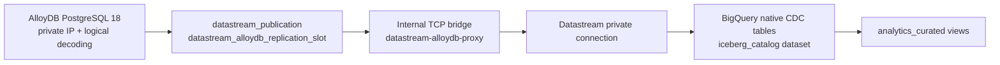
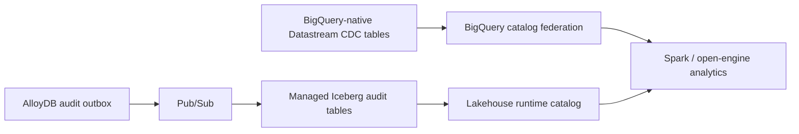

# CDC and Apache Iceberg Lakehouse Architecture

This document describes the current AlloyDB CDC path and the planned Iceberg architecture. It deliberately distinguishes deployed behavior from the follow-on Iceberg epic.

## Deployed mutable-table CDC

AlloyDB connects to the application VPC through Private Service Access, while Datastream uses a separate peered producer network (`172.16.1.0/29`). Because VPC peering is non-transitive, a Container-Optimized OS VM in the application subnet exposes TCP 5432 only to the Datastream subnet and forwards the connection to the AlloyDB private address. It runs Google's supported, digest-pinned Database Migration Service TCP proxy in host-network mode. The bridge has no public IP and does not hold database credentials.

The `banking_bq_connector` built-in database user owns the Datastream password boundary. The ordered database reconciliation job creates and verifies its replication grant, publication, and AlloyDB-specific logical slot after Alembic completes. Terraform creates a new AlloyDB-specific stream identity rather than retaining a Cloud SQL WAL checkpoint, and the release controller starts that stopped stream only after database and analytics prerequisites pass.

Despite the historical dataset name, the current Datastream destination tables are BigQuery-native tables, not Apache Iceberg tables. This limitation is why the lakehouse work is a separate epic.

## Planned Iceberg architecture

The strategic follow-on uses two complementary catalog paths:

1. Audit outbox events flow through Pub/Sub into Iceberg managed tables registered in the lakehouse runtime catalog.
2. Existing BigQuery-native mutable CDC tables remain queryable from Spark through BigQuery catalog federation.

The follow-on implementation must not describe BigQuery-native Datastream tables as Iceberg. See the standalone Iceberg epic and trade-off analysis in the private planning repository for the delivery plan.

## Curated analytics contract

The `analytics_curated` views provide stable business-facing names over raw CDC tables. They include enriched posted transactions, spend velocity, international fraud anomalies, and premium travel offer candidates. The view reconciler runs after Datastream activation and fails closed only for required dependencies; optional demo sources may remain deferred until their first backfill.

Operational identities use UUID joins, and authorization-time merchant snapshots remain immutable so historical financial activity does not change when reference data is reseeded.
