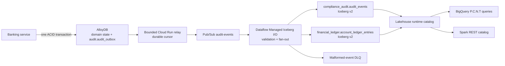

# Catalog-Native Iceberg Audit and Financial Ledger Architecture

## Purpose

The banking service records immutable audit evidence inside the same AlloyDB transaction as each domain mutation. A bounded asynchronous relay and streaming Dataflow pipeline copy committed events into Apache Iceberg v2 tables owned by the Lakehouse runtime catalog. BigQuery and Spark then query the same catalog metadata and Parquet files.

This path is deliberately separate from Datastream. Datastream continues to replicate mutable operational tables into BigQuery-native tables; it does not carry the audit outbox.

## Data flow



## Source transaction and journal contract

`record_audit_event` only inserts into `audit.audit_outbox`; it performs no network I/O. Relay state is stored separately in `audit.outbox_relay_checkpoint`, allowing outbox rows to remain append-only.

Every completed money movement creates one `FINANCIAL_TRANSACTION_POSTED` v1 event with:

- a stable event and transaction identifier;
- business posting time, currency, source type, and source references;
- two or more positive journal entries with explicit `DEBIT` or `CREDIT` direction; and
- equal debit and credit totals.

The canonical PostgreSQL journal is `ledger.transactions` plus `ledger.account_ledger`. Card statement rows are projections linked through `cards.posted_transactions.journal_transaction_id`; they are not a second accounting system.

## Delivery semantics

The scheduled Cloud Run relay reads by the immutable `(created_at, event_id)` cursor, publishes each envelope to Pub/Sub, and advances its checkpoint only after the entire bounded batch is acknowledged. A crash after publication and before checkpoint commit can redeliver events, so delivery is intentionally at-least-once.

Dataflow validates the envelope and the balanced financial contract, writes the complete event to `compliance_audit.audit_events`, and fans financial entries into `financial_ledger.account_ledger_entries`. Invalid records go to `audit-events-iceberg-dlq` with the validation stage and error. Managed Iceberg I/O commits snapshots at the configured interval and authenticates with workload ADC through Iceberg's renewable Google auth manager; no one-hour static token is embedded in the job.

## Query contract

Catalog tables use BigQuery four-part names:

```sql
SELECT *
FROM `PROJECT_ID.nova-audit-lakehouse.compliance_audit.audit_events`;
```

The `compliance_audit.audit_events` and `compliance_audit.account_ledger_entries` BigQuery views apply deterministic event-id and entry-id deduplication. Domain views (`origination_audit_log`, `financial_ledger_audit_log`, `identity_access_audit_log`, and `system_config_audit_log`) are ordinary views over that logical audit stream. `account_ledger_balance` exposes the debit/credit invariant; `imbalance_cents` must be zero for every transaction.

Spark validation configures the Iceberg REST catalog and the native BigQuery connector in one session:

- `audit`, using `bl://projects/PROJECT_ID/catalogs/nova-audit-lakehouse`; and
- the Dataproc Spark BigQuery connector, reading the existing BigQuery-native CDC dataset directly.

The validation batch reads audit ledger rows and Iceberg snapshot/file metadata, reads the existing BigQuery-native `iceberg_catalog.cards_credit_accounts` CDC table, and proves a cross-catalog join.

## Operations and recovery

- Cloud Monitoring alerts on relay failures, Dataflow job failures, excessive Pub/Sub age/backlog, and any DLQ backlog.
- A full transactional reset truncates the outbox and relay checkpoint before seeding, so the new demo lifecycle starts from a coherent cursor.
- Iceberg history is retained independently. Catalog deletion or recreation is a separate privileged operation and must not be coupled to ordinary presenter reset.
- Replay is safe: reset the relay cursor or replay Pub/Sub messages, then rely on logical BigQuery deduplication by stable IDs.
- The legacy `audit-events-bq-sub` subscription and `raw_audit_outbox_cdc` landing table are retired.

## Deployment order

1. Apply Terraform APIs, IAM, catalog, buckets, topics, subscriptions, jobs, and views.
2. Run database bootstrap, Alembic migration, and grant reconciliation.
3. Run `audit-iceberg-bootstrap` to create the two namespaces and Iceberg v2 tables through the REST API.
4. Build and launch or update the `nova-audit-iceberg` Flex Template job.
5. Reset/seed the transactional database, run the relay, and verify BigQuery balance and deduplication views.
6. Run `deployment/scripts/validate_lakehouse_interoperability.sh` for Spark cross-catalog proof.
