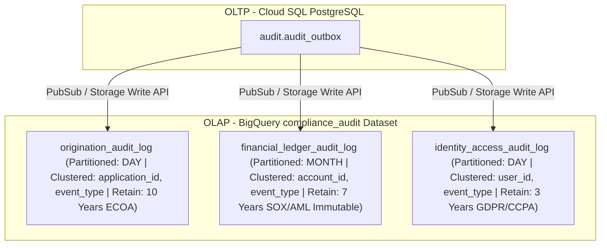
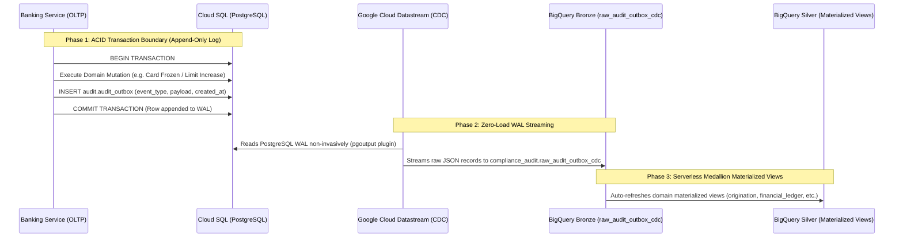

# 🏛️ BigQuery OLAP Audit & Compliance Architecture Blueprint

This document specifies the Enterprise OLAP Data Warehousing and Compliance Auditing architecture for the Nova Horizon Banking Platform. It defines our domain-segmented BigQuery auditing strategy, mandatory partitioning guardrails, native JSON search indexing, and FSI regulatory compliance rules.

---

## 🌐 1. Executive Summary & OLAP Topology

To achieve FSI regulatory compliance across Equal Credit Opportunity (ECOA), Anti-Money Laundering (AML), and Data Privacy (GDPR/CCPA) laws, our platform separates live transactional OLTP processing (Cloud SQL PostgreSQL) from immutable analytical warehousing (Google Cloud BigQuery).

Rather than dumping disparate system events into a single monolithic audit table, we establish a dedicated **`compliance_audit`** dataset in BigQuery segmented by Bounded Context workflows:

---

## 🏛️ 2. Domain-Segmented Audit Tables

### A. `origination_audit_log` (Underwriting & Loan Origination)
* **Regulatory Regime**: Equal Credit Opportunity Act (ECOA) and Fannie Mae guidelines. Requires preserving document extraction results and human loan officer override decisions for up to 10 years to prove fair lending practices.
* **Core Events**: `APPLICATION_CREATED`, `ARTIFACT_UPLOADED`, `DOCUMENT_EXTRACTION_COMPLETED`, `UNDERWRITING_OVERRIDE_APPLIED`.
* **Partitioning & Clustering**: Partitioned by `DAY` on `created_at`. Clustered by `[application_id, event_type]`.

### B. `financial_ledger_audit_log` (Core Accounting & Cards)
* **Regulatory Regime**: Sarbanes-Oxley (SOX), Anti-Money Laundering (AML), and PCI-DSS. Requires strict tamper-proof immutability for 5 to 7 years.
* **Core Events**: `MONETARY_TRANSFER_EXECUTED`, `CREDIT_LIMIT_INCREASED`, `FEE_REVERSED`, `CARD_FROZEN`.
* **Partitioning & Clustering**: Partitioned by `MONTH` on `created_at`. Clustered by `[account_id, event_type]`.

### C. `identity_access_audit_log` (IAM & Messaging)
* **Regulatory Regime**: GDPR / CCPA right-to-be-forgotten rules. Supports cryptographic shredding and pseudonymization.
* **Core Events**: `USER_CREATED`, `DEVICE_REGISTERED`, `MESSAGE_SENT`.
* **Partitioning & Clustering**: Partitioned by `DAY` on `created_at`. Clustered by `[user_id, event_type]`.

### D. `system_config_audit_log` (System Pricing & Catalog Policies)
* **Regulatory Regime**: Truth in Lending (TILA), Truth in Savings (TISA), SOX internal control guidelines. Requires preserving pricing rate updates and limits policies modification history.
* **Core Events**: `CREDIT_PRODUCT_CATALOG_UPDATED`, `DEPOSIT_PRODUCT_CATALOG_UPDATED`, `SYSTEM_FEATURE_FLAG_MODIFIED`.
* **Partitioning & Clustering**: Partitioned by `MONTH` on `created_at`. Clustered by `[product_code, event_type]`.

---

## ⚙️ 3. Append-Only WAL CDC Pipeline & Lakehouse Materialized Views

To guarantee zero loss of compliance audit events without introducing network latency, database polling overhead, or locks into real-time customer banking workflows, we implement an **Append-Only WAL CDC Architecture** across a 3-phase lifecycle:

### A. Phase 1: ACID Append-Only Recording (`record_audit_event`)
When a state mutation occurs, the backend application writes an immutable record into the PostgreSQL `audit.audit_outbox` table inside the exact same database transaction. Notice there are no `status` mutation columns (`PENDING`, `PUBLISHED`, `DLQ`) or `UPDATE` queries. This guarantees atomicity: if the transaction rolls back, the outbox record rolls back as well. No external network API calls or database updates occur after commit.

### B. Phase 2: Zero-Load WAL Streaming (`raw_audit_outbox_cdc`)
Google Cloud Datastream non-invasively monitors PostgreSQL Write-Ahead Log (WAL) insertions on `audit.audit_outbox`. It streams each appended record in sub-second time directly into our BigQuery bronze landing table: `compliance_audit.raw_audit_outbox_cdc` (partitioned by day on `created_at` and clustered by `event_type`). This eliminates database polling queries, connection pool starvation, and thundering herds across API replicas.

### C. Phase 3: Serverless Medallion Materialized Views
Over our bronze landing table, we define our domain-segmented regulatory tables as **BigQuery Materialized Views** (`origination_audit_log`, `financial_ledger_audit_log`, `identity_access_audit_log`, `system_config_audit_log`). BigQuery's serverless engine automatically maintains these views in the background, extracting JSON attributes (e.g., `account_id`, `application_id`, `amount_cents`) with instant analytical query performance and proper clustering per regulatory regime.

---

## 🛡️ 4. Defense-in-Depth PII Protection & Guardrails

### A. Application-Layer Payload Filtering
Audit outbox logging utilities strictly serialize structural metadata, status deltas, and UUID references. Plaintext PII strings (such as plain SSNs, raw tax form strings, or unmasked account numbers) are stripped at the application layer prior to outbox serialization.

### B. Cryptographic Schema Isolation & KMS Envelope Encryption
Sensitive customer KYC records reside in an isolated PostgreSQL schema (`kyc.kyc_records`). PII is encrypted at rest using AES-256-GCM envelope encryption with Data Encryption Keys wrapped by Google Cloud KMS (`kyc-kek`). Encryption operations bind `user_id + kyc_record_id` as Additional Authenticated Data (AAD) to prevent ciphertext transplant attacks.

### C. BigQuery Data Catalog Policy Tags & Dynamic Masking
In OLAP tables, sensitive NPI columns enforce Google Cloud Data Catalog Policy Tags (`sensitive_npi`, `PII_HIGH`). Unauthorized analysts querying BigQuery automatically receive masked outputs (e.g. `XXX-XX-1234`) dynamically evaluated by GCP IAM without requiring custom database views.

### D. Mandatory Time Partitioning & Dedicated CMEK at Rest
Every analytical table enforces strict time partitioning (`require_partition_filter = true`) to prevent accidental full-table scans. Compliance audit streaming topics (`audit-events`) and BigQuery analytical datasets enforce Customer-Managed Encryption Keys at rest using a dedicated cryptographic key domain (`audit-cmek-key`), ensuring full blast radius containment separated from Document AI processing pipelines.
