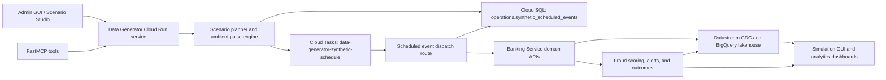

# Data Generator Architecture

The Data Generator is the synthetic activity service for the demo banking platform. It produces realistic card activity, scenario-backed fraud signals, and scheduled customer follow-up actions so the UI, fraud workflow, operational database, and lakehouse surfaces have fresh demonstration data.

## High-Level Flow



## Service Role

The service runs as the `data-generator` Cloud Run service. It is intentionally separate from Banking Service:

* Data Generator owns synthetic scenario planning, ambient transaction pulses, durable schedule orchestration, and operator/agent control surfaces.
* Banking Service owns banking-domain execution APIs such as card authorization, settlement, reversal, fraud alert triage, account paydown, and customer/account state.
* Data Generator calls Banking Service through internal HTTP APIs with the card-network switch token and Cloud Run service-to-service permissions.

This boundary keeps synthetic workload orchestration outside the banking-domain API while still using the same production-like banking workflows that the demos exercise.

## Runtime Workloads

Data Generator supports four primary workload types:

* Ambient transaction pulses: periodic synthetic card swipes and paydowns across eligible demo cards.
* Scenario execution: deterministic scenario templates for baseline behavior, spend velocity surges, travel stories, fraud campaigns, and customer follow-up events.
* Durable scheduled execution: scenario timelines persisted as scheduled events and dispatched later through Cloud Tasks.
* Operator and agent control: HTTP routes and FastMCP tools for inspecting schedules, creating plans, enqueueing stories, canceling future events, and adjusting ambient load controls.

## Durable Scheduler

The durable scheduler is owned by Data Generator and stores records in the existing Cloud SQL PostgreSQL database, not in a separate database.

Database:

```text
banking
```

Table:

```text
operations.synthetic_scheduled_events
```

The table stores one row per scheduled synthetic event. Important fields include:

* `schedule_id`, `scenario_id`, and `execution_id` for grouping.
* `event_id`, `parent_event_id`, and `event_type` for the scenario timeline.
* `persona_id` for persona-scoped context.
* `status` for lifecycle state such as `SCHEDULED`, `DISPATCHING`, `SUCCEEDED`, `FAILED`, or `CANCELED`.
* `idempotency_key` to make enqueue and retry behavior repeat-safe.
* `scheduled_for` for Cloud Tasks dispatch timing.
* `payload` and `result_payload` for event input and execution result context.
* `attempts`, `last_error`, `dispatched_at`, `completed_at`, and `canceled_at` for operational tracking.

Data Generator connects to Cloud SQL with its own IAM database user:

```text
datagen-service-sa@<project-id>.iam
```

Banking Service no longer exposes synthetic scheduler routes. Its Alembic migration chain still provisions and grants the scheduler table because the platform has one shared migration path for the existing operational PostgreSQL database.

## Cloud Tasks Dispatch

The scheduler uses a regional Cloud Tasks queue:

```text
data-generator-synthetic-schedule
```

When a scenario is enqueued with `dispatch_transport=cloud_tasks`, Data Generator creates one Cloud Task per scheduled event. Each task calls back to:

```text
POST /scheduled-events/{event_record_id}/dispatch
```

The Cloud Task uses an OIDC token minted from the Data Generator service account. The service account has:

* `roles/cloudtasks.enqueuer` to create tasks.
* `roles/run.invoker` on the Data Generator service so tasks can invoke the dispatch route.
* `roles/iam.serviceAccountUser` on itself so Cloud Tasks can mint the configured OIDC token.

The dispatch handler is idempotent. Completed events return their stored result, canceled events no-op, and failed events retain error context for inspection or retry.

## Banking Service Integration

Scheduled event dispatch calls Banking Service domain APIs based on event type:

* `authorization` calls the card-network authorization route.
* `settlement` calls the card-network settlement route using prior authorization context.
* `reversal` calls the card-network reversal route.
* `customer_action` calls the fraud triage workflow to resolve or leave open synthetic fraud alerts according to the scenario outcome.
* `outcome_persistence` records scenario feedback labels for downstream validation.

This means synthetic events use the same fraud scoring, alert creation, account, card, and audit paths as interactive demo traffic.

## FastMCP Control Surface

Data Generator mounts a FastMCP HTTP surface at:

```text
/mcp
```

The current tools are:

* `inspect_synthetic_schedule`
* `create_scenario_plan`
* `enqueue_synthetic_story`
* `cancel_future_synthetic_events`
* `adjust_ambient_load_profile`

The MCP app is hosted inside the Data Generator FastAPI process and shares the service's scheduler client, scenario planner, and ambient profile controls.

## Key Google Cloud Technologies

The Data Generator architecture uses:

* Cloud Run for the Data Generator service.
* Cloud Scheduler and Eventarc/Pub/Sub to trigger ambient generation pulses.
* Cloud Tasks for durable delayed dispatch of scenario events.
* Cloud SQL for PostgreSQL scheduler persistence and banking-domain operational data.
* IAM database authentication for service-account-based Postgres access.
* Secret Manager for the card-network switch token and Redis password.
* Memorystore for Redis-backed pulse admission control and duplicate-event protection.
* BigQuery and Datastream indirectly through the banking platform's CDC/lakehouse flow for downstream analytics.

## Reset Behavior

The current full database reset path rebuilds banking demo data through the Banking Service reset job. It clears transactional tables and reseeds users, accounts, cards, merchants, and historical activity.

Reset also clears Data Generator scheduler artifacts before reseeding. The reset job deletes rows from `operations.synthetic_scheduled_events` and purges the `data-generator-synthetic-schedule` Cloud Tasks queue when the queue is configured through the `DATA_GENERATOR_CLOUD_TASKS_*` environment variables.

For local or test resets where Cloud Tasks is not configured, the queue purge is skipped and the database reset continues. In deployed environments, queue purge failures fail the reset so stale scheduled synthetic work cannot replay into a freshly seeded demo population.
