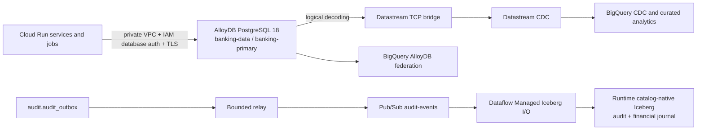

# Enterprise Data Layer Architecture

Nova Horizon separates transactional processing in AlloyDB for PostgreSQL from analytical processing in BigQuery. AlloyDB is the only active OLTP source in deployed environments.

## OLTP ownership

The `banking` database is divided into bounded schemas: `identity`, `kyc`, `ledger`, `cards`, `operations`, `origination`, `audit`, `admin`, `catalog`, `ref_data`, `merchants`, and `voice_support_sessions`. AlloyDB provides managed PostgreSQL, automated backups and point-in-time recovery, query insights, IAM-integrated authentication, and environment-specific availability:

- Developer environments use a cost-conscious zonal primary.
- `fsi-demo-1841` uses a regional high-availability primary.
- All application traffic uses private IP; there is no public database endpoint.
- Runtime services authenticate as AlloyDB IAM database users with short-lived tokens and required TLS.

## Database release contract

Database deployment has three explicit owners:

1. Terraform owns the AlloyDB cluster and instance, network, IAM bindings, database users, secrets, Cloud Run jobs, and Datastream resources.
2. Alembic owns schemas, tables, indexes, constraints, and versioned application DDL. The consolidated baseline is `2ea57c78ba89`; the current head is `91d7b4a6c2ef`.
3. The database lifecycle jobs own cluster roles, group memberships, database creation, object ownership, grants, default privileges, immutable-ledger revocations, publication, replication slot, and invariant verification.

The ordered release is:

```mermaid
flowchart LR
    Build["Resolve immutable image digests"] --> TF["Environment-specific Terraform plan/apply"]
    TF --> Bootstrap["banking-db-bootstrap"]
    Bootstrap --> Migrate["banking-db-migrate"]
    Migrate --> Reconcile["banking-db-reconcile"]
    Reconcile --> Catalog["Bootstrap catalog-native Iceberg tables + views"]
    Catalog --> Pipeline["Build and launch/update audit Dataflow pipeline"]
    Pipeline --> Deploy["Deploy services by digest"]
    Deploy --> Pause["Drain and pause Datastream"]
    Pause --> Seed["banking-db-reset"]
    Seed --> CDC["Federation + BigQuery destination recreation + backfill"]
    CDC --> Views["Reconcile curated views"]
    Views --> Smoke["Service and analytics smoke tests"]
    Smoke --> Manifest["Immutable release manifest"]
```

Application services never create roles or repair grants, and they do not own schema objects. Bootstrap and reconciliation are idempotent and fail closed when a Terraform-managed principal or database invariant is missing.

## Analytics paths

- Mutable operational tables flow through PostgreSQL logical decoding and Datastream into BigQuery CDC tables.
- Full demo reset is a coordinated source-and-destination operation. Datastream does not propagate PostgreSQL `TRUNCATE`, so the release controller drains the stream, resets AlloyDB, recreates stream-owned BigQuery tables with a 60-second freshness target, and requires a complete backfill before qualification.
- Analysts can query the live `banking` database through the BigQuery `banking-postgres-connection`, implemented as a native AlloyDB connector configuration.
- Transactional outbox events flow through the bounded relay, Pub/Sub, and Dataflow into catalog-native Iceberg audit and financial-ledger tables. BigQuery domain views in `compliance_audit` provide logical deduplication independently of mutable-table CDC.
- AlloyDB Dataplex integration publishes operational metadata into Universal Catalog; the application-specific fraud guidance catalog remains managed by its dedicated sync job.

See [Apache Iceberg CDC Data Lakehouse](./apache_iceberg_cdc_datalake_architecture.md), [BigQuery OLAP Audit Architecture](./bigquery_olap_audit_architecture.md), and [Real Time Analytics Agent](./real_time_analytics_agent_architecture.md).
