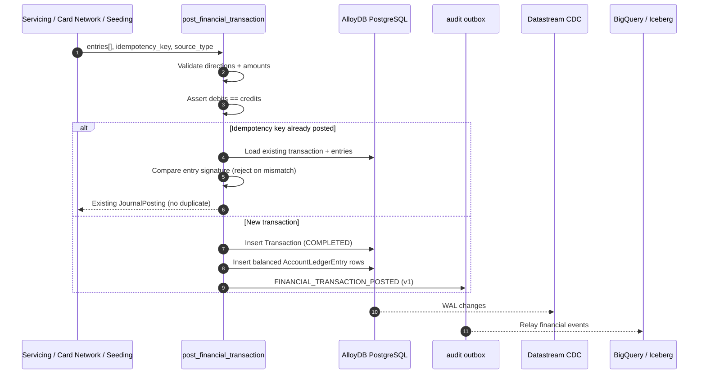

# FSI Architecture Design: Financial Ledger & Double-Entry Journal

This document defines the canonical money-movement primitive for the FSI GECX Bundle: a **balanced double-entry financial journal** with idempotent posting and versioned audit events.

Every action that moves money — bill payments, deposits, card authorizations and settlement, fee reversals, and simulated traffic — funnels through one function, `post_financial_transaction`. Balances are never mutated ad hoc; they are the result of appended, balanced journal entries. This keeps the operational ledger auditable and gives the lakehouse a clean, replayable financial-event stream.

---

## 1. Posting Model

---

## 2. Core Contract

`post_financial_transaction` (`services/financial_journal.py`) appends a balanced transaction and a versioned event **without committing** — the caller controls the surrounding transaction boundary.

| Input | Meaning |
| :--- | :--- |
| `entries` | Two or more `JournalEntrySpec(account_id, direction, amount_cents)`. |
| `idempotency_key` | Uniqueness key that makes re-posting safe. |
| `source_type` | Origin classifier (payment, authorization, reversal, seeding, …). |
| `source_references` | Optional structured provenance persisted with the event. |
| `currency` | Defaults to `USD`; balance is asserted per currency. |

Validation rules enforced before any write:

| Rule | Behavior |
| :--- | :--- |
| Direction | Each entry must be `DEBIT` or `CREDIT`; anything else raises `ValueError`. |
| Positive amounts | Amounts must be positive integers in cents; the direction carries the sign. |
| Minimum entries | A transaction requires at least two entries. |
| Balance | Total debits must equal total credits, or the post is rejected as unbalanced. |

The function returns a `JournalPosting(transaction, entries, event_id)`.

---

## 3. Idempotency & Replay Safety

Idempotency is first-class, because payments and authorizations retry:

- On a reused `idempotency_key`, the existing transaction and its ledger entries are loaded and returned instead of double-posting.
- The requested entry set is compared against the stored set as a signature (`account_id`, direction, `amount_cents`). A **reused key with different entries** raises `ValueError`, catching accidental key collisions rather than silently corrupting the ledger.
- The prior `FINANCIAL_TRANSACTION_POSTED` event is located and its `event_id` returned, so downstream consumers can reconcile to the original event.

---

## 4. System & Clearing Accounts

Journal postings need a balancing counterparty. The module provisions durable accounts on demand:

| Helper | Purpose |
| :--- | :--- |
| `ensure_system_journal_account` | Returns (or creates) a `SYSTEM`-type clearing account used as the balancing counterparty for external-facing movements. |
| `ensure_credit_journal_account` | Returns (or creates) the canonical receivable `Account` mirroring a `CreditAccount` (`CARD-<id>`), keeping card balances and available credit synchronized with the ledger view. |

This lets card receivables, deposit accounts, and system clearing all participate in the same balanced-entry model.

---

## 5. Versioned Financial Events

Each successful post emits a `FINANCIAL_TRANSACTION_POSTED` event (schema version `1`) into the audit outbox. The event is the durable, replay-friendly record of the movement and is relayed to the lakehouse for OLAP and compliance use. Because the event is versioned, the payload schema can evolve without breaking historical replay.

The outbox relay, deduplication, and Iceberg delivery mechanics are owned by the audit/lakehouse layer — see the related documents below.

---

## 6. Callers

The journal is the shared write path for every money movement in the platform:

| Caller | Movement |
| :--- | :--- |
| `services/accounts.py` | Deposits and inter-account bill payments. |
| `services/credit_card.py` | Card servicing money movement (payments, fee reversals). |
| `services/card_network.py` | Authorization holds and settlement. |
| `services/ledger.py` | Account-locked posting orchestration (`SELECT ... FOR UPDATE NOWAIT`). |
| `services/seeding_service.py` | Deterministic demo/history generation. |

Concurrency is protected upstream in `LedgerService`, which acquires pessimistic row locks on accounts sorted by ID (`FOR UPDATE NOWAIT`) to avoid deadlocks and connection exhaustion before posting.

---

## 7. Related Documents

| Document | Relationship |
| :--- | :--- |
| [Transactional Data Layer Architecture](./data_layer_architecture.md) | Schema home of `Account`, `Transaction`, and `AccountLedgerEntry`. |
| [BigQuery OLAP & Compliance Audit Architecture](./bigquery_olap_audit_architecture.md) | Outbox relay, deduplication, and Managed Iceberg delivery of financial events. |
| [Apache Iceberg CDC Data Lakehouse](./apache_iceberg_cdc_datalake_architecture.md) | Catalog-native financial-event path and cross-engine access. |
| [Cardholder Self-Service & Account Servicing](../domain-workflows/servicing/cardholder_self_service.md) | Servicing actions that post through this journal. |
