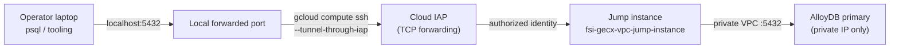

# FSI Architecture Design: Secure Database Access via IAP SSH Tunnel

This document defines how operators reach the private AlloyDB (PostgreSQL) instance in the FSI GECX Bundle without exposing it to the public internet.

AlloyDB has no public IP. All human access goes through an **Identity-Aware Proxy (IAP) SSH tunnel** to a hardened jump host, which forwards a local port to the database's private address. Authentication is short-lived IAM credentials, not a static database password. This keeps the database on a private network while still allowing an authorized engineer to run `psql`, inspect migration state, or diagnose CDC from their laptop.

---

## 1. Connection Topology



There is no inbound path from the internet to either the bastion or the database. The tunnel rides over IAP's TCP forwarding, so the bastion needs no public SSH port and no `0.0.0.0/0` firewall rule — only IAP's range and IAM authorization.

---

## 2. Why a Tunnel Instead of a Public IP

| Concern | How the tunnel addresses it |
| :--- | :--- |
| Network exposure | AlloyDB stays private; the bastion accepts SSH only from IAP's forwarding range. |
| Identity | Access is gated by IAM (`roles/iap.tunnelResourceAccessor` + compute SSH permissions), so revoking a person is an IAM change, not a password rotation. |
| Credential lifetime | The database password is a freshly minted IAM access token that expires in ~1 hour, so nothing long-lived is stored on the operator's machine. |
| Auditability | IAP and the bastion produce connection logs tied to the authenticated principal. |
| Encryption | SSH secures laptop→bastion; `sslmode=require` secures the psql session end to end. |

---

## 3. The `connect-db.sh` Helper

`scripts/ssh-tunnel/connect-db.sh` establishes the forward. It is parameterized by environment variables with sensible defaults:

| Variable | Default | Purpose |
| :--- | :--- | :--- |
| `PROJECT_ID` | active gcloud project | Target project (required if no active project). |
| `REGION` | `us-central1` | AlloyDB region. |
| `CLUSTER_ID` / `INSTANCE_ID` | `banking-data` / `banking-primary` | AlloyDB cluster and primary instance. |
| `BASTION_VM_NAME` | `fsi-gecx-vpc-jump-instance` | The jump host to tunnel through. |
| `BASTION_ZONE` | `us-central1-a` | Zone of the jump host. |
| `LOCAL_PORT` | `5432` | Local port to forward. |

The script first resolves the instance's **private** IP via `gcloud alloydb instances describe ... --format='value(ipAddress)'`, then opens the tunnel:

```bash
gcloud compute ssh "${BASTION_VM_NAME}" \
  --project "${PROJECT_ID}" --zone "${BASTION_ZONE}" --tunnel-through-iap \
  -- -N -L "${LOCAL_PORT}:${alloydb_ip}:5432"
```

`-N` means "no remote command" (port-forward only) and `-L` binds `localhost:${LOCAL_PORT}` to the AlloyDB private IP on `5432` from inside the VPC.

---

## 4. Authenticating the psql Session

The forward carries a raw TCP connection; the database still authenticates the user. The platform uses AlloyDB **IAM authentication**, so the operator's password is a short-lived access token:

```bash
PGPASSWORD="$(gcloud auth print-access-token)" \
  psql "host=127.0.0.1 port=5432 dbname=banking user=$(gcloud config get-value account) sslmode=require"
```

| Element | Role |
| :--- | :--- |
| `gcloud auth print-access-token` | Mints a ~1-hour OAuth token used as the database password. |
| `user=$(gcloud config get-value account)` | The IAM principal is the database user (IAM auth). |
| `sslmode=require` | Forces TLS on the psql leg of the connection. |
| `host=127.0.0.1` | Connects to the locally forwarded port, not the database directly. |

Because the token expires, a long operator session simply re-runs `print-access-token` for a fresh password.

---

## 5. Operational Use

This access path is for controlled, human-in-the-loop tasks — not application traffic. Application services connect over the private VPC directly and never use the tunnel. Typical operator uses:

- Inspecting `admin.alembic_version` to confirm the applied migration revision.
- Diagnosing connectivity, roles, grants, or replication-slot state during a release.
- Reset/seed and CDC/federation health checks.

The operations runbook step 6 codifies this: run `scripts/ssh-tunnel/connect-db.sh` and use a fresh `gcloud auth print-access-token` as the password.

---

## 6. Related Documents

| Document | Relationship |
| :--- | :--- |
| [AlloyDB Demo Operations Runbook](../../operations/alloydb_demo_runbook.md) | Connection diagnosis, reset/seed, and CDC health procedures that use this tunnel. |
| [Alembic Schema Migrations](./alembic_schema_migrations.md) | Migration revision state operators inspect through the tunnel. |
| [Transactional Data Layer Architecture](./data_layer_architecture.md) | The schemas and roles reachable once connected. |
| [Database Deployment Lifecycle](./pre_deployment_migrations_plan.md) | Automated bootstrap/migrate/reconcile jobs that run inside the VPC without a tunnel. |
