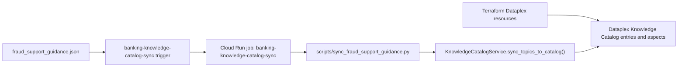
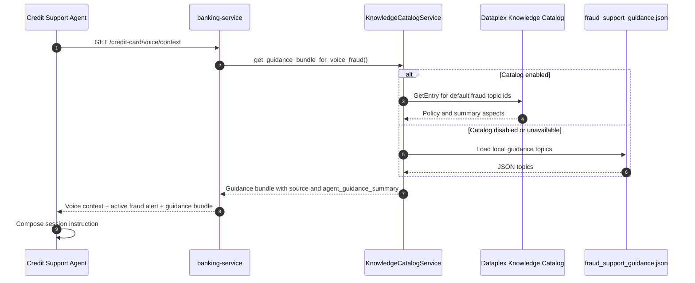

# Knowledge Catalog Fraud Support Guidance Architecture

This document explains how curated fraud support policy is seeded into Dataplex Knowledge Catalog and then supplied to the Gemini Live credit support agent as voice-flow guidance.

The canonical placement is the data platform architecture area because Dataplex owns the governed metadata objects, sync job, IAM boundary, and cross-environment repeatability. The AI and voice architecture should link here because the Gemini Live agent is the runtime consumer.

---

## Purpose

The fraud voice remediation flow needs current, governed guidance for how the agent should speak and sequence actions during an active fraud alert. That guidance is not live account state and it is not a substitute for MCP tool results. It is policy and phrasing context that tells the agent what it must do, what it must not do, and which high-level tools are appropriate for the flow.

Examples include:

- Ask whether the customer recognizes suspicious charges before calling them fraud.
- Confirm the disputed transaction selection before opening the case.
- Use `triage_fraud_case` as the high-level fraud workflow instead of sequencing low-level card tools.
- Describe provisional credits as pending the full fraud investigation.
- Offer Google Wallet provisioning only after replacement card issuance and customer agreement.

---

## Ownership Boundary

| Layer | Responsibility |
| :--- | :--- |
| `banking-service/resources/data/fraud_support_guidance.json` | Source-controlled seed content and local fallback. |
| Terraform | Dataplex API enablement, entry group, entry type, aspect types, Cloud Run sync job, IAM. |
| `banking-knowledge-catalog-sync` Cloud Build trigger | Rebuilds the banking-service image and executes the catalog sync job when guidance/catalog code changes. |
| `banking-knowledge-catalog-sync` Cloud Run job | Writes guidance topics into Dataplex Knowledge Catalog. |
| `KnowledgeCatalogService` | Reads catalog entries at runtime and falls back to the local JSON file if catalog is disabled or unavailable. |
| `FraudAlertService` voice context endpoint | Adds the guidance bundle to `/credit-card/voice/context`. |
| Credit support agent | Composes session instructions from base prompt, active fraud context, and guidance summary. |

---

## Provisioned Catalog Model

Terraform creates a small custom Dataplex catalog model for approved fraud support guidance:

| Resource | Id | Purpose |
| :--- | :--- | :--- |
| Entry group | `fraud-support-guidance` | Container for curated support guidance topics. |
| Entry type | `fraud-support-topic` | Custom entry type for one support guidance topic. |
| Aspect type | `fraud-support-policy` | Structured policy fields such as `must_do`, `must_not_do`, `tool_dependencies`, `version`, and `last_reviewed`. |
| Aspect type | `fraud-customer-summary` | Customer-safe summary text that can shape spoken language without exposing internal policy detail. |

Each topic from `fraud_support_guidance.json` becomes a Dataplex entry with both policy and customer-summary aspects.

Current default topics are:

- `fraud_golden_path`
- `recognized_activity`
- `replacement_card`
- `wallet_provisioning`
- `human_escalation`

---

## Sync Flow



The sync trigger is intentionally separate from the main banking-service deployment trigger. Guidance-only edits should update catalog content without forcing a banking-service rollout, and banking-service code changes should not block on catalog content sync unless catalog-related files changed.

The sync trigger watches:

- `banking-service/cloudbuild-knowledge-catalog-sync.yaml`
- `banking-service/resources/data/fraud_support_guidance.json`
- `banking-service/scripts/sync_fraud_support_guidance.py`
- `banking-service/services/knowledge_catalog.py`

The job runs:

```bash
python scripts/sync_fraud_support_guidance.py
```

with `KNOWLEDGE_CATALOG_ENABLED=true` and Dataplex resource ids supplied by Terraform.

---

## Runtime Read Flow



The guidance bundle includes:

- `source`: `knowledge_catalog`, `knowledge_catalog_with_local_fallback`, `local_file`, or `local_file_fallback`
- `topic_ids`: ordered topic ids used for the session
- `topics`: structured topic payloads
- `agent_guidance_summary`: compact instruction summary composed from `must_do`, `must_not_do`, and `tool_dependencies`

The voice agent logs the guidance source when it loads session context. During a healthy catalog-backed run this should show `guidance_source=knowledge_catalog`.

---

## Agent Composition Semantics

The credit support agent does not use catalog guidance by itself. It composes three inputs:

1. Base instruction text from `agent/resources/instruction.txt`.
2. Trusted session context from `/credit-card/voice/context`, including active fraud alert id, card last four, message thread id, and suspicious transaction details.
3. Catalog guidance summary from `KnowledgeCatalogService`.

The ordering matters:

- Live banking-service state and MCP tool results are operational truth.
- Catalog guidance shapes policy, sequencing, and phrasing.
- The local JSON file is a fallback and seed source, not a competing policy store.

This prevents catalog content from becoming stale operational state. For example, the catalog may say to call `triage_fraud_case`, but only the MCP result can confirm whether the case was triaged, the card was blocked, provisional credits were applied, or a replacement card was issued.

---

## Environment Variables

| Variable | Producer | Consumer | Description |
| :--- | :--- | :--- | :--- |
| `KNOWLEDGE_CATALOG_ENABLED` | Terraform / job env | banking-service | Enables Dataplex reads or sync behavior. |
| `KNOWLEDGE_CATALOG_PROJECT_ID` | Terraform / job env | banking-service | Project containing the catalog resources. |
| `KNOWLEDGE_CATALOG_LOCATION` | Terraform / job env | banking-service | Dataplex location, normally `us-central1`. |
| `KNOWLEDGE_CATALOG_ENTRY_GROUP_ID` | Terraform | banking-service | Entry group id, normally `fraud-support-guidance`. |
| `KNOWLEDGE_CATALOG_ENTRY_TYPE_ID` | Terraform | sync job | Entry type id, normally `fraud-support-topic`. |
| `KNOWLEDGE_CATALOG_POLICY_ASPECT_TYPE_ID` | Terraform | banking-service | Policy aspect type id, normally `fraud-support-policy`. |
| `KNOWLEDGE_CATALOG_SUMMARY_ASPECT_TYPE_ID` | Terraform | banking-service | Customer summary aspect type id, normally `fraud-customer-summary`. |

---

## Failure And Fallback Behavior

Catalog read failures are deliberately non-fatal for the voice demo:

- If catalog is disabled, banking-service returns guidance from the local JSON source with `source=local_file`.
- If catalog is enabled but a read fails, banking-service logs a warning and returns `source=local_file_fallback`.
- If some requested topics are absent in catalog, banking-service merges remote topics with local fallback topics and returns `source=knowledge_catalog_with_local_fallback`.
- If all requested topics are present in catalog, banking-service returns `source=knowledge_catalog`.

This fallback keeps the voice flow usable during Dataplex provisioning issues while still making the guidance source visible in logs and session context.

---

## IAM Model

The catalog path uses separate runtime permissions:

- `banking-service-sa` receives Dataplex catalog viewer access so runtime voice context can read entries.
- `knowledge-catalog-sync-sa` receives Dataplex catalog editor access so the sync job can create or update entries and aspects.
- Cloud Build runs the sync trigger and updates/executes the Cloud Run job.

This keeps content publication separate from runtime consumption.

---

## Operational Checklist

To verify a new environment:

1. Apply Terraform so Dataplex entry group, entry type, aspect types, IAM, trigger, and Cloud Run job exist.
2. Run or wait for the `banking-knowledge-catalog-sync` trigger after guidance files are present.
3. Confirm the sync job logs list the topic ids it wrote.
4. Start a fraud voice session and confirm banking-service or credit-support-agent logs show `guidance_source=knowledge_catalog`.
5. If the source is fallback, inspect Dataplex entry existence, sync job logs, and IAM bindings before debugging the voice agent prompt.

