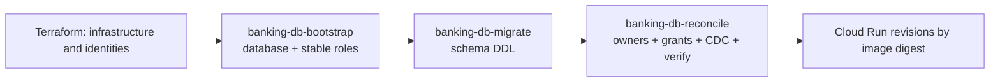

# Database Deployment Lifecycle

This document supersedes the original Cloud SQL migration-job proposal. The deployed AlloyDB lifecycle uses three isolated Cloud Run jobs under one ordered release controller.

## Ownership boundaries

- Terraform owns AlloyDB, networking, IAM, database users, secrets, jobs, and Datastream resources.
- Bootstrap creates the `banking` database, stable `NOLOGIN` group roles, and memberships for Terraform-managed principals.
- Alembic owns only versioned schemas and application objects.
- Reconciliation owns object ownership, runtime grants, default privileges, immutable-ledger revocations, and logical replication prerequisites.
- Application services never create database roles or own schema objects.

Each stage is idempotent and blocks the next stage on failure. The release controller records the tested commit, immutable image digests, Alembic revision, environment, final legacy backup identifier when applicable, and validation results. A promotion to `fsi-demo-1841` consumes that manifest and requires approval.

For the full architecture and operations sequence, see [Enterprise Data Layer Architecture](./data_layer_architecture.md).
