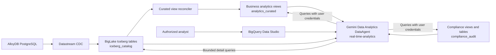
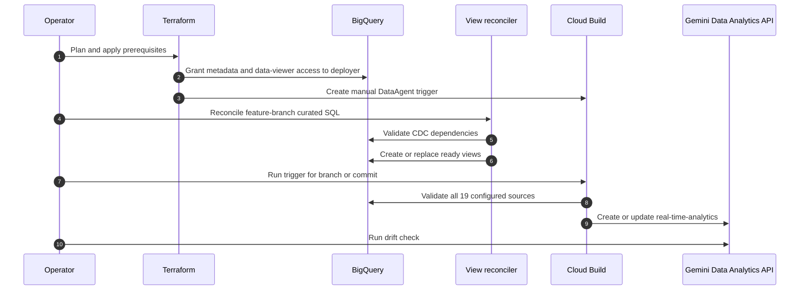

# Real Time Analytics Agent Architecture

## Purpose

The Real Time Analytics Agent is a managed Gemini Data Analytics `DataAgent` for business,
operational, and compliance analysis over the Nova Horizon banking data platform. It gives
authorized users a natural-language analytics surface without introducing another data copy or
embedding analytical logic in the banking application.

The agent is grounded in an explicit, source-controlled allowlist of 19 BigQuery tables and views.
It prefers reusable curated views for business questions, uses compliance views for audit evidence,
and falls back to selected CDC tables only when curated data does not contain the required detail.

The stable managed resource is:

```text
projects/{project-id}/locations/us/dataAgents/real-time-analytics
```

The agent is deployed independently of `banking-service` and `banking-ui`.

## System Context



The DataAgent stores instructions and source metadata, not a separate copy of banking data. At
conversation time it generates BigQuery queries and executes them with the signed-in user's
permissions.

## Grounding Layers

| Layer | Dataset | Agent use |
| :--- | :--- | :--- |
| Curated analytics | `analytics_curated` | Preferred source for customer, geography, spend, fraud, offer, and scenario analysis. |
| Compliance evidence | `compliance_audit` | Audit trails, control evidence, and bounded access to the raw audit outbox. |
| CDC detail | `iceberg_catalog` | Selected cards, merchant, fraud operations, and retail-location tables when curated views lack required detail. |

The allowlist is intentionally explicit. Dataset IAM grants access but does not automatically add
every table in a dataset to the agent's knowledge sources. This keeps source selection reviewable,
limits prompt context, and prevents newly created tables from silently entering the agent.

The system instruction establishes these source-selection rules:

1. Prefer `analytics_curated` for business metrics and trends.
2. Prefer `compliance_audit` domain views for audit and control questions.
3. Use selected `iceberg_catalog` tables only for unavailable detail.
4. Treat `compliance_audit.audit_events` as a bounded, last-resort source and never return
   raw payloads verbatim.

For the CDC and curated-view lifecycle, see
[Apache Iceberg CDC Data Lakehouse](./apache_iceberg_cdc_datalake_architecture.md) and
[Lakehouse View Reconciliation](./lakehouse_view_reconciliation.md).

## Ownership Boundary

| Component | Responsibility |
| :--- | :--- |
| Terraform | Required APIs, deployer IAM, BigQuery dataset grants, manual Cloud Build trigger, and stable agent-name output. |
| Curated SQL and manifest | Source-controlled definitions and dependencies for `analytics_curated` views. |
| Curated view reconciler | Idempotently creates or updates views after their CDC dependencies are queryable. |
| DataAgent JSON specification | Project-neutral agent identity, instructions, labels, query budget, and explicit BigQuery source allowlist. |
| DataAgent deployer | Injects the target project, validates every source, and creates, updates, or drift-checks the managed resource through the Gemini Data Analytics REST API. |
| `real-time-analytics-agent-deploy` trigger | Runs the deployer from a selected branch or commit without deploying application services. |
| BigQuery Data Studio | User-facing discovery, conversation, query, and visualization experience. |

Terraform does not own the `DataAgent` resource directly because the Google Terraform provider
does not expose that resource. The deployer provides the missing idempotent resource lifecycle:

- Create the stable agent when it does not exist.
- Leave it unchanged when the managed projection matches the specification.
- Update only the managed fields when configuration has drifted.
- Fail `--check` when the resource is missing or different.

## Deployment Flow



The required order is:

1. Apply Terraform prerequisites.
2. Reconcile curated views.
3. Deploy the managed DataAgent.
4. Verify configuration drift and test representative questions.

Source validation occurs before create or update. A missing view, invalid reference, or unreadable
source blocks deployment rather than producing a partially grounded agent.

## Identity and Access Model

Deployment and conversation use different principals.

### Deployment identity

The Cloud Build service account needs:

- Gemini Data Analytics Data Agent Creator and Editor roles.
- Data Catalog Viewer on the project so it can add knowledge sources.
- BigQuery Job User on the project.
- BigQuery Metadata Viewer and Data Viewer on `analytics_curated`, `compliance_audit`, and
  `iceberg_catalog`.

The DataAgent API validates knowledge sources with the deployment principal's credentials. Metadata
access alone is insufficient because the principal must also be able to read each configured source.

### User identity

The agent queries BigQuery on behalf of the signed-in user. An end user therefore needs:

- Data Agent User and Viewer access.
- Cloud AI Companion User access for the Gemini-powered Data Studio interface.
- BigQuery Job User and access to the underlying datasets.

Agent access never bypasses BigQuery IAM. Sharing the agent without sharing its data sources lets a
user discover the agent but does not grant access to query protected banking data.

## Analytical Guardrails

The managed instruction applies several high-level safeguards:

- State the sources and time window used.
- Distinguish pending authorizations from posted transactions.
- Convert cent-denominated monetary fields before presentation.
- Treat fraud signals as investigative indicators, not proof of wrongdoing.
- Prefer aggregates and avoid exposing raw customer identifiers or audit payloads.
- Identify freshness, missing partitions, and incomplete result sets.
- Reject sources outside the environment-local allowlist.
- Limit each generated query with a configured maximum billed-byte budget.

Curated views remain reusable building blocks rather than precomputed answers. The agent performs
requested joins, grouping, filtering, ranking, percentages, and visualization at query time.

## Operations and Drift

The checked-in specification contains no project id. The deployer injects the target project into
all table references, allowing the same specification to be promoted across environments.

Operators can use three modes:

| Mode | Behavior |
| :--- | :--- |
| Render | Produces the environment-specific API payload without calling Google Cloud. |
| Deploy | Validates sources and idempotently creates or updates the stable agent. |
| Check | Validates sources and fails if the managed resource is absent or has configuration drift. |

Operational failures are intentionally explicit:

| Failure | Expected behavior |
| :--- | :--- |
| Curated source is not ready | Reconcile views first; DataAgent deployment stops during source validation. |
| Deployer has metadata but not data access | The DataAgent API rejects the source configuration; add dataset-level read access through Terraform. |
| Agent specification changes | The next deploy updates the managed fields; `--check` reports drift until deployment completes. |
| User lacks underlying data access | Agent discovery may work, but queries fail under that user's credentials. |
| Older manually created agent coexists | Validate `real-time-analytics`, then rename or retire the older manual resource to avoid ambiguity. |

## Related Implementation

| Artifact | Purpose |
| :--- | :--- |
| `deployment/data_agents/real_time_analytics_agent.json` | Canonical project-neutral agent specification. |
| `deployment/data_agents/deploy_data_agent.py` | Validation, payload rendering, deployment, and drift detection. |
| `deployment/cloud_build/cloudbuild-data-agent-deploy.yaml` | Manual Cloud Build execution definition. |
| `deployment/bigquery/analytics_curated/` | Curated SQL definitions and dependency manifest. |
| `scripts/datastream/reconcile_lakehouse_views.py` | Direct curated-view reconciliation entry point. |
