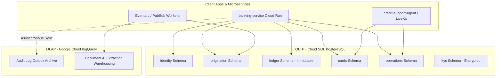

# 🏢 Enterprise Data Layer Architecture & Deployment Governance

This document describes the data architecture for the Nova Horizon Banking Platform. It details the bounded contexts enforced across Cloud SQL (PostgreSQL) and Google Cloud BigQuery, as well as our automated CI/CD schema migration lifecycle.

---

## 🌐 1. Hybrid Data Topology: OLTP vs. OLAP

Our platform separates high-velocity transactional processing from long-term analytical compliance warehousing:



### A. Cloud SQL (PostgreSQL) — Online Transaction Processing (OLTP)
PostgreSQL serves as the primary system of record for real-time customer operations, enforcing strict ACID referential integrity across specialized domain boundaries.

### B. Google Cloud BigQuery — Online Analytical Processing (OLAP)
BigQuery serves as the enterprise immutable analytics warehouse. It ingests asynchronous audit outbox events, compliance logs, and raw Document AI parsed JSON payloads (`application_artifact`) for multi-year regulatory retention and fraud analytics.

---

## 🏛️ 2. Domain Bounded Contexts (PostgreSQL Schemas)

To prevent monolithic table coupling and enforce Principle of Least Privilege (PoLP) at the database kernel level, our PostgreSQL database is segmented into dedicated schemas:

| Schema Name | Primary Bounded Context | Core Tables | Mutability & RBAC Profile |
| :--- | :--- | :--- | :--- |
| **`identity`** | Customer IAM, Profiles & Messaging | `users`, `user_devices`, `user_secure_messages` | High read/write velocity; profile updates |
| **`origination`** | Onboarding & Application Workflows | `applications`, `application_artifacts`, `mortgage_applications`, `credit_card_applications`, `deposit_applications` | Mutable state machines (`STARTED` -> `APPROVED`) |
| **`ledger`** | Core Financial Bookkeeping | `accounts`, `transactions`, `account_ledger` (Splits) | **Strictly Immutable / Append-Only** (No UPDATE/DELETE) |
| **`cards`** | Card Issuance & Network Authorizations | `issued_cards`, `transaction_authorizations`, `posted_transactions` | High-velocity hold & authorization gateway |
| **`operations`** | Bank Admin & Support Routing | `support_escalations`, `retail_locations`, `system_settings` | Internal operational administration |
| **`kyc`** | Sensitive Regulatory Compliance | `kyc_records` | Envelope-encrypted PII (DEK/KEK rotation) |

---

## ⚙️ 3. Automated Deployment Governance (`alembic/env.py`)

Our schema migration pipeline is engineered to eliminate manual script boilerplate and prevent race conditions during automated CI/CD deployments.

### A. Distributed Advisory Locking (`pg_advisory_xact_lock`)
During continuous deployment rollouts, dozens of Cloud Run or GKE container instances may boot simultaneously. To prevent concurrent horizontal scaling instances from executing overlapping DDL migrations or deadlocking schema catalogs, `run_migrations_online()` in `alembic/env.py` acquires an explicit PostgreSQL transaction advisory lock:

```python
with context.begin_transaction():
    if is_postgres:
        logger.info("Acquiring transactional advisory migration lock (ID: 592837410)...")
        connection.execute(sa.text("SELECT pg_advisory_xact_lock(592837410);"))
    context.run_migrations()
```
Secondary containers wait patiently on this advisory lock until the primary migration worker finishes upgrading the schema.

### B. Programmatic Pre-Upgrade Schema Initialization
Before applying revision diffs, `env.py` programmatically ensures that all six bounded context schemas exist in the target database (`CREATE SCHEMA IF NOT EXISTS <schema_name>`), freeing individual migration files from needing structural prerequisites.

### C. Zero-Touch Programmatic RBAC Permission Hooks
Manually maintaining `GRANT USAGE` and table privileges inside individual Alembic scripts is error-prone. We implement an automated post-migration hook in `env.py` that dynamically resolves Google Cloud IAM database roles (`<service-account>@<project_id>.iam`) and reapplies least-privilege RBAC grants immediately after migrations complete:

```python
# Executed programmatically across all schemas after context.run_migrations():
connection.execute(sa.text(f'GRANT USAGE ON SCHEMA {s} TO "{role}";'))
connection.execute(sa.text(f'GRANT SELECT, INSERT, UPDATE, DELETE ON ALL TABLES IN SCHEMA {s} TO "{role}";'))
connection.execute(sa.text(f'ALTER DEFAULT PRIVILEGES IN SCHEMA {s} GRANT SELECT, INSERT, UPDATE, DELETE ON TABLES TO "{role}";'))
```
This ensures that any newly created tables or schemas automatically inherit strict least-privilege IAM service account access rules without requiring manual DBA intervention.
