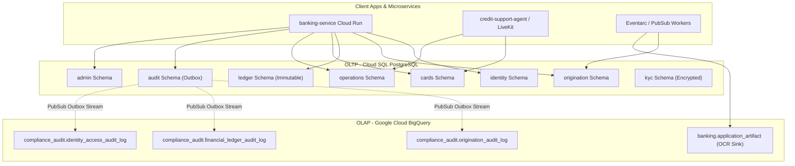

# 🏢 Enterprise Data Layer Architecture & Deployment Governance

This document describes the data architecture for the Nova Horizon Banking Platform. It details the bounded contexts enforced across Cloud SQL (PostgreSQL) and Google Cloud BigQuery, as well as our containerized CI/CD schema migration lifecycle and automated RBAC bootstrapping.

---

## 🌐 1. Hybrid Data Topology: OLTP vs. OLAP

Our platform separates high-velocity transactional processing from long-term analytical compliance warehousing:



### A. Cloud SQL (PostgreSQL) — Online Transaction Processing (OLTP)
PostgreSQL serves as the exclusive system of record for real-time customer operations, enforcing strict ACID referential integrity across 8 specialized domain boundaries.

### B. Google Cloud BigQuery — Online Analytical Processing (OLAP)
BigQuery serves as the enterprise immutable analytics warehouse. It ingests asynchronous audit outbox events into the domain-segmented `compliance_audit` dataset and archives raw Document AI parsed JSON payloads (`application_artifact`) for multi-year regulatory retention and fraud analytics.

To guarantee zero transaction overhead or event loss, compliance ingestion operates via a **3-Phase Transactional Outbox Pattern**:
1. **ACID Recording**: Domain mutations record pending events into PostgreSQL `audit.audit_outbox` inside the primary transaction boundary.
2. **Outbox Draining**: The asynchronous `POST /internal/process-outbox` poller batches pending records and publishes structured JSON payloads to Pub/Sub topic `audit-events`.
3. **Direct Serverless Streaming**: Google Cloud Pub/Sub BigQuery Subscriptions (`audit-events-bq-sub`) stream events directly into `compliance_audit.origination_audit_log` via the BigQuery Storage Write API (`--use-table-schema=true`).

All layers enforce defense-in-depth PII protection: application-layer string stripping, KMS envelope encryption for KYC records, and Data Catalog Policy Tags (`sensitive_npi`) for dynamic column masking in analytical queries. For full specifications, see [BigQuery OLAP Audit Architecture](file:///docs/architecture/bigquery_olap_audit_architecture.md).

---

## 🏛️ 2. Domain Bounded Contexts (PostgreSQL Schemas)

To prevent monolithic table coupling and enforce Principle of Least Privilege (PoLP) at the database kernel level, our PostgreSQL database is segmented into dedicated schemas:

| Schema Name | Primary Bounded Context | Core Tables | Mutability & RBAC Profile |
| :--- | :--- | :--- | :--- |
| **`identity`** | Customer IAM, Profiles & Messaging | `users`, `user_devices`, `user_secure_messages` | High read/write velocity; profile updates |
| **`origination`** | Onboarding & Application Workflows | `applications`, `application_artifacts`, `mortgage_applications`, `credit_card_applications`, `deposit_applications` | Mutable state machines (`STARTED` -> `APPROVED`) |
| **`ledger`** | Core Financial Bookkeeping | `accounts`, `transactions`, `account_ledger_entries` (Splits) | **Strictly Immutable / Append-Only** (No UPDATE/DELETE) |
| **`cards`** | Card Issuance & Network Authorizations | `credit_accounts`, `issued_cards`, `transaction_authorizations`, `posted_transactions` | High-velocity hold & authorization gateway |
| **`operations`** | Bank Support & Retail Routing | `support_escalations`, `retail_locations` | Customer-facing support administration |
| **`audit`** | Asynchronous Compliance Outbox | `audit_outbox` | Transactional outbox event publishing queue |
| **`admin`** | Platform Governance & Migrations | `system_settings`, `alembic_version` | Locked down to CI/CD and platform operators |
| **`kyc`** | Sensitive Regulatory Compliance | `kyc_records` | Envelope-encrypted PII (DEK/KEK rotation) |

### A. Origination Schema Structural Normalization (Parent-Child Extensions)
Within the `origination` schema, onboarding workflows avoid monolithic null-heavy parent tables by utilizing a **Parent-Child Extension Architecture**:
* **Parent Table (`applications`)**: Serves as the universal root workflow container holding common metadata (`id`, `user_id`, `product_category`, `status`, timestamps). `user_id` strictly links to `identity.users.id` via foreign key.
* **Child Extension Tables**: Domain-specific financial figures and attributes are strictly isolated into 1-to-1 extension tables (`mortgage_applications`, `credit_card_applications`, `deposit_applications`). Each extension table defines its own surrogate UUID primary key (`id`), a unique foreign key back to the root application (`application_id`), and product-isolated requested amounts (`requested_loan_cents`, `requested_limit_cents`, `initial_deposit_cents`). This allows clean schema evolution for domain expansion (e.g. adding multi-property appraisal records referencing `mortgage_applications.id`).

---

## ⚙️ 3. Automated Deployment Governance (`alembic/env.py`)

Our schema migration pipeline is engineered to eliminate manual script boilerplate, prevent race conditions during automated deployments, and validate lifecycles inside ephemeral containers.

### A. Distributed Advisory Locking (`pg_advisory_xact_lock`)
During continuous deployment rollouts, dozens of Cloud Run container instances may boot simultaneously. To prevent concurrent scaling instances from executing overlapping DDL migrations or deadlocking catalog tables, `run_migrations_online()` in `alembic/env.py` acquires an explicit PostgreSQL transaction advisory lock:

```python
with context.begin_transaction():
    if is_postgres:
        logger.info("Acquiring transactional advisory migration lock (ID: 592837410)...")
        connection.execute(sa.text("SELECT pg_advisory_xact_lock(592837410);"))
    context.run_migrations()
```
Secondary containers wait patiently on this advisory lock until the primary migration worker finishes upgrading the schema.

### B. Programmatic Pre-Upgrade Schema Initialization
Before applying revision diffs, `env.py` programmatically ensures that all 8 bounded context schemas exist in the target database (`CREATE SCHEMA IF NOT EXISTS <schema_name>`), freeing individual migration files from needing structural prerequisites.

### C. Zero-Touch RBAC Bootstrapping & Savepoint Isolation
Manually maintaining `GRANT USAGE` and table privileges inside individual Alembic scripts is error-prone. We implement automated post-migration hooks in `env.py` that dynamically resolve Google Cloud IAM database roles (`<service-account>@<project_id>.iam`) and bootstrap any missing database roles inside sub-transaction savepoints (`begin_nested()`):

```python
# 1. Idempotent role bootstrap inside savepoint isolation:
with connection.begin_nested():
    stmt = f'DO $$ BEGIN IF NOT EXISTS (SELECT FROM pg_roles WHERE rolname = \'{role}\') THEN CREATE ROLE "{role}" NOLOGIN; END IF; END $$;'
    connection.execute(sa.text(stmt))

# 2. Least-privilege RBAC permission grants:
with connection.begin_nested():
    connection.execute(sa.text(f'GRANT USAGE ON SCHEMA {s} TO "{role}";'))
    connection.execute(sa.text(f'GRANT SELECT, INSERT, UPDATE, DELETE ON ALL TABLES IN SCHEMA {s} TO "{role}";'))
    connection.execute(sa.text(f'ALTER DEFAULT PRIVILEGES IN SCHEMA {s} GRANT SELECT, INSERT, UPDATE, DELETE ON TABLES TO "{role}";'))
```
Sub-transaction savepoints guarantee that even if a role grant fails in an isolated environment, it rolls back cleanly without aborting the parent migration transaction.

### D. Containerized CI Migration Validation
In Step #2 of Cloud Build (`validate-ephemeral-migrations` in `cloudbuild-publish-deploy.yaml`), our CI/CD pipeline validates migration health prior to staging artifacts. It spins up an ephemeral `mirror.gcr.io/library/postgres:16-alpine` background daemon and connects the newly built banking container over shared container networking (`--network container:pg-validate`) to execute:
```bash
alembic upgrade head && alembic downgrade base && alembic upgrade head
```
This guarantees that DDL execution, schema scoping, role bootstrapping, and rollback reversibility are 100% verified against a true PostgreSQL 16 kernel before deploying to Cloud Run.
