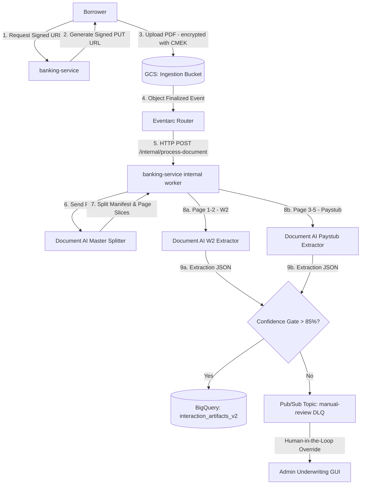

# FSI Architecture Design: Document AI Ingestion Pipeline & Data Catalog Governance

This document details the system architecture, design decisions, and security compliance framework for the automated **Google Cloud Document AI Ingestion & Processing Pipeline** (Asynchronous Document Processing Paradigm).

---

## 📐 1. Pipeline Topology & Data Ingestion Flow

The document processing pipeline uses a fully asynchronous, event-driven architecture to parse, classify, and extract structured personal financial information from multi-page loan packages without introducing blocking delays in the user interface.

---

## 🔒 2. Core Architectural Design Decisions

### A. Two-Phase Splitting & Specialized Extraction
* **Context**: Loan application packages are typically uploaded as a single combined PDF (containing a W2, multiple paystubs, and bank statements). Direct execution of a single extraction model over a combined PDF results in poor entity mapping and high error rates.
* **Decision**: We implement a two-phase hierarchy:
  1. **Phase 1 (Classification & Slicing)**: The package is sent to the master `LENDING_DOCUMENT_SPLIT_PROCESSOR` to identify page boundaries and document types (e.g. classifying pages 1-2 as W2 and 3-5 as Paystub).
  2. **Phase 2 (Specialized Extraction)**: The worker extracts the raw byte slices for the specified pages and submits them concurrently to dedicated extractors (`W2_PROCESSOR` and `PAYSTUB_PROCESSOR`).

### B. Idempotency Guards & Event Deduping
* **Context**: Google Cloud Pub/Sub guarantees at-least-once delivery, which can result in duplicate events arriving at the `/internal/process-document` endpoint. Processing duplicate events multiple times wastes Document AI processor quota and causes database write contention.
* **Decision**: The backend implements strict state-based idempotency checks. On event ingestion, the database status of the corresponding artifact ID is checked:
  - If status is `PENDING_CLASSIFICATION`, the processing proceeds.
  - If status is `PROCESSING` or `PROCESSED`, the event is dropped immediately with an HTTP 200 (OK) acknowledgment to prevent redundant processing.

### C. Split-State Schema (`claimed_artifact_type` vs. `actual_artifact_type`)
* **Context**: When a user uploads a document, they indicate what it is (e.g., claiming it's a W-2). However, users frequently upload incorrect documents (e.g., uploading a utility bill instead).
* **Decision**: The BigQuery schema tracks both `claimed_artifact_type` (what the user declared) and `actual_artifact_type` (what Document AI splitter classified). If a mismatch is detected, a state mismatch exception is raised, flagging the file for loan officer review.

---

## 🛡️ 3. Security, Privacy & Compliance (FSI Guidelines)

### A. Data Catalog, Policy Tags & Data Masking
* **Context**: Extractions pull highly sensitive personal data (e.g., SSN, gross wages). This data must be locked down to satisfy Gramm-Leach-Bliley Act (GLBA) and PCI rules.
* **Decision**: We define a centralized taxonomy in `governance.tf` that attaches security Policy Tags to sensitive BigQuery columns:
  - Columns like `social_security_number` or `net_wages` are tagged as `PII_HIGH`.
  - GCP IAM policies enforce column-level access controls, ensuring that only authorized underwriting accounts can see plain-text values, while agents see masked outputs (e.g., `XXX-XX-1234`).

### B. OIDC Token Authentication for Event Ingestion
* **Context**: The `/internal/process-document` endpoint runs asynchronously and executes backend operations. It must be protected from public HTTP execution.
* **Decision**: We restrict ingress to the endpoint to internal Google Cloud triggers. Eventarc is configured to sign the HTTP post request using an OpenID Connect (OIDC) token issued to a dedicated Service Account. The FastAPI worker validates this token's signature, issuer (`https://accounts.google.com`), and audience (the target URL) before processing the payload.

### C. Data Minimization & Auto-Purging
* **Context**: Storing raw PDFs containing personal finance data in GCS indefinitely increases the project's risk profile.
* **Decision**: We enforce a **30-day automatic deletion lifecycle rule** on the GCS ingestion bucket. This ensures raw documents are purged from storage after processing, while the parsed, metadata-governed data remains queryable inside encrypted BigQuery tables.

---

## ⚡ 4. Asynchronous Queue Management & Retries

To prevent pipeline failures under bursts of application uploads, the architecture utilizes GCS notifications integrated with Google Cloud Pub/Sub subscriptions:
* **Dead-Letter Queue (DLQ)**: If the processing worker fails (due to API rate limit exhaustion or document corruption), Pub/Sub retries delivery using an exponential backoff schedule. If it continues to fail after 5 attempts, the message is moved to a DLQ topic for engineering audit.
* **Timeout & Memory Sizing**: The Cloud Run worker's timeout is set to 300 seconds to allow Document AI processing latency on long documents, and is configured with 2GiB memory to cache PDF byte page arrays comfortably.
