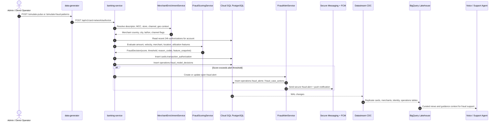

# FSI Architecture Design: Fraud Detection Workflow

This document defines the domain workflow, data contracts, and operational boundaries for the **Fraud Detection Workflow** in the FSI GECX Bundle.

The current implementation is a deterministic, explainable fraud scorer rather than a trained ML model. That is intentional for the demo baseline: it produces stable, auditable decisions from realistic authorization, merchant, velocity, and location features while leaving clear seams for a future model service.

---

## 1. System Topology & Workflow Mechanics

The fraud workflow starts in the card-network authorization path. Synthetic and demo swipes flow through the same gateway as normal card activity, receive merchant and location enrichment, are scored in real time, and then produce durable operational and analytical records.

---

## 2. Domain Responsibilities

### A. Data Generator

`data-generator` simulates an external merchant and card-present/card-not-present transaction network. It does not connect directly to the database. It discovers active cards and merchant stores through `banking-service`, then sends authorization requests back through the internal card-network API.

The generator has three fraud-oriented entry points:

| Endpoint | Purpose |
| :--- | :--- |
| `POST /simulate-pulse` | Generates normal background swipes and can probabilistically include fraud patterns when `FRAUD_PATTERN_ENABLED=true`. |
| `POST /simulate-fraud-patterns` | Explicitly triggers one or more named fraud patterns for controlled demo setup. |
| `POST /inject-anomaly` | Legacy targeted anomaly path that sends a small burst of suspicious authorizations. |

Named fraud patterns include gift-card bursts, electronics marketplace bursts, international amount outliers, impossible travel, unusual ecommerce country mismatch, merchant-category velocity, and near-limit pressure.

### B. Authorization Gateway

`banking-service` treats fraud scoring as part of authorization hold creation. Each swipe is enriched and scored before the hold is committed. The hold is still returned through the card-network response shape, with risk metadata included for downstream UI and demo stream consumers.

Key responsibilities:

| Component | Responsibility |
| :--- | :--- |
| `services/card_network.py` | Orchestrates card lookup, balance checks, merchant context, fraud scoring, authorization persistence, alert creation, and Redis UI broadcast. |
| `services/merchant_service.py` | Resolves merchant descriptor, MCC, country, store coordinates, ecommerce/card-present capabilities, and high-risk flags. |
| `services/fraud_scoring.py` | Extracts features and produces an explainable fraud decision. |
| `repositories/fraud.py` | Persists fraud model decisions and fraud case records. |
| `services/fraud_alerts.py` | Creates customer alerts, secure messages, voice-agent context, and deterministic remediation workflows. |

### C. Fraud Support Workflow

When a decision is high enough to alert, the system creates or updates one open fraud alert per credit account. Alerts are linked to suspicious authorization IDs and summarized into a secure message thread. The same alert context is available to voice/support agents through the fraud alert service, along with Knowledge Catalog guidance for safe customer handling.

Customer triage can resolve the alert as recognized activity or continue into remediation. Remediation can void suspicious authorization holds, apply provisional credits for posted transactions, issue a replacement card, escalate to specialist review, and write durable case actions with idempotency keys.

If no customer response arrives within the configured demo lifecycle window, a scheduled Banking Service job moves stale synthetic/demo alerts out of `OPEN` into `EXPIRED_NO_CUSTOMER_RESPONSE`. The transition records a `FRAUD_ALERT_RESPONSE_TIMEOUT` case action and audit event; it does not mark the activity as customer-recognized or confirmed fraud.

---

## 3. Feature Model

The fraud scorer uses a deterministic feature snapshot so every decision is explainable and reproducible. The current model version is `local-deterministic-v1`.

| Feature Group | Examples | Why It Matters |
| :--- | :--- | :--- |
| Transaction amount | `amount_cents`, amount-to-recent-average ratio | Detects outlier ticket sizes relative to recent account behavior. |
| Merchant context | MCC, descriptor flags, high-risk merchant flags | Flags known risky categories such as gift cards, digital goods, gaming, brokerage, and gambling-like activity. |
| Channel context | `transaction_channel`, `entry_mode`, ecommerce/card-present markers | Distinguishes chip/contactless/wallet activity from card-not-present ecommerce behavior. |
| Location context | Merchant country, city, region, lat/lon | Supports international anomaly and impossible-travel detection. |
| Ecommerce context | IP country, shipping country, digital goods flag | Detects country mismatch and digital-goods risk. |
| Account velocity | Counts over 10 minutes, 1 hour, and 24 hours | Detects bursts and repeated same-category activity. |
| Credit pressure | Available-credit ratio and utilization after authorization | Flags suspicious near-limit pressure. |
| Simulation labels | Synthetic fraud labels and pattern sequence | Keeps demo/test provenance in the feature snapshot without making it the only scoring signal. |

The scorer returns:

| Field | Meaning |
| :--- | :--- |
| `score` | Integer risk score. |
| `threshold` | Runtime flag threshold, defaulting from `FRAUD_FLAG_THRESHOLD`. |
| `decision` | `FLAGGED` or `APPROVED`. |
| `reason_codes` | Explainable rule triggers such as `IMPOSSIBLE_TRAVEL`, `VELOCITY_SPIKE_10M`, or `GIFT_CARD_OR_DIGITAL_GOODS`. |
| `feature_snapshot` | JSON payload persisted with the decision for audit and analytics. |
| `model_version` | Scorer version for future model comparison and replay. |

---

## 4. Scoring and Alert Thresholds

There are two runtime thresholds:

| Variable | Default | Purpose |
| :--- | :--- | :--- |
| `FRAUD_FLAG_THRESHOLD` | `20` | Marks the authorization as `FLAGGED` and records the risk score on the hold. |
| `FRAUD_ALERT_THRESHOLD` | `70` | Creates or updates an operational fraud alert and customer notification. |
| `FRAUD_ALERT_NO_RESPONSE_MAX_AGE_MINUTES` | `30` | Lifecycle job age threshold for moving stale synthetic/demo alerts out of `OPEN` when no customer response arrives. |
| `FRAUD_ALERT_LIFECYCLE_BATCH_LIMIT` | `100` | Maximum alerts processed by one lifecycle sweep. |

This split lets the platform show lower-risk anomalies in analytical views without opening a customer-facing case for every suspicious signal. `FRAUD_MODEL_ALERTS_ENABLED=false` can disable alert creation while preserving scoring and decision history.

---

## 5. Persistence Model

Fraud workflow tables live in the `operations` schema.

| Table | Purpose |
| :--- | :--- |
| `operations.fraud_model_decisions` | One explainable model decision per authorization, keyed by `authorization_id`. Includes score, threshold, decision, reason codes, feature snapshot, merchant context, and model version. |
| `operations.fraud_alerts` | Customer-facing alert/case record for suspicious card activity. Stores card/account linkage, secure-message thread, suspicious authorizations, remediation status, triage results, provisional credit totals, and replacement-card linkage. |
| `operations.fraud_case_actions` | Durable idempotent action history for triage and remediation steps. |

Authorization records also carry fraud and merchant context in `cards.transaction_authorization`, including risk score, channel, entry mode, merchant country/city/region/postal code, coordinates, IP/shipping country, digital-goods marker, immutable merchant snapshots, and optional merchant/store UUIDs when descriptor enrichment resolves a catalog match.

Merchant context is sourced from normalized merchant tables in the `merchants` schema:

| Table | Purpose |
| :--- | :--- |
| `merchants.merchant_master` | Parent merchant brand keyed by UUID, clean name, stable `merchant_slug`, category/domain attributes, and MCC linkage. |
| `merchants.merchant_stores` | Store or ecommerce descriptor keyed by UUID, `merchant_id` UUID FK to `merchant_master.id`, country, city, region, postal code, coordinates, channel capability, high-risk flags, and risk score. |

---

## 6. Lakehouse and Analytics Flow

Fraud decision history is part of the CDC stream. Datastream replicates the following fraud-relevant tables into the lakehouse:

| Schema | Tables |
| :--- | :--- |
| `cards` | `transaction_authorization`, `posted_transactions`, `credit_accounts`, `issued_card` |
| `identity` | `users`, `user_addresses` |
| `kyc` | `user_credit_profiles` |
| `merchants` | `merchant_master`, `merchant_stores`, `merchant_category_codes` |
| `operations` | `fraud_model_decisions` |

Curated BigQuery views can join authorization events, model decisions, users, credit profiles, and merchant stores without parsing geography out of merchant descriptor strings. When reference joins are needed, store rows join to merchant master rows with `merchant_stores.merchant_id = merchant_master.id`; `merchant_slug` is the retained seed/catalog key, not the relational FK. Demo surfaces can use these views for real-time spend velocity, international fraud anomalies, Mexico travel offer candidates, and fraud support context.

See also:

| Document | Relationship |
| :--- | :--- |
| [Apache Iceberg CDC Data Lakehouse](../../data-platform/apache_iceberg_cdc_datalake_architecture.md) | CDC and BigLake/Iceberg replication architecture. |
| [Lakehouse View Reconciliation](../../data-platform/lakehouse_view_reconciliation.md) | Curated view deployment and reconciliation workflow. |
| [Knowledge Catalog Fraud Support Guidance](../../data-platform/knowledge_catalog_fraud_support_guidance.md) | Runtime fraud support guidance consumed by voice agents. |

---

## 7. Model Evolution Path

The deterministic scorer is the first production-like seam, not the final fraud model. A future trained model can be introduced behind the same contract:

1. `FraudDecision` remains the stable response object.
2. Preserve `feature_snapshot`, `reason_codes`, and `model_version`.
3. Add an offline training pipeline from historical authorizations, model decisions, customer profiles, merchant stores, and confirmed fraud outcomes.
4. Register model artifacts and feature definitions with explicit versioning.
5. Run demo scoring before replacing the deterministic scorer for alerting.
6. Compare demo output against the deterministic baseline in BigQuery.
7. Promote only after alert precision, false-positive behavior, and support workflow impacts are reviewed.

The implementation should continue to favor explainability. Even if a trained classifier is introduced, customer support and audit flows still need reason codes that can be explained safely to non-technical users.

---

## 8. Operational Notes

### A. CDC Grants

Because fraud decisions replicate through Datastream, the CDC replication user must have `USAGE` and `SELECT` on all included schemas, including `operations`. The migration environment applies these grants after migrations so existing environments pick up CDC permission changes even when no historical migration reruns.

### B. Demo Reset and Seeding

Presenter reset clears fraud workflow residue for the target user and restores account/card state without requiring a full database reset. Full seeding populates the merchant catalog and generates enriched historical swipes so curated views can use structured merchant geography rather than string parsing.

### C. Guardrails

The generator excludes presenter and VIP/demo-script accounts from random background traffic by default. Explicit fraud-pattern simulation can still target a requested card token for controlled demos. Pulse admission uses Redis/Eventarc idempotency to avoid retry amplification and overlapping background pulses.
