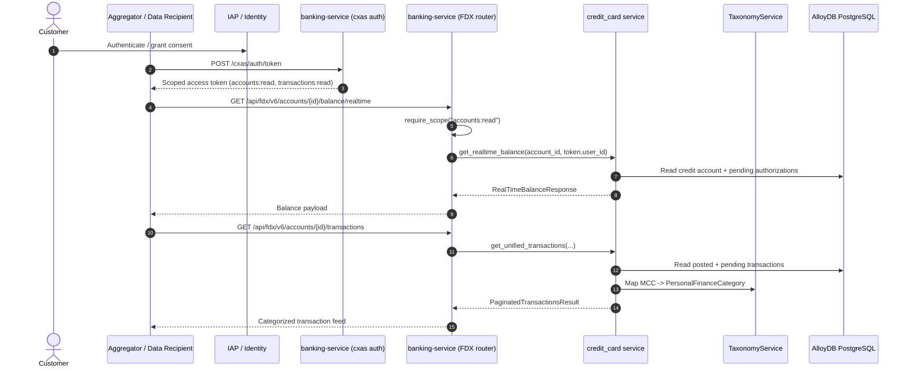

# FSI Architecture Design: FDX v6 Open Banking Integration

This document defines the domain workflow, data contracts, and security boundaries for the **Financial Data Exchange (FDX) v6 Open Banking API** in the FSI GECX Bundle.

The platform exposes a standards-aligned open-banking surface so an external aggregator, personal finance manager, or partner fintech can read a consented customer's account, balance, transaction, and payment-network data without screen scraping. The same service functions also back the first-party UI, so the FDX contract and the internal `credit-card/*` contract return identical, deduplicated data.

---

## 1. System Topology & Workflow Mechanics

An external data recipient authenticates the customer, receives a scoped access token, and then calls the FDX resource endpoints. Every request is scope-gated and re-checked against the token's user identity before any account data is returned.

---

## 2. Domain Responsibilities

### A. Authorization & Scope Enforcement

The FDX router (`routers/fdx.py`) is registered under the `Open Banking FDX v6` tag and enforces access with two independent controls:

| Control | Mechanism |
| :--- | :--- |
| Scope gate | `require_scope(...)` reads the `scope` claim from the validated token and rejects the call with `403` unless the required scope (`accounts:read` or `transactions:read`) or the wildcard `all` is present. |
| Identity binding | Every handler requires a non-empty `token.user_id` and passes it into the service layer, which re-validates account ownership before returning data. |

Access tokens are minted by the customer-experience auth surface (`/cxas/auth/token`) after IAP authentication, so consent and identity are established before any FDX scope check runs.

### B. FDX Resource Surface

| Endpoint | Scope | Purpose |
| :--- | :--- | :--- |
| `GET /api/fdx/v6/accounts/{account_id}` | `accounts:read` | Account metadata: masked number, product name, status, balances, credit line. |
| `GET /api/fdx/v6/accounts/{account_id}/balance/realtime` | `accounts:read` | Cleared balance, pending authorization total, and real-time available credit. |
| `GET /api/fdx/v6/accounts/{account_id}/transactions` | `transactions:read` | Paginated, MCC-categorized posted and pending transactions. |
| `GET /api/fdx/v6/accounts/{account_id}/payment-networks` | `accounts:read` | Supported payment rails (e.g. `US_ACH`) with transfer-in/out capability. |
| `GET /api/fdx/v6/taxonomies` | `accounts:read` | Full MCC → personal-finance-category map. |
| `GET /api/fdx/v6/taxonomies/{mcc}` | `accounts:read` | Single MCC category lookup. |

### C. First-Party Contract Parity

The internal UI consumes the same service functions through mirrored `credit-card/*` routes (`/credit-card/accounts/{id}/balance/realtime`, `/credit-card/transactions`, `/credit-card/accounts/{id}/payment-networks`). Because both surfaces call `services.credit_card`, the aggregator view and the customer's own app cannot diverge.

---

## 3. Data Contracts

FDX response models live in `models/fdx.py` and follow FDX v6 field naming.

| Model | Key Fields |
| :--- | :--- |
| `FDXAccount` | `account_id`, `account_number_display` (masked), `product_name`, `status`, `account_type`, `current_balance`, `available_credit`, `credit_line`, `iso_currency_code`. |
| `RealTimeBalanceResponse` | `credit_limit`, `cleared_balance`, `pending_authorizations_amount`, `realtime_available_credit`. |
| `FDXTransaction` | `transaction_id`, `pending`, `amount`, `transaction_type` (clearing rail), `posted_timestamp`, `transaction_timestamp`, `personal_finance_category`, `payment_meta`. |
| `PaymentNetwork` | `bank_id`, `identifier`, `type`, `transfer_in`, `transfer_out`. |
| `PersonalFinanceCategory` | `primary`, `detailed`, `confidence_level`. |

Real-time balance intentionally separates cleared balance from open authorization holds so a recipient can compute genuinely available credit rather than a stale statement balance.

---

## 4. Personal Finance Categorization

`TaxonomyService` maps Merchant Category Codes to an FDX `PersonalFinanceCategory` (`primary`/`detailed`). It is a thread-safe, TTL-cached (1 hour) lookup that loads from `resources/data/merchant_category_codes.json` and falls back to an in-code default map when the resource cannot be read. This keeps the transaction feed enriched with stable spend categories (e.g. `GROCERY_SUPERMARKETS`, `DINING_RESTAURANTS`, `FEES_LATE`) without the recipient having to interpret raw MCC integers.

---

## 5. Security Boundaries

| Concern | Behavior |
| :--- | :--- |
| Broken object-level authorization | Account ownership is re-checked against `token.user_id`; a mismatch raises `ValueError` mapped to `403`, so token possession alone does not grant cross-customer access. |
| Least privilege | Read scopes are granular (`accounts:read`, `transactions:read`); the wildcard `all` exists for first-party/internal callers only. |
| Data minimization | Account numbers are returned masked (`account_number_display`); no PAN or full account number is exposed. |
| Pagination bounds | Transaction `limit` is clamped to `1..500` and `offset` to `>= 0` at the router boundary. |

---

## 6. Related Documents

| Document | Relationship |
| :--- | :--- |
| [Transactional Data Layer Architecture](../../data-platform/data_layer_architecture.md) | Source-of-truth schemas for the accounts and transactions surfaced through FDX. |
| [Financial Ledger & Double-Entry Journal](../../data-platform/financial_ledger_journal_architecture.md) | How balances and postings that FDX reports are produced. |
| [Cardholder Self-Service & Account Servicing](../servicing/cardholder_self_service.md) | First-party servicing actions that mutate the same accounts FDX exposes read-only. |
