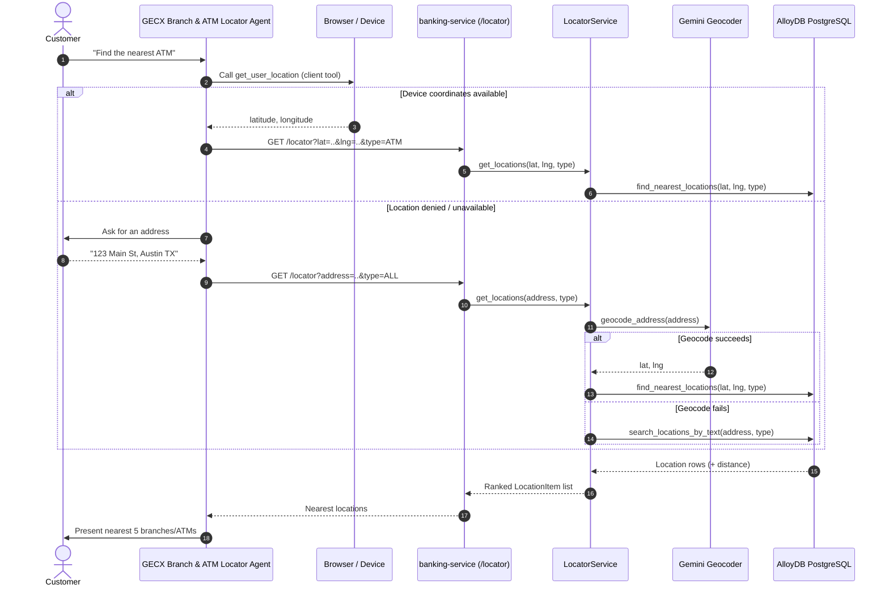

# FSI Architecture Design: Branch & ATM Locator

This document defines the domain workflow and integration boundaries for the **Branch & ATM Locator** journey in the FSI GECX Bundle.

The locator lets a customer find the nearest retail branches and ATMs either from the banking UI or conversationally through the dedicated GECX **Branch and ATM Locator** agent. It supports three inputs — device coordinates, a typed address, or free-text place search — and always returns a ranked, distance-annotated list.

---

## 1. System Topology & Workflow Mechanics

The conversational path and the UI path converge on a single `/locator` endpoint backed by `LocatorService`.

---

## 2. Domain Responsibilities

### A. GECX Locator Agent

The `Branch_and_ATM_Locator` agent (part of the `Nova_Horizon_Bot_v2` deployment) drives a single `Locate Branches and ATMs` task flow:

1. Call the `get_user_location` **client function** to request device geolocation from the browser.
2. If valid coordinates return, call the locator tool with `lat`/`lng`.
3. If location is null or denied, ask the customer for an address and call the locator tool with `address`.
4. Present the nearest five results.

`get_user_location` is a client-side tool: it returns `{ latitude, longitude }` from the device and never sends the raw address to the model when coordinates are available.

### B. Locator Endpoint

`GET /locator` accepts `lat`, `lng`, `address`, and `type` (`ALL`, `BRANCH`, or `ATM`) and returns a `LocatorResponse` of `LocationItem` records:

| Field | Meaning |
| :--- | :--- |
| `id`, `type`, `name`, `address` | Location identity and classification. |
| `latitude`, `longitude` | Coordinates for map rendering. |
| `hours`, `phone_number` | Optional service metadata. |
| `distance_miles` | Present for coordinate/geocoded queries; omitted for text fallback. |

### C. LocatorService Resolution Order

`LocatorService.get_locations` applies a deterministic input precedence:

| Input | Resolution |
| :--- | :--- |
| `lat` + `lng` provided | Direct nearest-neighbor query via `identity_repo.find_nearest_locations`, distances included. |
| `address` provided | `geocode_address` (Gemini) converts the address to coordinates, then nearest-neighbor query. |
| Geocode returns nothing | Fallback to `search_locations_by_text`, returning matches **without** distance. |

Distances are normalized to miles; when the repository returns `distance_meters`, the service converts it (`meters * 0.000621371`) and rounds to two decimals.

---

## 3. Data Source

Branch and ATM records are served from the `identity` domain repository. Coordinate queries use a nearest-location lookup so ranking is by true geographic proximity rather than string matching. Text search is a graceful degradation path for addresses that cannot be geocoded, ensuring the journey never dead-ends.

---

## 4. Related Documents

| Document | Relationship |
| :--- | :--- |
| [GECX Telephony Voice Agent](../../ai-and-voice/gecx_telephony_voice_agent.md) | Conversational agent runtime that hosts the locator sub-agent. |
| [Cardholder Self-Service & Account Servicing](./cardholder_self_service.md) | Companion self-service journeys exposed through the same UI and agent surfaces. |
| [Enterprise Search & Generative Answers](../../ai-and-voice/enterprise_search_and_answers.md) | Complementary knowledge-retrieval journey for informational questions. |
