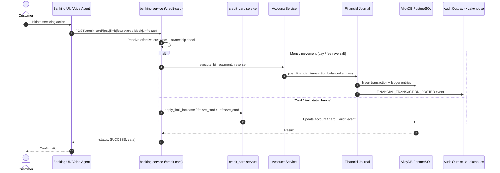

# FSI Architecture Design: Cardholder Self-Service & Account Servicing

This document defines the domain workflow, ledger effects, and authorization boundaries for **Cardholder Self-Service & Account Servicing** in the FSI GECX Bundle.

These are the post-origination servicing actions a cardholder can take on an existing account: pay the balance, request a credit-line increase, dispute and reverse a fee, and freeze/unfreeze or replace a card. Every action is reachable from the banking UI, from the Gemini Live credit-support voice agent, and — where appropriate — from a supervisor acting on a customer's behalf. Money-moving actions post through the balanced financial journal so servicing and the ledger never disagree.

---

## 1. System Topology & Workflow Mechanics

---

## 2. Servicing Actions

| Endpoint | Service Call | Effect |
| :--- | :--- | :--- |
| `POST /credit-card/pay` | `AccountsService.execute_bill_payment` | Inter-account bill payment from a checking/savings deposit account to pay down the card, posted as a balanced journal transaction. |
| `POST /credit-card/limit` | `apply_limit_increase` | Adjusts the credit line and recomputes available credit. |
| `POST /credit-card/fee/reverse` | `reverse_posted_fee` | Appends offsetting reversal ledger lines for a disputed fee and adjusts balances. |
| `POST /credit-card/block` | `freeze_card` | Freezes/permanently blocks a card token after an ownership check. |
| `POST /credit-card/unfreeze` | `unfreeze_card` | Restores a frozen card token to active use. |
| `POST /credit-card/internal/auto-paydown` | `SimulationService.execute_internal_auto_paydown` | Internal-context automated paydown that reduces utilization for continuous demo traffic. |
| `GET /credit-card/active-cards`, `/account`, `/transactions` | `credit_card` service | Read models backing the UI account and activity views. |

Card replacement is handled by `issue_replacement_card`, which is also invoked from the fraud remediation path when a compromised card must be reissued.

---

## 3. Authorization & Effective-Customer Resolution

Servicing endpoints separate the **authenticated caller** from the **effective customer** being serviced:

| Control | Behavior |
| :--- | :--- |
| `resolve_effective_id` | Combines the optional `target_customer_id`, the caller's own `customer_id`, and the validated token to determine whose account is acted on. A supervisor may service another customer; a customer may only service their own. |
| Ownership / BOLA guard | Card actions call `get_card_by_token_secured(card_token, effective_id)` before mutating; a token that does not belong to the effective customer returns `404` and logs a security warning, preventing BOLA/IDOR access. |
| Compliance stamping | When a supervisor acts (`target_customer_id` present), the caller's email is stamped into the ledger/reason string (`REVERSED_BY_<email>`, `FREEZE_BY_<email>`); direct customer actions record `CUSTOMER_VOICE_REQUEST` / `CUSTOMER_DISPATCH`. |

This makes every servicing mutation attributable to a specific human actor for audit review.

---

## 4. Ledger Integration

Money-moving servicing actions do not mutate balances directly. They call the canonical journal primitive `post_financial_transaction`, which enforces balanced double-entry posting, idempotency, and emission of a `FINANCIAL_TRANSACTION_POSTED` audit-outbox event. Fee reversals specifically append offsetting entries rather than editing the original posting, preserving an immutable, replayable history.

See [Financial Ledger & Double-Entry Journal](../../data-platform/financial_ledger_journal_architecture.md) for posting mechanics.

---

## 5. Channel Reach

| Channel | How Servicing Is Exposed |
| :--- | :--- |
| Banking UI | `CreditCardsView` and related views call the `/credit-card/*` endpoints directly. |
| Gemini Live voice agent | The credit-support agent invokes the same endpoints via the banking-service MCP toolset (pay, limit increase, fee dispute, card freeze). |
| Supervisor / admin | Admin surfaces pass `target_customer_id` to service a customer, with email compliance stamping. |

Because all channels share one service layer, the same authorization and ledger guarantees hold regardless of how the action is initiated.

---

## 6. Related Documents

| Document | Relationship |
| :--- | :--- |
| [Gemini Multimodal Live Voice Agent](../../ai-and-voice/gemini_live_voice_agent.md) | Voice channel that invokes these servicing actions as tools. |
| [Fraud Detection Workflow](../fraud/fraud_detection_workflow.md) | Shares card block and replacement actions during remediation. |
| [Financial Ledger & Double-Entry Journal](../../data-platform/financial_ledger_journal_architecture.md) | Posting engine behind payments and fee reversals. |
| [FDX v6 Open Banking Integration](../open-banking/fdx_open_banking_integration.md) | Read-only external view of the accounts serviced here. |
