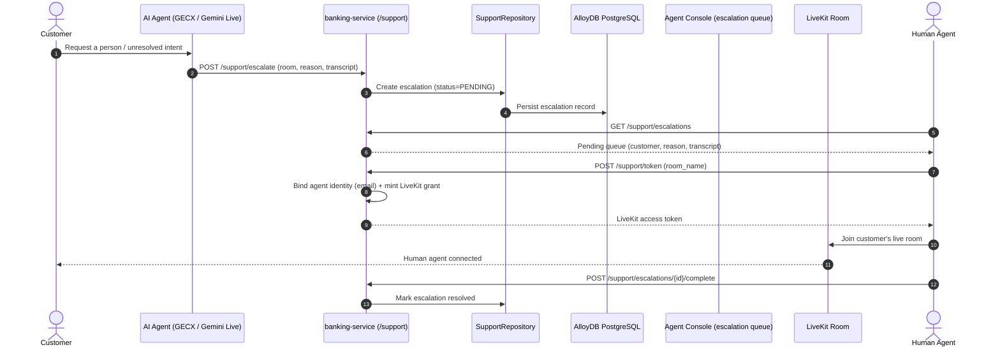

# FSI Architecture Design: Live Agent Escalation & Human Handoff

This document defines the domain workflow and session boundaries for **Live Agent Escalation & Human Handoff** in the FSI GECX Bundle.

When an AI conversation cannot or should not continue autonomously, the platform hands the live session to a human agent without dropping the customer. Escalation is available from both the conversational GECX bot and the Gemini Live voice agent, and the human agent joins the customer's existing real-time room rather than starting a new contact.

---

## 1. System Topology & Workflow Mechanics

---

## 2. Domain Responsibilities

### A. Escalation Triggers

Escalation is initiated by the AI layer, not the customer directly:

| Trigger Source | Mechanism |
| :--- | :--- |
| GECX bot | The `escalate_to_agent` and `transfer_to_loan_officer` tools in the `Nova_Horizon_Bot_v2` deployment signal a handoff for support and origination intents respectively. |
| Gemini Live voice agent | The credit-support agent escalates a live voice session when it reaches a terminal or out-of-scope outcome. |

Each escalation carries the room name, a reason, and the conversation transcript so the receiving human has full context before joining.

### B. Support Endpoints

| Endpoint | Purpose |
| :--- | :--- |
| `POST /support/escalate` | Create a pending escalation from an active session (`EscalationPayload`). |
| `GET /support/escalations` | Human agent console lists the pending queue with customer, reason, transcript, and timestamp. |
| `POST /support/token` | Mint a LiveKit access token bound to the human agent's identity for a specific room. |
| `POST /support/escalations/{id}/complete` | Mark an escalation resolved after handoff. |
| `POST /support/escalations/{id}/abandon` | Release an escalation that will not be serviced. |

### C. Human Agent Identity Binding

`SupportService.get_human_agent_token` requires a real agent identity before issuing a room grant:

- The agent email is taken from the validated token (`user_data.email`).
- In development, `ALLOW_DEV_AUTH_BYPASS=true` or `ENV=development` substitutes `agent@novahorizon.com`.
- If no email context is present, the request is rejected with `401` and a security alert is logged.

Room and agent references are written to logs through `stable_log_reference`, so operational logs correlate sessions without exposing raw identifiers.

---

## 3. Real-Time Takeover Model

The handoff is a **join**, not a transfer: the human agent is issued a LiveKit token for the customer's existing room (`room_name`), so audio/session continuity is preserved and the customer is not asked to re-authenticate or repeat context. This mirrors the same LiveKit room infrastructure used by the Gemini Live voice agent, meaning an AI-hosted room can be occupied by a human agent using identical transport.

| Property | Behavior |
| :--- | :--- |
| Session continuity | Human joins the live room; no new contact is created. |
| Context transfer | Transcript is persisted on the escalation and shown in the queue. |
| Lifecycle | Escalations move `PENDING → COMPLETE` (serviced) or `PENDING → ABANDON` (released). |

---

## 4. Related Documents

| Document | Relationship |
| :--- | :--- |
| [Gemini Multimodal Live Voice Agent](../../ai-and-voice/gemini_live_voice_agent.md) | Provides the LiveKit room and session model the human agent joins. |
| [GECX Telephony Voice Agent](../../ai-and-voice/gecx_telephony_voice_agent.md) | Conversational runtime that raises `escalate_to_agent` / `transfer_to_loan_officer`. |
| [Secure Messaging Backend Integration](./secure_messaging_backend_integration.md) | Asynchronous support channel complementing live escalation. |
| [Home Loan Preapproval Integration](../origination/home_loan_preapproval_integration.md) | Origination flow that routes to a loan officer via transfer. |
