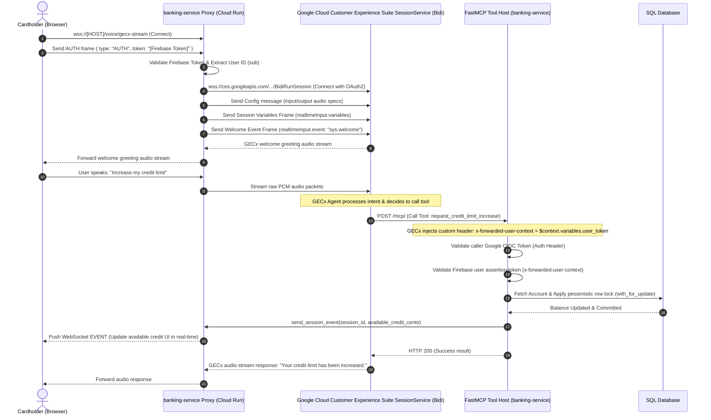

# FSI Architecture Design: GECx Telephony Voice Agent & Bidi Stream Orchestration

This document details the system architecture, security design, and key implementation gotchas for the real-time **GECx Telephony Voice Agent** using Google Cloud Customer Experience Suite (GECx) bi-directional streaming.

---

## 📐 1. System Topology & Media Flow

The GECx Telephony Voice Agent establishes a low-latency, bidirectional audio streaming connection between the client browser and the Google Cloud Customer Experience Suite Bidi API via the `banking-service` acting as an authenticated proxy. 



---

## 🔒 2. Security Architecture & Identity Forwarding

Because GECx operates as a Google-managed cloud agent orchestrator, it must securely call on-premise or custom APIs (like our FastMCP endpoints) on behalf of the active user:

1. **Google OIDC ID Token Verification**: The FastMCP router ensures that invocations come exclusively from Google Cloud Customer Experience Suite services by verifying the Google service account OIDC token in the `Authorization: Bearer <JWT>` header.
2. **End-User Identity Assertion (`x-forwarded-user-context`)**: The backend forwards the end-user's Firebase ID token into GECx at startup. In the GECx Toolset GUI, the custom header `x-forwarded-user-context` is mapped to `$context.variables.user_token`. During tool calls, GECx automatically injects this token, allowing the backend `requires_user_assertion` decorator to cryptographically verify the cardholder's identity.

---

## ⚠️ 3. Key Gotchas & Solutions

### A. Session Variables & Welcoming Protocol Union Constraint (The `oneof` Gotcha)
* **The Pitfall**: The Google Cloud Customer Experience Suite `SessionInput` proto message represents input types inside a Protobuf `oneof input_type` union block:
  ```protobuf
  message SessionInput {
    oneof input_type {
      string text = 2;
      ...
      google.protobuf.Struct variables = 8;
      Event event = 9;
    }
  }
  ```
  Sending session variables and triggering the welcome greeting (`sys.welcome` event) in a single consolidated WebSocket message results in an immediate connection termination with code `1007` (`oneof field 'input_type' is already set`).
* **The Solution**: The two payloads must be sent as **two separate, sequential WebSocket frames**:
  1. Write a `realtimeInput` frame containing only the `variables` to seed GECx's session state.
  2. Write a `realtimeInput` frame containing only the `event` to prompt the greeting.

### B. Session Registry Identity Mismatch (Firebase UID vs Database Customer ID)
* **The Pitfall**: The WebSocket proxy session is authenticated via Firebase ID tokens and registers the active audio loop under the Firebase UID (`sub` claim, e.g., `JMZkJxwLgWSaa0YPmB41lmCQc9L2`). However, MCP tools query the SQL database and perform operations based on DB Customer IDs (which fallback to the seed ID `cust-123` for demo purposes). Discarding UI refresh events due to key mismatches results in the UI failing to update in real-time.
* **The Solution**: During WebSocket startup, the proxy queries the database to resolve the customer ID associated with the Firebase UID. It registers the active session under **both** keys in the `active_sessions` registry, ensuring that out-of-band updates sent to either ID are routed to the user's browser UI.
