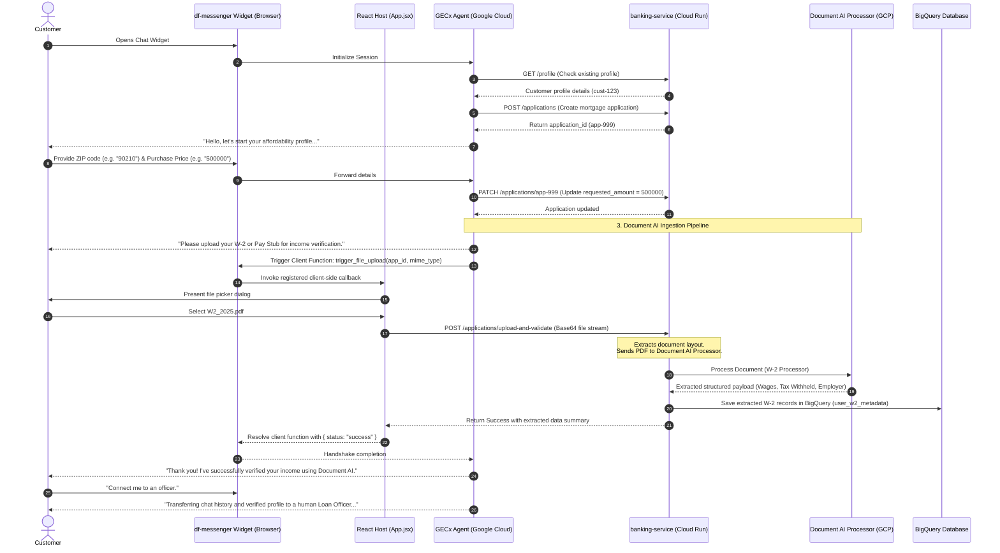

# FSI Architecture Design: Home Loan Assistant & Document AI Integration

This document defines the system topology, conversational flows, and integration details for the **Home Loan Assistant and Document AI Income Verification Pipeline** in the FSI GECX Bundle.

---

## 📐 1. System Topology & Media Flow

The Home Loan Assistant orchestrates a conversational preapproval check. It interacts with the client browser's file upload interface via Dialogflow client function callbacks and automates W-2 or Pay Stub verification using Google Cloud **Document AI**.



---

## 🔒 2. Core Architectural Design Decisions

### A. Client-Coordinated Document Upload Handshake
* **Context**: The conversational agent runs in a sandboxed, Google-managed cloud environment. It cannot directly read files from the user's hard drive or directly post binary files to the API backend.
* **Decision**: We use GECx **Client-Side Functions** to prompt the browser when a document upload is required. The browser opens a native file selection prompt, reads the file contents as a base64 string, and uploads it to the `/upload-and-validate` API endpoint. The result payload is returned to the agent session to confirm completion.

### B. Inline Structured Document Extraction with Document AI
* **Context**: Manual verification of salary, employer name, and federal withholding from uploaded tax documents is slow and prone to errors.
* **Decision**: The FastAPI backend routes files directly to Google Cloud **Document AI** specialized processors (such as the W-2 Parser or Document OCR). The processor parses the unstructured PDF or image into structured JSON fields, allowing the application to immediately verify and log parameters.

---

## 🛠️ 3. Integration Schemas & Endpoints

### A. Client-Side Upload Function
The browser registers `trigger_file_upload` to intercept the agent request:

```javascript
node.registerClientSideFunction(
  uploadToolName,
  uploadToolId,
  (args) => {
    return new Promise((resolve) => {
      const input = document.createElement('input');
      input.type = 'file';
      input.accept = args.mime_type || 'application/pdf';
      input.onchange = async () => {
        const file = input.files[0];
        const reader = new FileReader();
        reader.onload = async () => {
          const base64Content = reader.result.split(',')[1];
          const result = await uploadAndValidateArtifact({
            application_id: args.application_id,
            artifact_type: args.artifact_type || "W2",
            base64_content: base64Content,
            content_type: file.type
          });
          resolve({ status: 'success', data: result });
        };
        reader.readAsDataURL(file);
      };
      input.click();
    });
  }
);
```

### B. Ingestion API Endpoint
The FastAPI endpoint `/applications/upload-and-validate` orchestrates Document AI invocation and commits verified records to the BigQuery database:

* **File Upload Router:** [underwriting.py](../../banking-service/routers/underwriting.py) or [applications.py](../../banking-service/routers/applications.py)
* **Document AI Processing:** Calls `process_document()` using the official Vertex AI/Document AI Python Client libraries.
* **Database Target:** Saves metadata in `banking.user_w2_metadata` and application status logs in `banking.application`.
