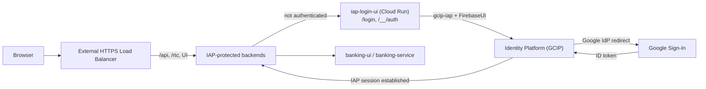

# FSI Architecture Design: Custom IAP Login UI (External Identities)

This document defines the **custom Identity-Aware Proxy (IAP) sign-in experience** in the FSI GECX Bundle.

When the platform runs with external identities, IAP does not use the default Google account chooser. Instead it delegates authentication to a branded, self-hosted sign-in page (`iap-login-ui`) built on Google Cloud Identity Platform (GCIP). This lets the demo present a "Nova Horizon Credit Union" login backed by GCIP tenants while still gating every downstream Cloud Run service behind IAP.

---

## 1. Where It Sits in the Request Path

The load balancer routes `/login`, `/login/*`, `/__/auth`, and `/__/auth/*` to the `iap-login-ui` backend; everything else flows to the IAP-protected application backends. IAP redirects unauthenticated users to `/login`, and after GCIP completes authentication IAP establishes its session and returns the user to the original destination.

---

## 2. Deployment Gating

The custom login surface exists only when external identities are enabled:

| Resource | Condition |
| :--- | :--- |
| `google_cloud_run_v2_service.iap_login_ui` | `deploy_cloud_run_services && use_external_identities` |
| `iap-login-ui-neg` / `iap-login-ui-backend` (load balancer) | Present with the service |

With `use_external_identities = false`, IAP uses default Google identities and this service is not deployed. This is the switch that turns the whole external-identity flow on or off.

---

## 3. Client Composition

`src/main.js` wires three libraries into the IAP external-identity contract:

| Library | Role |
| :--- | :--- |
| `firebase/compat/auth` | Underlying auth SDK. |
| `firebaseui` | Renders the hosted sign-in widget into `#firebaseui-auth-container`. |
| `gcip-iap` (`ciap.Authentication`) | Bridges FirebaseUI to IAP; it reads IAP's redirect parameters and completes the CICP/IAP handshake. |

The handler is configured per API key and uses a **multi-tenant wildcard** so any GCIP tenant can sign in through the same page:

- `displayMode: 'optionFirst'`
- `tenants: { '*': { displayName: 'Nova Horizon Credit Union', signInOptions: [Google], signInFlow: 'redirect', immediateFederatedRedirect: false } }`
- Google provider with `customParameters.prompt = 'select_account'` so the account chooser always appears.

`new ciap.Authentication(handler).start()` hands control to IAP's authentication lifecycle.

---

## 4. Runtime Configuration Injection

The image is environment-agnostic; Firebase settings are injected at container start rather than baked in at build time. `docker-entrypoint.sh`:

1. `envsubst` renders `config.template.js` → `config.js`, substituting `FIREBASE_API_KEY`, `FIREBASE_AUTH_DOMAIN`, `FIREBASE_PROJECT_ID`, and `FIREBASE_PROJECT_NUMBER` into `window.firebaseConfig`.
2. Normalizes a runtime `BASE_PATH` (default `/login/`) and replaces the `/__VITE_BASE_PATH__/` placeholder across built HTML/JS/CSS so the app serves correctly under the `/login` sub-path.
3. Renders the nginx config from its template (`PORT`, `FIREBASE_PROJECT_ID`), then deletes the template files so they are never served statically.

`src/main.js` reads `window.firebaseConfig` at load and refuses to initialize (console error) if the API key or project number is missing, preventing a half-configured login page.

---

## 5. Identity Platform Configuration

The GCIP project config (`google_identity_platform_config.default`) backs the page:

| Setting | Value |
| :--- | :--- |
| Authorized domains | `localhost`, the deployment `custom_domain`, and `iap.googleapis.com`. |
| Default IdP | `google.com`, enabled with the IAP OAuth client id/secret sourced from Secret Manager. |
| Multi-tenant | Managed out-of-band (`ignore_changes = [multi_tenant]`). |

`iap.googleapis.com` in authorized domains is what permits IAP to drive the GCIP redirect flow.

---

## 6. Local Development Shortcut

When served from `localhost`/`127.0.0.1` without IAP's redirect parameters, `main.js` synthesizes them (`apiKey`, `mode=login`, `tid=_<projectNumber>`, `state=local-dev-state`, `redirect_uri=http://localhost:5173/`) and reloads. This lets a developer exercise the sign-in widget without a live IAP redirect while keeping the production path (real IAP parameters) untouched.

---

## 7. Related Documents

| Document | Relationship |
| :--- | :--- |
| [GCIP Blocking Functions](./gcip_blocking_functions.md) | Domain-restriction policy enforced during the sign-in this page initiates. |
| [Build & Deploy Operations](../../operations/build_and_deploy.md) | Build and deployment of the `iap-login-ui` image and IAP configuration. |
