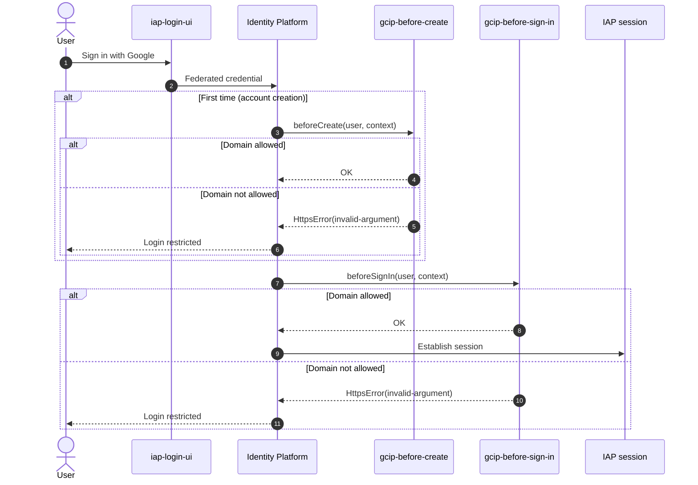

# FSI Architecture Design: GCIP Blocking Functions

This document defines the **Cloud Identity Platform (GCIP) blocking functions** that enforce email-domain access control during authentication in the FSI GECX Bundle.

Blocking functions are synchronous authorization hooks that GCIP invokes *before* an account is created and *before* each sign-in. They let the platform reject identities that pass Google authentication but are not permitted to use the demo — without changing any application code. Here they restrict access to an allow-list of corporate domains.

---

## 1. Authentication Hook Points

`beforeCreate` fires only on the first authentication (account provisioning); `beforeSignIn` fires on every authentication. Enforcing the same rule in both means an account that was provisioned while a domain was allowed is still re-checked on each subsequent sign-in.

---

## 2. Policy Logic

Both handlers (`blocking-function/index.js`) apply identical logic via `gcip-cloud-functions`:

| Step | Behavior |
| :--- | :--- |
| Extract email | Read `user.email`; if absent, throw `HttpsError('invalid-argument', 'Email is required for authentication.')`. |
| Extract domain | Split on `@` and lowercase the domain. |
| Allow-list check | Permit only `google.com`, `gcp.altostrat.com`, `gcp.solutions`; otherwise throw `HttpsError('invalid-argument', 'Login is restricted. Domain … is not allowed.')`. |

The allow-list is a constant in source (`ALLOWED_DOMAINS`); changing who may sign in is a code + redeploy of the functions, keeping the policy versioned and reviewable.

---

## 3. Deployment Model

The functions are deployed as two Gen2 Cloud Functions, gated on `enable_blocking_functions` (`blocking_function.tf`):

| Aspect | Detail |
| :--- | :--- |
| Functions | `gcip-before-create` (entry point `beforeCreate`) and `gcip-before-sign-in` (entry point `beforeSignIn`). |
| Runtime | `nodejs22`, 256 MB, 60s timeout, `min=0`/`max=3` instances. |
| Source packaging | The `blocking-function/` directory is zipped (excluding `node_modules`) and uploaded to a dedicated GCS bucket; the object name embeds the archive MD5 so a source change forces redeploy. |
| Invoker | `roles/run.invoker` granted to `allUsers`. GCIP invokes blocking functions unauthenticated, so this public invoker is a requirement of `gcip-cloud-functions`, not an oversight. |

---

## 4. Wiring Into Identity Platform

The functions are registered as triggers on the GCIP project config (`google_identity_platform_config.default`):

- A `blocking_functions` block adds two `triggers` mapping `beforeCreate` and `beforeSignIn` event types to each function's `service_config.uri`.
- `forward_inbound_credentials` is set to **not** forward refresh, access, or ID tokens to the functions — the domain check needs only the email claim, so no OAuth credentials are handed to the function runtime (least privilege).

The `blocking_functions` block is itself `dynamic` on `enable_blocking_functions`, so with the flag off no triggers are registered and authentication proceeds without the hook.

---

## 5. Configuration Constraints & Environment Notes

| Constraint | Rationale |
| :--- | :--- |
| `enable_blocking_functions = true` requires `use_external_identities = true` | A Terraform validation enforces this — blocking functions only make sense with GCIP external identities driving the sign-in. |
| Not usable where unauthenticated invocations are disallowed | Because the invoker must be `allUsers`, environments that forbid unauthenticated Cloud Run invocation (e.g. Argolis) cannot enable this feature. |

---

## 6. Related Documents

| Document | Relationship |
| :--- | :--- |
| [Custom IAP Login UI (External Identities)](./custom_iap_login_ui.md) | The sign-in surface whose authentication these functions gate. |
| [Build & Deploy Operations](../../operations/build_and_deploy.md) | Deployment flow and the `enable_blocking_functions` / `use_external_identities` flags. |
