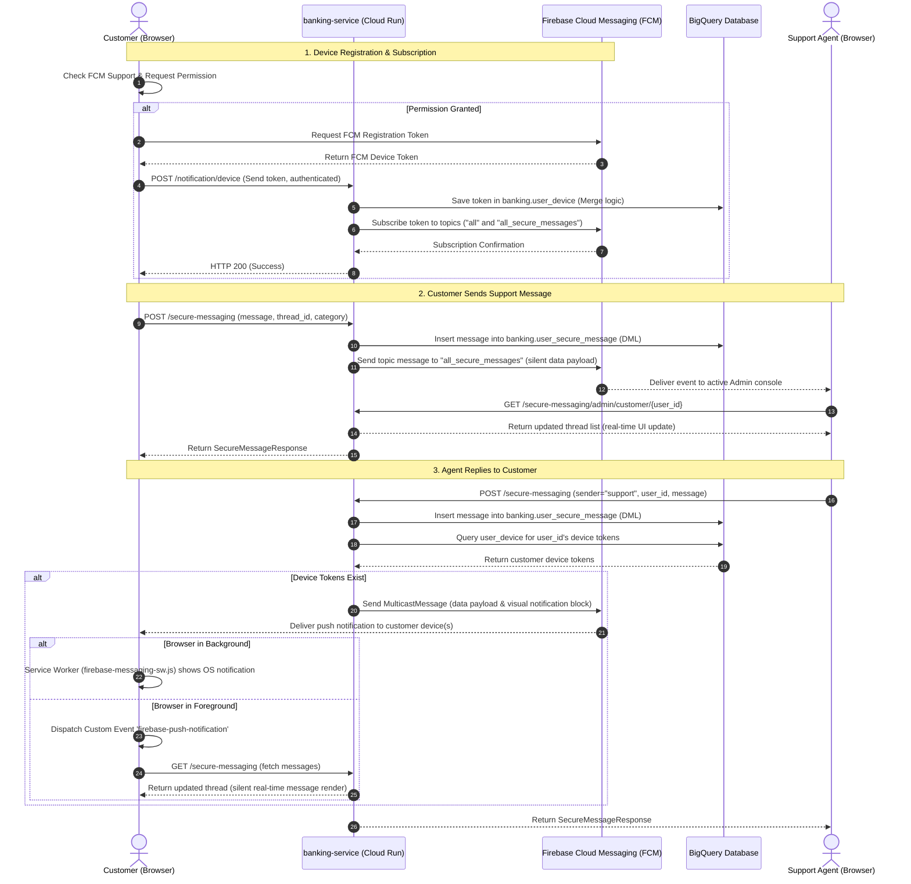

# FSI Architecture Design: Secure Messaging & Real-Time Notification Engine

This document details the system architecture, event flow, security framework, and database models for the **Secure Messaging and Real-Time Push Notification Engine** in the FSI GECX Bundle.

---

## 📐 1. System Topology & Event Flow

The secure messaging system uses an asynchronous, real-time push architecture to enable two-way support conversations between customers and bank agents. It synchronizes records in a BigQuery database while dispatching low-latency push notifications via **Firebase Cloud Messaging (FCM)**.

---

## 🔒 2. Core Architectural Design Decisions

### A. Asynchronous Push Synchronization via Firebase Cloud Messaging
* **Context**: Traditional HTTP polling patterns to fetch support chat replies introduce excessive database read queries and create a laggy user experience.
* **Decision**: We utilize **Firebase Cloud Messaging (FCM)** as a pub/sub mechanism. The UI connects and registers its active browser window using FCM device tokens, allowing the backend to push instant alerts when new replies arrive.

### B. Foreground vs. Background Notification Dispatch
* **Context**: Sending full-screen visual alert popups when the user is actively chatting with the agent inside the app feels intrusive. However, when the tab is hidden or backgrounded, standard notifications must show.
* **Decision**:
  1. **Foreground Messages**: When the customer's browser tab is active, the app intercepts the notification and triggers a custom window event (`firebase-push-notification`). The chat UI listens to this event and silently triggers a reload of the current conversation thread, ensuring fluid, instant visual rendering of incoming text blocks.
  2. **Background Messages**: When the browser tab is hidden, the background service worker ([firebase-messaging-sw.js](file:///Users/mservidio/GitHub/fsi-gecx-bundle/banking-ui/public/firebase-messaging-sw.js)) intercepts the message and presents a standard, OS-level visual push notification utilizing the system notification tray. Clicking on this tray banner navigates the customer directly to the corresponding chat thread.

---

## 🛠️ 3. Security & Least Privilege

The secure messaging module integrates strict security compliance mechanisms to ensure data secrecy and prevent spoofing:

1. **Cryptographic Identity Verification**: All endpoints under `/secure-messaging` and `/notification` require token validations (`Depends(get_current_user)`). The server verifies the caller's Firebase ID token or Google Cloud OIDC token against trusted public certificates before committing database rows or checking thread ownership.
2. **Access Control & Spoofing Guards**: The backend validates the token's claims against the request parameters. If `sender = "user"`, the system ignores any arbitrary user ID passed in the payload and enforces `user_id = token.user_id`, preventing malicious actors from sending messages on behalf of other customers.
3. **Data-Only Payload Separation**: To avoid exposing raw database logs in push notification bubbles, the backend dispatches topic updates (to the `all_secure_messages` topic monitored by support agents) as **data-only payloads** without the `notification` block. The agent's UI intercepts these silent payloads and triggers a secure API call to fetch the updated messages over TLS, keeping sensitive finance text off public notification channels.

---

## 💾 4. Database Schema & Storage (BigQuery)

All messages, threads, and device registrations are stored persistently in Google Cloud BigQuery.

### A. `banking.user_secure_message`
Stores the records of individual messages and thread properties.

| Field Name | Type | Description |
| :--- | :--- | :--- |
| `message_id` | STRING (UUID) | Unique identifier for the message |
| `user_id` | STRING | The customer identifier |
| `sender` | STRING | Origin of the message (`"user"` or `"support"`) |
| `category` | STRING | Chat category (e.g. `"General"`, `"Credit Card"`, `"Loan"`) |
| `message` | STRING | The text message payload |
| `created_at` | TIMESTAMP | Message creation date and time |
| `deleted` | BOOLEAN | Soft-deletion flag |
| `thread_id` | STRING (UUID) | Conversation thread identifier |
| `is_user_read` | BOOLEAN | Indicates if the customer has read the message |
| `is_agent_read` | BOOLEAN | Indicates if a support agent has read the message |

### B. `banking.user_device`
Maps active user IDs to their registered Firebase Cloud Messaging tokens.

| Field Name | Type | Description |
| :--- | :--- | :--- |
| `user_id` | STRING | The customer identifier |
| `device_token` | STRING | FCM device registration token |
| `updated_at` | TIMESTAMP | Last registration or handshake refresh |

---

## ⚠️ 5. Key Gotchas & Implementation Tips

### A. FCM VAPID Key Initialization
* **The Pitfall**: To obtain an FCM registration token inside modern web browsers, the client application must verify its identity against the Firebase server using a **Voluntary Application Server Identification (VAPID)** key. Failure to configure the VAPID key in `index.html` throws errors and blocks device registration.
* **The Solution**: The frontend retrieves the VAPID key dynamically at startup from `window.env.FIREBASE_VAPID_KEY` (configured during deployment) and passes it in the `getToken()` options inside the [index.html](file:///Users/mservidio/GitHub/fsi-gecx-bundle/banking-ui/index.html#L114-L115) initialization script.

### B. Multicast Notification Failures and Token Cleanup
* **The Pitfall**: Customers registering multiple devices (e.g., phone, laptop) will have multiple active entries in the `user_device` table. Sending individual messages in a loop blocking on failures creates latency.
* **The Solution**: The backend utilizes `messaging.send_each_for_multicast()` in [secure_messaging.py](file:///Users/mservidio/GitHub/fsi-gecx-bundle/banking-service/routers/secure_messaging.py#L101) to deliver push notifications to all registered tokens concurrently. The API response returns a breakdown of success/failure counts, allowing developers to clean up expired or invalid device tokens from BigQuery in subsequent batches.
