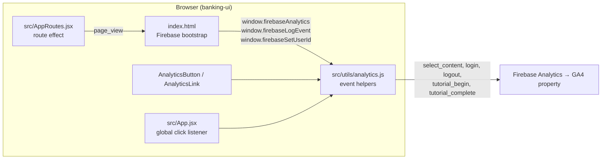
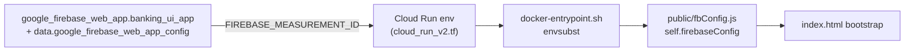
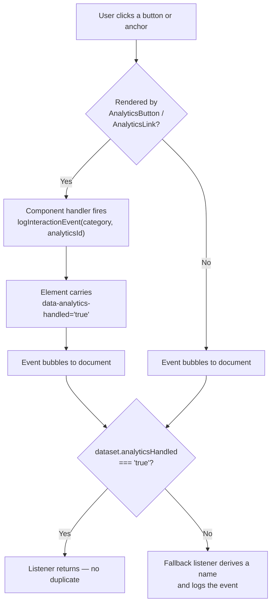

# FSI Architecture Design: Google Analytics Instrumentation (Banking UI)

This document defines how the **`banking-ui`** React application is instrumented for **Google Analytics 4 (GA4)** via the **Firebase Analytics** web SDK.

The instrumentation is designed around three goals: every page transition in a client-side routed SPA must produce a `page_view`; every meaningful click must produce an attributed interaction event without requiring per-element wiring; and the entire analytics surface must degrade silently to a no-op when the app runs unconfigured (local development, mock auth).

---

## 1. Where It Sits



The Firebase SDK is loaded as an ES module directly from `gstatic.com` inside `banking-ui/index.html` — there is no bundled `firebase` dependency and no `gtag.js` / Google Tag Manager container. The SDK handles have deliberately been hung off `window` so that plain modules (`src/utils/analytics.js`) can emit events without importing Firebase or threading a context provider through the tree.

| Global | Source | Purpose |
| :--- | :--- | :--- |
| `window.firebaseAnalytics` | `getAnalytics(app)` | The Analytics instance; also the presence flag every helper guards on. |
| `window.firebaseLogEvent` | `logEvent` | Event emitter. |
| `window.firebaseSetUserId` | `setUserId` | Binds the authenticated Firebase UID to the GA4 user. |

---

## 2. Configuration & Deployment Path

The measurement ID is never baked into the image. It travels from Terraform → Cloud Run env var → container start → static JS:



| Stage | Detail |
| :--- | :--- |
| Terraform | `deployment/terraform/firebase.tf` creates the `Banking UI` Firebase web app; `data.google_firebase_web_app_config` reads back `measurement_id`, `api_key`, `app_id`, and friends. |
| Cloud Run | `deployment/terraform/cloud_run_v2.tf` (line 442) injects `FIREBASE_MEASUREMENT_ID` (plus the rest of the Firebase config) as container environment variables. |
| Container start | `banking-ui/docker-entrypoint.sh` renders `fbConfig.template.js` → `fbConfig.js` with `envsubst`, then deletes the template so it is never served. |
| Page load | `index.html` loads `/fbConfig.js` before the app bundle, so `self.firebaseConfig` is present at bootstrap. |

**Local runs.** `make docker-run-banking-ui` re-reads the values out of a developer's existing `banking-ui/public/fbConfig.js` and passes them through as env vars, so a locally-run container reports into the same GA4 property as the deployed app.

### Unconfigured fallback

`index.html` computes:

```js
const useMockAuth = !self.firebaseConfig || !self.firebaseConfig.apiKey || self.firebaseConfig.apiKey.startsWith("${");
```

When true — no `fbConfig.js`, or an unsubstituted `${FIREBASE_API_KEY}` placeholder — the app installs a **mock auth object and never calls `getAnalytics()`**. `window.firebaseAnalytics` stays `undefined`, and because every helper in `analytics.js` is guarded on `window.firebaseAnalytics && window.firebaseLogEvent`, all instrumentation becomes a silent no-op. Nothing throws, nothing is dropped into a nonexistent property, and no developer traffic pollutes production analytics.

---

## 3. Event Taxonomy

Five GA4 events are emitted. Four are GA4-recommended events used as intended; `logout` is a custom event.

| Event | Emitted by | Trigger |
| :--- | :--- | :--- |
| `page_view` | `AppRoutes.jsx` | Every React Router location change. |
| `select_content` | `analytics.js` → `logInteractionEvent` | All button/link/input interactions. |
| `login` | `analytics.js` → `logLoginEvent` | First authenticated `onAuthStateChanged` after a sign-in attempt. |
| `logout` | `analytics.js` → `logLogoutEvent` | Sign-out from the profile menu. |
| `tutorial_begin` / `tutorial_complete` | `analytics.js` | Guided product tours (react-joyride). |

### 3.1 `page_view` — client-side routing

`banking-ui` is a single-page app, so the SDK's automatic page-view collection only ever sees the initial document load. `banking-ui/src/AppRoutes.jsx` (line 70) closes that gap with an effect keyed on the router `location`:

```js
useEffect(() => {
  const payload = {
    page_title: PAGE_TITLES[location.pathname] || document.title,
    page_location: window.location.href,
    page_path: location.pathname,
    page_search: location.search,
    page_hash: location.hash,
  };
  // page_referrer = previous in-app route, or document.referrer on first view
  ...
}, [location]);
```

Two details matter:

- **`page_title` is resolved from `PAGE_TITLES`** in `banking-ui/src/utils/constants.js` (line 24) — a 26-entry path → human title map (`/admin/underwriting` → `Admin Underwriting`). Without it every route would report the static `<title>` from `index.html`, collapsing all traffic onto one page name. **Adding a route means adding a `PAGE_TITLES` entry**, otherwise it silently falls back to `document.title`.
- **`page_referrer` is synthesized.** A `prevLocationRef` holds the previous in-app location so the referrer chain reflects the actual in-app journey; only the first view of a session uses `document.referrer`.

### 3.2 `select_content` — the interaction event

Every non-navigation interaction is normalized into a single GA4 `select_content` event by `logInteractionEvent(category, analyticsId, additionalProps)` in `banking-ui/src/utils/analytics.js` (line 44):

| Parameter | Value |
| :--- | :--- |
| `content_type` | The interaction category — `button_click`, `link_click`, `input_focus`, `button_hover`, `search_submit`. |
| `content_id` | The stable interaction name (the `analyticsId`). |
| `page_path` / `page_location` | `window.location.pathname` / `href` at click time. |
| `view_name` | `PAGE_TITLES[pathname]`, falling back to `document.title`. |
| `breadcrumb_path` | Derived from the path by `deriveBreadcrumbFromUrl` (`/admin/underwriting` → `Admin > Underwriting`). |
| *(spread)* | Any `additionalProps` — e.g. `search_term` on `search_submit`. |

Using one event type with a `content_type` dimension (rather than a distinct event per interaction kind) keeps the property well inside GA4's 500-distinct-event limit and makes "all interactions on this page" a single-event query.

> **Note:** `content_id` was renamed from `item_id` in [#201](https://github.com/GoogleCloudPlatform/fsi-gecx-bundle/pull/201). Reports and explorations written against the old parameter name need updating.

### 3.3 `login` / `logout`

Sign-in is redirect-based in deployed environments, so the click that starts it and the callback that completes it happen in **different page loads**. The click handler therefore records the intended method in `sessionStorage`:

```js
const method = window.firebaseAuth ? 'Google' : 'IAP';
sessionStorage.setItem('pending_login_method', method);
```

and the `onAuthStateChanged` handler in `banking-ui/src/App.jsx` (line 835) drains it, emits `login` with `{ method }`, and removes the key. Draining is what prevents a `login` event on every subsequent auth-state re-emit (token refresh, tab focus) — only a session with a pending intent produces one.

### 3.4 `tutorial_begin` / `tutorial_complete`

Nine views ship a react-joyride guided tour (`HomeView`, `LocatorView`, `SecureMessagingView`, `VoiceSupportView`, `AgentSupportDashboard`, and the admin views). Each tour maps joyride lifecycle events onto GA4:

| Joyride condition | Event | `status` |
| :--- | :--- | :--- |
| `EVENTS.TOUR_START` | `tutorial_begin` | — |
| `STATUS.FINISHED` | `tutorial_complete` | `finished` |
| `ACTIONS.CLOSE` before finishing | `tutorial_complete` | `abandoned` |
| `ACTIONS.SKIP` before finishing | `tutorial_complete` | `skipped` |

The distinction between `abandoned` and `skipped` is the point of the instrumentation: it separates "closed the tour mid-way" (a friction signal on a specific step) from "opted out up front".

---

## 4. Click Capture: Two Layers

Interaction coverage is deliberately two-tiered so that no click is ever unattributed, while important clicks get stable names.



### Layer 1 — Explicit wrappers

`banking-ui/src/components/AnalyticsButton.jsx` and `banking-ui/src/components/AnalyticsLink.jsx` are drop-in replacements for `<button>` and `react-router` `<Link>` / `<a>`. They accept `analyticsId` and optional `eventProperties`, log before delegating to the caller's `onClick`, and stamp `data-analytics-handled="true"` on the DOM node.

`AnalyticsButton` additionally reads `useLocation()` and merges the router `page_path` into the payload — a click that triggers navigation is then attributed to the page it *originated* from, not the page it lands on.

`AnalyticsLink` branches on its props: `href` without `to` renders a plain `<a>` (external), otherwise a router `<Link>`.

38 components use `AnalyticsButton` and roughly 242 explicit `analyticsId` values are in the tree today.

### Layer 2 — Global fallback listener

`banking-ui/src/App.jsx` (line 170) registers a single document-level click listener that catches everything the wrappers missed:

1. `e.target.closest('button, a')` — ignores clicks on non-interactive elements.
2. Returns immediately if `target.dataset.analyticsHandled === 'true'` — **this is the deduplication guard**. Without it, wrapped elements would log twice, since the wrapper's handler and the bubbled document listener both fire.
3. Derives the category from the tag (`a` → `link_click`, else `button_click`).
4. Derives a name from `data-analytics-name` → `aria-label` → `innerText`, falling back to `unknown_button` / `unknown_link`, then trims to 50 characters (GA4 truncates long parameter values; truncating deliberately keeps names comparable).

Naming derived from `innerText` is unstable — it changes with copy edits, breaks under i18n, and varies by state. Treat a rising `unknown_button` or free-text `content_id` in reports as a signal to convert that element to `AnalyticsButton`.

### Naming convention

`analyticsId` values are `snake_case` and prefixed by their surface: `app_sign_in`, `admin_*`, `accounts_*`, `secure_*`, `voice_*`, `home_*`. The prefix is what makes GA4 `content_id` reports groupable by area, so **keep the prefix when adding new IDs**.

---

## 5. User Identity

An effect in `banking-ui/src/App.jsx` (line 428) keeps the GA4 user binding in sync with Firebase Auth:

```js
useEffect(() => {
  if (window.firebaseAnalytics && window.firebaseSetUserId) {
    window.firebaseSetUserId(window.firebaseAnalytics, fbUser?.uid ?? null);
  }
}, [fbUser]);
```

Setting `null` on sign-out is what prevents a subsequent anonymous session from being stitched onto the previous user. Note that the **Firebase UID is the only identifier sent** — no email, name, phone number, or account identifier is passed to Analytics, and event payloads carry only paths, view names, and interaction IDs. Keep it that way: `additionalProps` on `logInteractionEvent` is spread verbatim into the GA4 payload, so it is the most likely place for PII to leak in. `search_term` on `search_submit` is free-text user input and is the one parameter that should be reviewed if the property's data-retention or PII posture changes.

---

## 6. Adding Instrumentation

| Task | Do this |
| :--- | :--- |
| New clickable element | Use `AnalyticsButton` / `AnalyticsLink` with a prefixed `analyticsId`. |
| New route | Add the path to `PAGE_TITLES` in `src/utils/constants.js` — otherwise `page_view.page_title` and `select_content.view_name` fall back to the static document title. |
| New interaction kind | Call `logInteractionEvent('<category>', '<id>')` directly; the category becomes `content_type`. Prefer reusing an existing category. |
| Extra event context | Pass `eventProperties` / `additionalProps` — non-PII, low-cardinality values only. |
| New GA4 event type | Add a guarded helper to `src/utils/analytics.js` rather than calling `window.firebaseLogEvent` from a component, so the unconfigured-environment guard stays in one place. |

### Verifying locally

`analytics.js` and `AppRoutes.jsx` each carry a commented-out `console.log` of the outgoing payload; uncomment during development to see events without a configured property. With a real `fbConfig.js` present, GA4 **DebugView** shows the live stream.

---

## 7. Related Documentation

- [Custom IAP Login UI (External Identities)](../identity-access/custom_iap_login_ui.md) — the alternate sign-in path behind the `IAP` login `method`.
- [Search Content Ingestion Pipeline](../ai-and-voice/search_content_ingestion_pipeline.md) — the sitemap-driven crawler that shares the `PAGE_TITLES` route surface.
- [BigQuery OLAP & Compliance Audit Architecture](../data-platform/bigquery_olap_audit_architecture.md) — the platform's server-side analytics estate, which is entirely separate from this client-side GA4 stream.
